# Enterprise Secure Hub-Spoke Network Architecture (Azure)

## 1. Projectomschrijving & Business Case
Dit project demonstreert het ontwerpen en implementeren van een veilig, schaalbaar en enterprise-ready **Hub-Spoke netwerkmodel** in Microsoft Azure, gebouwd volgens de best practices van het **Azure Well-Architected Framework**. 

Veel startende organisaties maken de fout om workloads in één plat netwerk te plaatsen. Dit project lost dat op door centrale services (beheer, security, monitoring en connectiviteit) logisch en fysiek te scheiden van specifieke applicatieworkloads.

### Waarom deze architectuur? (Architecturale Keuzes)
* **Hub-Spoke Model:** De 'Hub' fungeert als de centrale toegangspoort. De 'Spokes' bevatten de workloads (Productie en Test). Dit voorkomt wildgroei aan publieke IP-adressen en centraliseert het beheer en de beveiliging.
* **Security & Isolatie:** Spokes kunnen standaard *niet* rechtstreeks met elkaar communiceren (isolatie van Productie en Test). Al het verkeer tussen spokes, of van/naar het internet, wordt gedwongen om door de centrale Hub te gaan.
* **Schaalbaarheid:** Nieuwe afdelingen of applicaties kunnen eenvoudig als een nieuwe 'Spoke' worden toegevoegd zonder het centrale netwerk te verstoren.

### Governance, Tenant & Tagging Strategie
* **Lab-omgeving:** Voor dit project is gekozen voor isolatie op **Resource Group-niveau** (`rg-secure-hubspoke-manual`) within een dedicated test-tenant (`://onmicrosoft.com`). Dit houdt de resources gecentraliseerd en kostenefficiënt.
* **Productie-aanbeveling:** In een enterprise-omgeving wordt een **Multi-Subscription strategie** geadviseerd. Hierbij worden de Hub (Centraal beheer), Spoke 1 (Productie) en Spoke 2 (Test) in aparte Azure Subscriptions geplaatst om harde grenzen te creëren voor budgettering (FinOps) en toegangsbeheer (RBAC).
* **Tagging Standaard:** Om cost-tracking (FinOps) en resource-lifecycle management te garanderen, is een strikte tagging-standaard toegepast op alle resources:
  * `Project` = `Secure-Hub-Spoke`
  * `Environment` = `Lab`
  * `Owner` = `Sven Velleman`
  * `CostCenter` = `IT-training`
  * `ManagedBy` = `Manual`

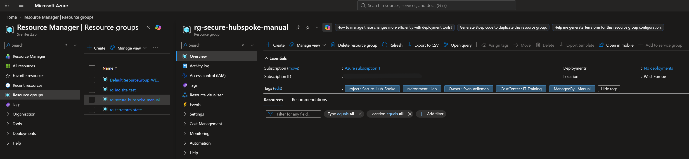

---

## 2. Netwerk- & IP-Adresseringsplan
Om IP-overlapping (IP overlap) te voorkomen dat subnets elkaar in de weg zitten, is het volgende schema ontworpen en volledig geïmplementeerd:

| Netwerk (Resource) | IP Range (CIDR) | Subnet Naam | Subnet Range | Doel / Functie |
| :--- | :--- | :--- | :--- | :--- |
| **vnet-hub-prod** | `10.0.0.0/16` | `AzureBastionSubnet` <br> `sn-hub-mgmt` <br> `AzureFirewallSubnet` <br> `AzureFirewallManagementSubnet` | `10.0.2.0/26` <br> `10.0.3.0/24` <br> `10.0.4.0/26` <br> `10.0.4.64/26` | Gereserveerd voor Azure Bastion (Basic SKU) <br> Beheer / Jumpbox subnet <br> Azure Firewall Dataplane <br> Verplicht beheer-subnet voor Azure Firewall Basic |
| **vnet-spoke1-prod** | `10.1.0.0/16` | `sn-spoke1-apps` | `10.1.1.0/24` | Productie workloads & VM's (Private Subnet) |
| **vnet-spoke2-test** | `10.2.0.0/16` | `sn-spoke2-apps` | `10.2.1.0/24` | Test- en acceptatieomgevingen (Private Subnet) |

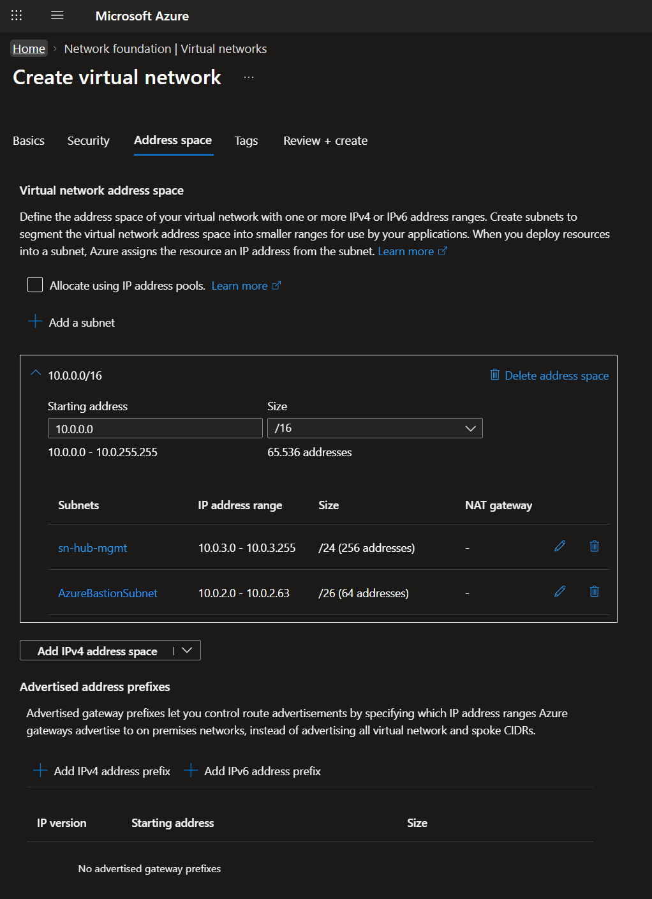

### Status na implementatie van de VNets & Subnetten:
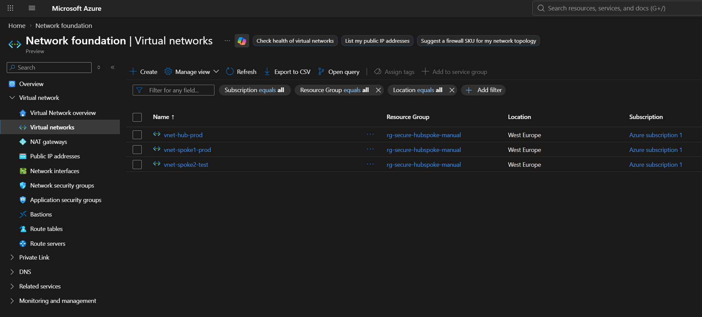
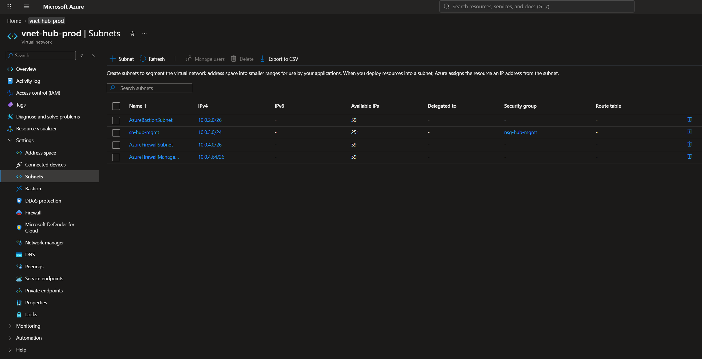

---

## 3. Financiële Analyse & Kostenefficiëntie (FinOps)
Als Cloud Architect is het cruciaal om niet alleen naar techniek, maar ook naar het budget te kijken. In deze infrastructuurfase is een bewuste **"Firewall-Last" deployment-strategie** toegepast om onnodige labkosten te elimineren:

* **VNet Peering Kosten:** In plaats van duren VPN-gateways tussen elk netwerk te zetten, gebruiken we **VNet Peering** via de peering-wizard. Dit gebruikt het backbone-netwerk van Microsoft. Omdat we binnen dezelfde regio werken (West Europe), betalen we enkel een flinterdun tarief per GB aan dataoverdracht. Zolang er geen VM's actief data verbruiken, blijft de kostprijs **€0,00**.
* **Azure Bastion Hub Integration:** In plaats van onveilige publieke IP-adressen op de workloads te plaatsen, is er een centrale Azure Bastion (Basic SKU) uitgerold in de Hub (`AzureBastionSubnet`). Door deze strategische plaatsing kan één enkele Bastion-host via de VNet Peerings veilig verbinding maken met beide Spokes. Om de kosten binnen het lab minimaal te houden, wordt deze service direct na de validatiefase weer ontmanteld (FinOps best practice).
* **UDR Pre-staging:** De Route Tables (`rt-spoke1-to-hub` en `rt-spoke2-to-hub`) zijn al volledig geconfigureerd en gekoppeld aan de Spokes met het toekomstige Private IP van de Azure Firewall (`10.0.4.4`) als Next Hop. Hierdoor kon de netwerklogica gratis worden klaargezet.
* **Auto-Shutdown Configuration:** Alle test-workloads zijn voorzien van een automatische uitschakeltijd (Auto-shutdown om 6:00 PM / 18:00) om onnodige compute-kosten buiten werktijd te voorkomen.
* **Isolatie van Workloads:** De virtuele machines zijn uitgerold zonder Publiek IP-adres (No Public IP) op goedkope Standard HDD OS-schijven om de aanvalsoppervlakte (attack surface) te minimaliseren en storage-kosten te drukken.

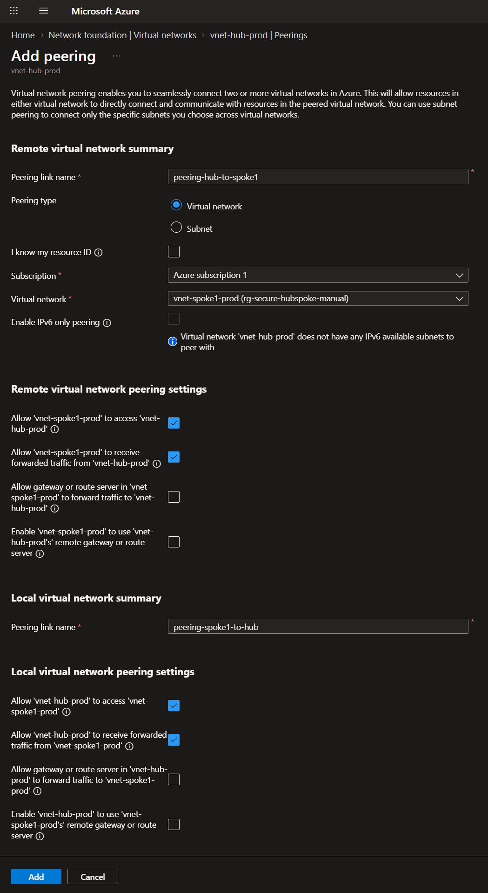
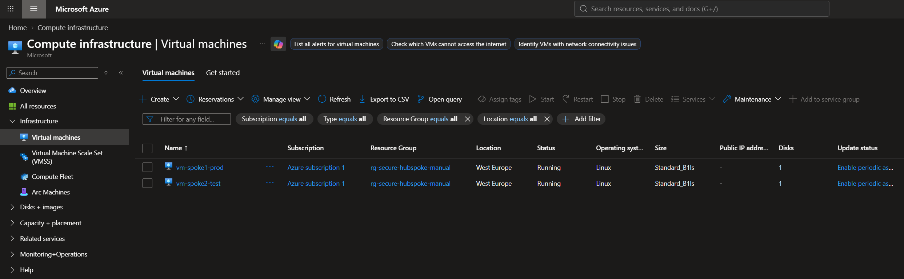
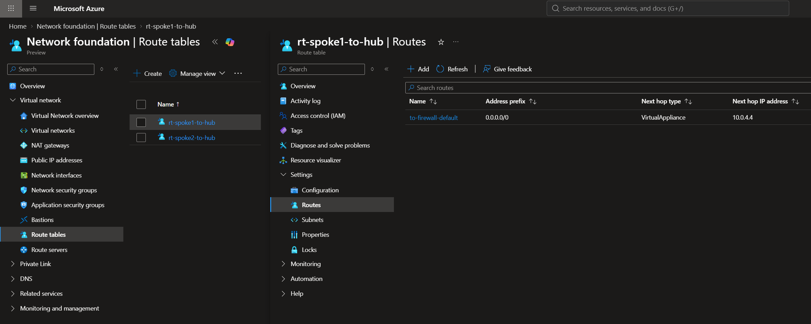

---

## 4. Architectuurdiagram (As-Designed)
Hieronder staat de visuele weergave van onze netwerkinfrastructuur. Dit diagram wordt automatisch gegenereerd via Mermaid.js op basis van de onderliggende code:

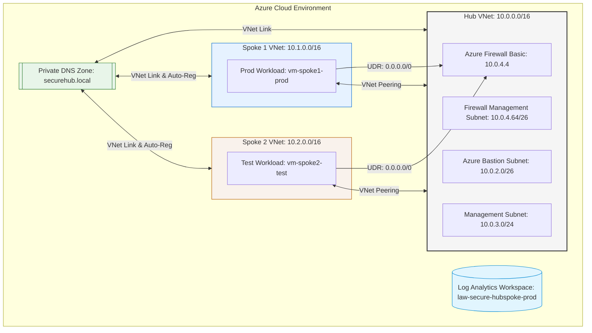
```mermaid
graph TD
    subgraph Azure Cloud Environment
        subgraph HUB_VNet [Hub VNet: 10.0.0.0/16]
            FW[Azure Firewall Basic: 10.0.4.4]
            FWMGMT[Firewall Management Subnet: 10.0.4.64/26]
            BASTION[Azure Bastion Subnet: 10.0.2.0/26]
            MGMT[Management Subnet: 10.0.3.0/24]
        end

        subgraph SPOKE_1 [Spoke 1 VNet: 10.1.0.0/16]
            PROD_VM[Prod Workload: vm-spoke1-prod]
        end

        subgraph SPOKE_2 [Spoke 2 VNet: 10.2.0.0/16]
            TEST_VM[Test Workload: vm-spoke2-test]
        end
        
        LAW[(Log Analytics Workspace: law-secure-hubspoke-prod)]
        DNS[[Private DNS Zone: securehub.local]]
    end

    %% Connections via VNet Peering
    PROD_VM <-->|VNet Peering| HUB_VNet
    TEST_VM <-->|VNet Peering| HUB_VNet

    %% Routing via Firewall Pre-staging
    PROD_VM -->|UDR: 0.0.0.0/0| FW
    TEST_VM -->|UDR: 0.0.0.0/0| FW
    
    %% DNS Links & Auto-Registration
    DNS <-->|VNet Link| HUB_VNet
    DNS <-->|VNet Link & Auto-Reg| SPOKE_1
    DNS <-->|VNet Link & Auto-Reg| SPOKE_2

    %% Style
    style HUB_VNet fill:#f5f5f5,stroke:#333,stroke-width:2px
    style SPOKE_1 fill:#e6f2ff,stroke:#0066cc,stroke-width:1px
    style SPOKE_2 fill:#f9f2ec,stroke:#b35900,stroke-width:1px
    style LAW fill:#e1f5fe,stroke:#0288d1,stroke-width:1px
    style DNS fill:#e8f5e9,stroke:#2e7d32,stroke-width:1px
```

### Geconfigureerde netwerkverbindingen (VNet Peerings):
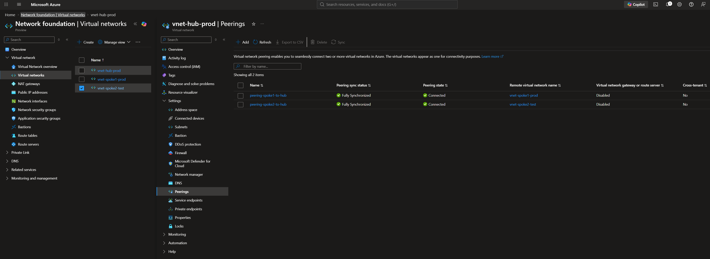

---

## 5. Security & Toegangscontrole (Network Security Groups)
Om te voldoen aan het **Zero Trust-principe**, passen we het principe van *least privilege* toe via **Network Security Groups (NSGs)**. Elk subnet is gekoppeld aan een specifieke NSG. We activeren de moderne **Private Subnet** standaard (geen standaard uitgaand internet), waardoor resources standaard volledig afgesloten zijn.

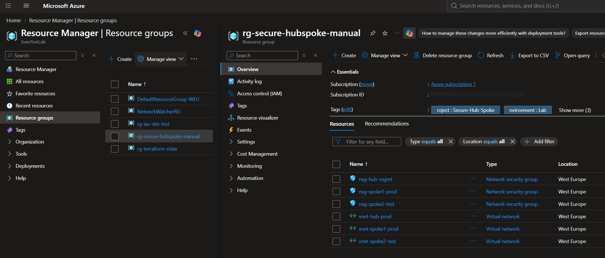

### NSG: `nsg-spoke1-prod` (Productie Subnet Beveiliging)
* `Allow-SSH-From-MgmtSubnet` (Priority 120): Staat SSH-beheer toe *uitsluitend* vanaf het Management Subnet (`10.0.3.0/24`).
* `Deny-Spoke2-Test-Traffic` (Priority 130): Blokkeert proactief al het verkeer komend uit de testomgeving (`10.2.0.0/16`) om kruisbesmetting te voorkomen.

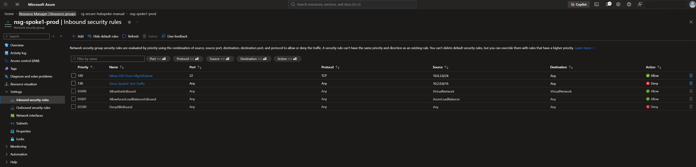
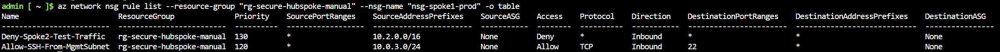

### NSG: `nsg-spoke2-test` (Test Subnet Beveiliging)
* `Allow-SSH-From-MgmtSubnet` (Priority 120): Staat SSH-beheer toe vanaf het Management Subnet (`10.0.3.0/24`).
* `Deny-Spoke1-Prod-Traffic` (Priority 130): Blokkeert inkomend verkeer vanuit het productienetwerk om harde scheiding van testdata te waarborgen.

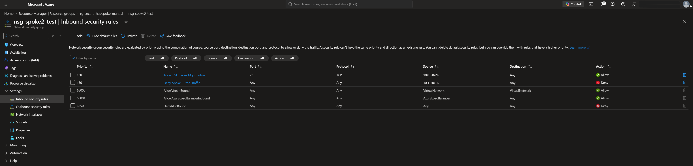
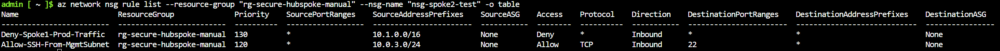

*Aanvullend zijn de specifieke beheerregels voor de hub-infrastructuur via CLI gevalideerd:*
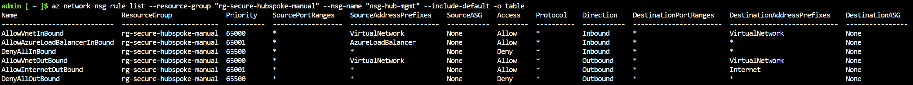

---

## 6. Centrale Enterprise Monitoring & Naamresolutie (DNS)

### Log Analytics Workspace & Diagnostic Settings
Voor de centrale logging van de Azure Firewall is er een gecentraliseerde **Log Analytics Workspace** (`law-secure-hubspoke-prod`) ingericht. De diagnostic settings van de firewall sturen alle core logs via het platform door naar deze workspace.

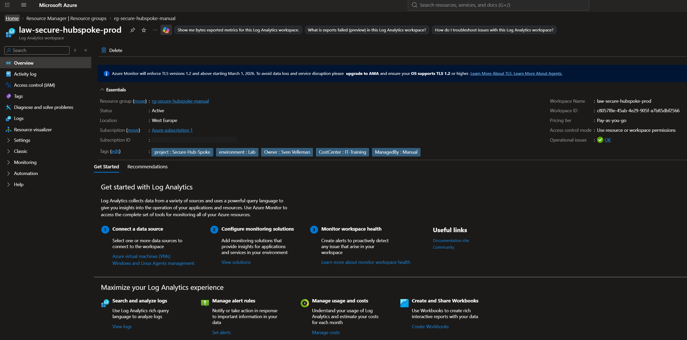
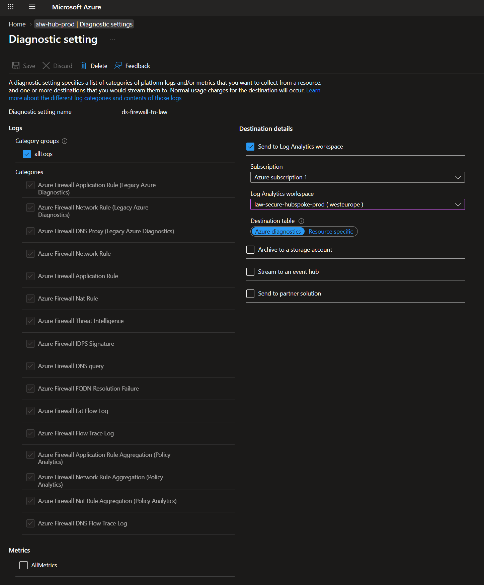

### Enterprise Private DNS & Auto-Registration
Om naadloze naamresolutie tussen de Hub spokes en de workloads te garanderen zonder dat deze publiek vindbaar zijn op internet, is een **Azure Private DNS Zone** (`securehub.local`) uitgerold. 
* De zone is via **Virtual Network Links** gekoppeld aan alle drie de VNets.
* Voor de Spokes is **Auto-Registration** ingeschakeld. Hierdoor registreren virtuele machines hun private IP-adres direct bij het opstarten binnen de DNS-zone, wat handmatig DNS-beheer elimineert.

---

## 7. Azure Firewall Policy & Rule Collections

De Azure Firewall Basic (`afw-hub-prod`) fungeert als de centrale poortwachter voor al het uitgaande verkeer naar het internet en draait in een strikte "Deny All" configuratie. Omdat de Spokes via User Defined Routes (UDR) hun internetverkeer (`0.0.0.0/0`) naar de firewall sturen, bepaalt de Firewall Policy exclusief welke externe resources veilig benaderd mogen worden.

De volgende Rule Collections zijn toegepast op de firewall policy (`afwp-hub-prod`):

### Layer 4 Network Rules (`rc-network-shared` - Priority 100)

* **allow-outbound-ping:** Staat ICMP-verkeer (pings) toe van beide Spokes (`10.1.0.0/16` en `10.2.0.0/16`) naar het internet (`*`). Dit stelt workloads in staat om externe connectiviteit te verifiëren via de centrale firewall.

### Layer 7 Application Rules (`rc-apps-shared` - Priority 110)

* **allow-ubuntu-updates:** Maakt gebruik van FQDN-filtering om HTTP (poort 80) en HTTPS (poort 443) verkeer uitsluitend toe te staan naar de officiële Ubuntu-domeinen (`*.ubuntu.com` en `ubuntu.com`). Dit stelt de Linux-workloads in staat om updates en security patches veilig op te halen, terwijl regulier surfverkeer strikt geblokkeerd blijft.

---

## 8. Validatie & Netwerk Routing Validatie (UDR & Systeem Routes)

Om aan te tonen dat het netwerkontwerp en de centrale beveiliging correct functioneren, zijn er twee test-VM's uitgerold (`vm-spoke1-prod` en `vm-spoke2-test`) zonder publiek IP-adres. De validatietesten via Azure Bastion leverden cruciale inzichten op in de routing-mechanismen van het Azure platform.

### User Defined Routes (UDR) Status

De subnets in de Spokes maken gebruik van Route Tables waarin al het externe verkeer (`0.0.0.0/0`) via een Virtual Appliance naar het private IP van de Azure Firewall (`10.0.4.4`) wordt gedwongen.

### Testfase & Bewijsvoering Connectiviteit

#### 1. Gecentraliseerde Internet Route (Validatie Azure Firewall)

Vanaf `vm-spoke1-prod` slaagt een ping naar het externe IP-adres `8.8.8.8` direct met **0% packet loss** (Screenshot 24). Dit bewijst dat de UDR voor `0.0.0.0/0` het verkeer succesvol naar de Azure Firewall stuurt, en dat de firewall dit doorlaat op basis van de geconfigureerde Network Rule.

#### 2. Inter-Spoke Validatietest (De "Peering Bypass" Cloud Gotcha)

Om te testen of de spokes elkaar konden bereiken, is er op de Network Security Group van Spoke 2 (`nsg-spoke2-test`) een specifieke regel toegevoegd: `Allow-Ping-From-Firewall` (Priority 110), welke ICMP-verkeer tussen de spoke IP-ranges toestaat.

* Een ping vanaf `vm-spoke1-prod` naar het private IP van `vm-spoke2-test` (`10.2.1.4`) **slaagde direct**.

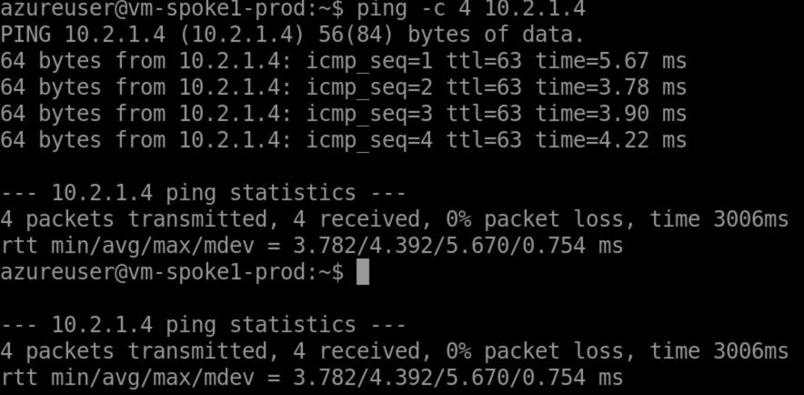

> [!IMPORTANT]
> **Architecturale 'Lesson Learned' & Cloud Gotcha:**
> Hoewel de UDR is ingesteld om internetverkeer (`0.0.0.0/0`) naar de firewall te dwingen, kiest Azure voor intern inter-spoke verkeer altijd de meest specifieke route (Longest Prefix Match). Omdat de systeemroute via de VNet Peering (`10.2.0.0/16`) specifieker is dan `0.0.0.0/0`, bypassde het interne ping-verkeer de Azure Firewall en liep het rechtstreeks via de peering-backbone. 

### Definitieve Productiestatus (Harde Isolatie conform Zero Trust)

Om de omgeving volledig conform het **Zero Trust-principe** op te leveren en kruisbesmetting tussen Productie en Test uit te sluiten, zijn de volgende stappen ondernomen:

1. De tijdelijke validatieregel `Allow-Ping-From-Firewall` is permanent verwijderd uit de NSG.

2. De harde `Deny`-regels (`Deny-Spoke2-Test-Traffic` en `Deny-Spoke1-Prod-Traffic` met Priority 130) zijn geactiveerd op de NSG's.

In de uiteindelijke status is de netwerkomgeving 100% veilig: workloads kunnen uitsluitend via de firewall gecontroleerd naar buiten voor Ubuntu updates, en **inter-spoke communicatie tussen Productie en Test is op subnet-niveau volledig en permanent geblokkeerd**.

---

## 9. Cloud Governance & Cost Control (FinOps)

In een enterprise-omgeving is het bewaken van het cloudbudget net zo belangrijk als de technische architectuur. Om te voorkomen dat resources onnodige kosten veroorzaken, zijn de volgende governance-mechanismen geïmplementeerd:

* **AI-Driven Cost Forecasting:** Er is een maandelijks geautomatiseerd kostenrapport geconfigureerd dat via e-mail een AI-prognose (forecast) stuurt op basis van de actuele runtime van de resources.

* **Proactieve Budget Alerts:** Er is een hard maandelijks budget ingesteld op €5,00, met automatische e-mail notificaties zodra de drempelwaarden van 80% (€4,00) en 100% (€5,00) worden overschreden.

* **Activity Log Alerts:** Er is een centrale Action Group ingericht die direct een e-mail alert triggert bij elke administratieve wijziging (zoals het aanmaken of wijzigen van een Azure Firewall of Bastion-host). Dit garandeert 100% auditability.

Hieronder bevindt zich de officiële Azure Cost Management-analyse, specifiek gefilterd op onze project-tag (`Project = Secure-Hub-Spoke`). Door de granulariteit cumulatief in te stellen en te groeperen op resource-niveau, wordt de exacte kostenverdeling per Azure-service (zoals de Firewall en VM's) tijdens de infrastructuurcyclus transparant aangetoond:

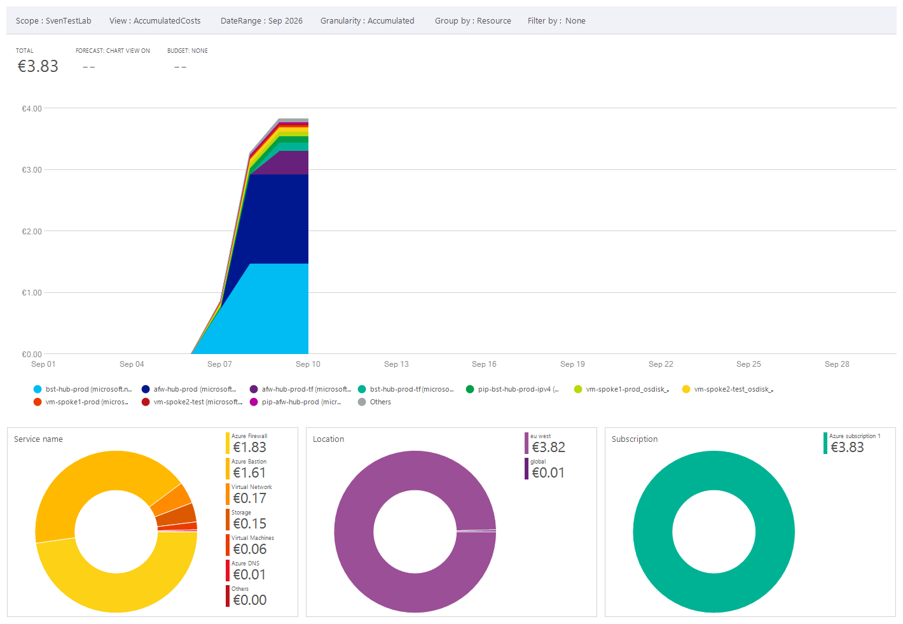

---

## 10. Lessons Learned & Cloud Gotchas

Tijdens de handmatige Proof of Concept (PoC) fase kwamen drie cruciale Azure-platformmechanismen aan het licht:

1. **Azure Portal Pop-up Blocker:** Omdat Azure Bastion de terminal sessie in een afzonderlijk browsertabblad opent, blokkeren moderne internetbrowsers deze verbinding initieel als een ongewenste pop-up. Het expliciet toelaten van pop-ups voor `://azure.com` is vereist voor beheer.

2. **Azure Firewall Basic Subnet Requirement:** In tegenstelling tot de Standard en Premium SKU's, eist de Azure Firewall Basic altijd de gelijktijdige aanwezigheid van een dedicated `AzureFirewallManagementSubnet` (minimaal `/26`), onafhankelijk van het feit of Forced Tunneling ingeschakeld is. Dit dwingt de architect tot een strikte en vroegtijdige scheiding tussen de beheer- en datalijnen.

3. **Strikte Subnet-to-RouteTable Toewijzing:** Bij het exporteren van de ARM-template werd zichtbaar dat het test-subnet (`sn-spoke2-apps`) per ongeluk gekoppeld was aan de Route Table van de productieomgeving (`rt-spoke1-to-hub`). Hoewel de netwerklogica identiek was (`0.0.0.0/0 -> 10.0.4.4`) en de configuratie technisch functioneerde, leert dit ons dat handmatige Portal-configuraties foutgevoelig zijn. Dit onderstreept het absolute belang van de overstap naar Infrastructure as Code (Terraform) in de volgende fase om menselijke fouten uit te sluiten.

---

## 11. Geautomatiseerde Uitrol via Infrastructure as Code (Terraform)

Na de succesvolle handmatige validatiefase (Proof of Concept) is de volledige Hub-and-Spoke architectuur vertaald naar declaratieve code met **HashiCorp Terraform**. Dit elimineert menselijke configuratiefouten en maakt de landing zone volledig consistent en herbruikbaar (FinOps best practice voor lab-omgevingen).

### Architecturale verbeteringen in de code:

* **Resource Groep & Tags:** De gehele opzet is netjes ondergebracht in een geautomatiseerde resource groep met de juiste tags via Terraform.

* **Automatische Firewall IP-berekening:** In plaats van handmatige IP-invoer maakt de code gebruik van de `cidrhost()`-functie om het private IP van de firewall (`10.0.4.4`) dynamisch te berekenen op basis van het subnet.

* **Oplossing van de Peering Bypass:** In de code zijn de Route Tables (`rt-spoke1-to-hub-tf` en `rt-spoke2-to-hub-tf`) direct uitgebreid met specifieke routes voor het inter-spoke verkeer (`10.1.0.0/16` <-> `10.2.0.0/16`). Hierdoor wordt het interne verkeer nu wél dwingend via de Azure Firewall geleid.

* **Strikte Subnet-scheiding:** De menselijke fout uit de handmatige fase (waarbij Spoke 2 per ongeluk naar de Route Table van Spoke 1 wees) is volledig opgelost door strikte, afzonderlijke resource-associaties in code.

### Bewijsvoering van de Terraform Blauwdruk (Planfase)

Vóór de daadwerkelijke uitrol is een gecontroleerde validatie uitgevoerd via de CLI (`terraform validate` en `terraform plan`). 

* De start van de geplande resources is vastgelegd in: `27a_terraform_plan_resources.PNG`.

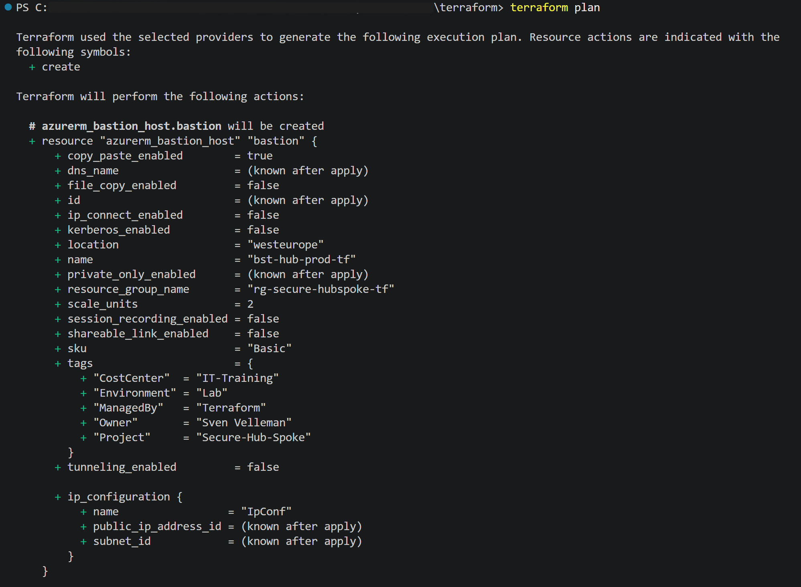

* De foutloze samenvatting van de 42 resources staat in: `27b_terraform_plan_summary.PNG`.

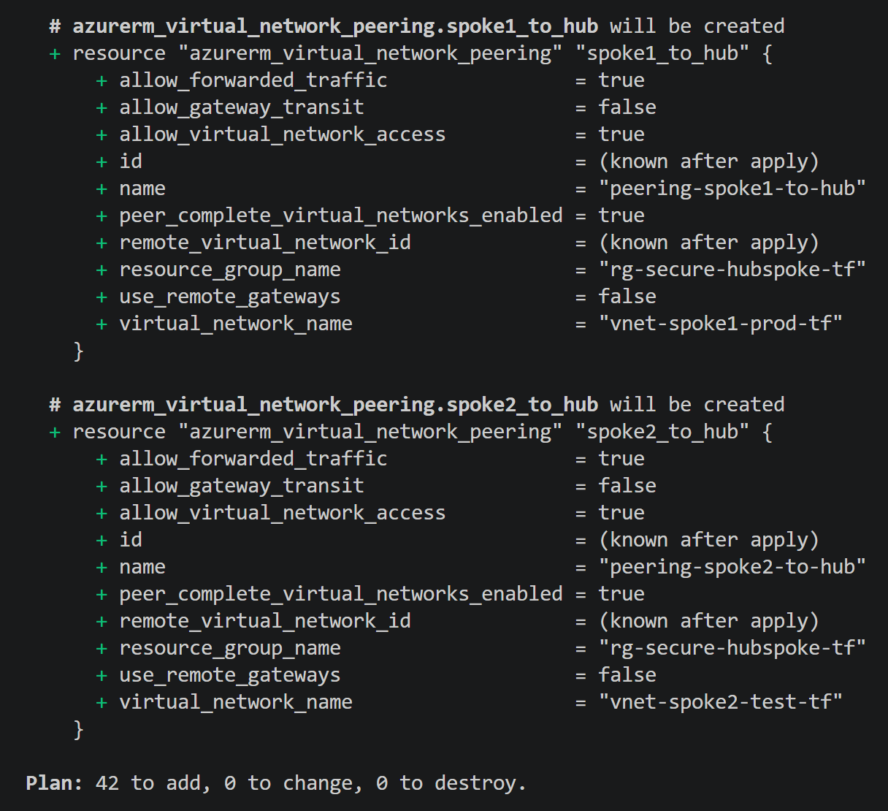

### De Live Uitrol (Apply-fase)

De definitieve lancering en de live-prompt waarbij de infrastructuur is goedgekeurd via de CLI, zijn gedocumenteerd in de volgende screenshots:

* `28a_terraform_apply_start.PNG` (Start van de live API-aanroepen)

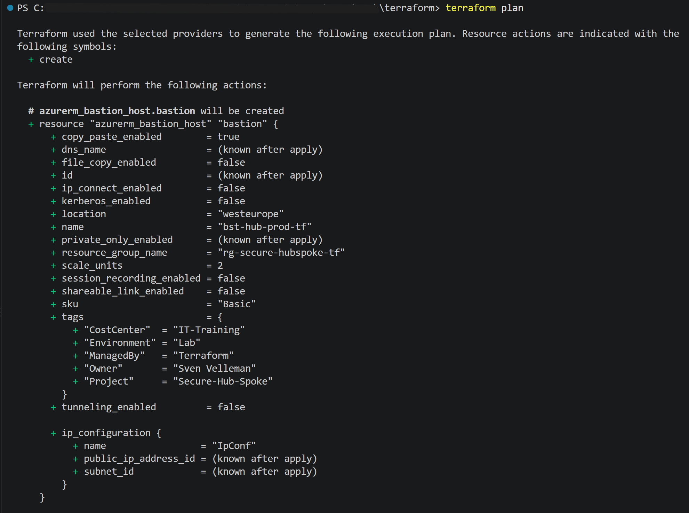

* `28b_terraform_apply_prompt.PNG` (De handmatige `yes`-bevestiging bij de prompt)

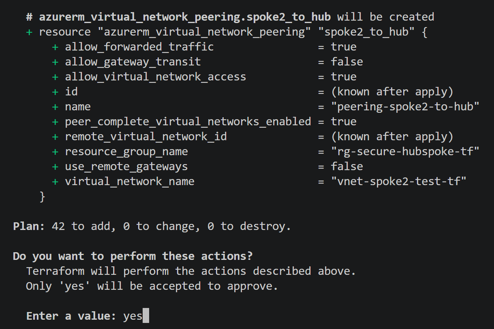

* `29a_terraform_apply_in_progress.PNG` (Het live provisioning-proces in de terminal)

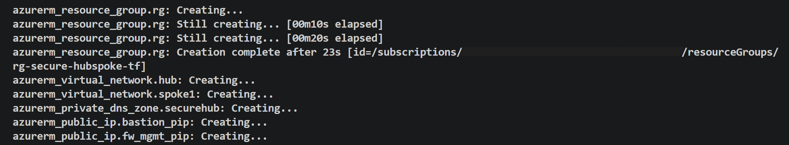

* `29b_terraform_apply_complete.PNG` (Succesvolle oplevering van alle 42 resources)

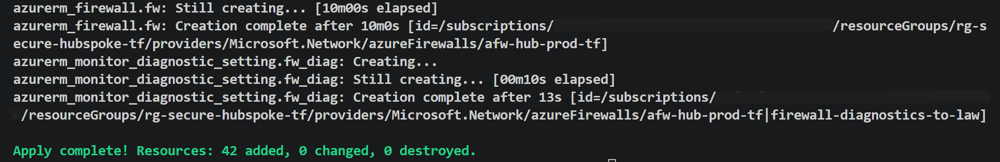

Hieronder bevindt zich de volledige, gecensureerde log-output van de Terraform-opzet ter inspectie:

<details>
<summary>📋 Klik hier om de volledige live uitrol (Apply-logs) te bekijken</summary>

```hcl
PS C:\terraform> terraform plan

Terraform used the selected providers to generate the following execution plan. Resource actions are indicated with the
following symbols:
  + create

Terraform will perform the following actions:

  # azurerm_bastion_host.bastion will be created
  + resource "azurerm_bastion_host" "bastion" {
      + copy_paste_enabled        = true
      + dns_name                  = (known after apply)
      + file_copy_enabled         = false
      + id                        = (known after apply)
      + ip_connect_enabled        = false
      + kerberos_enabled          = false
      + location                  = "westeurope"
      + name                      = "bst-hub-prod-tf"
      + private_only_enabled      = (known after apply)
      + resource_group_name       = "rg-secure-hubspoke-tf"
      + scale_units               = 2
      + session_recording_enabled = false
      + shareable_link_enabled    = false
      + sku                       = "Basic"
      + tags                      = {
          + "CostCenter"  = "IT-Training"
          + "Environment" = "Lab"
          + "ManagedBy"   = "Terraform"
          + "Owner"       = "Sven Velleman"
          + "Project"     = "Secure-Hub-Spoke"
        }
      + tunneling_enabled         = false

      + ip_configuration {
          + name                 = "IpConf"
          + public_ip_address_id = (known after apply)
          + subnet_id            = (known after apply)
        }
    }

  # azurerm_dev_test_global_vm_shutdown_schedule.shutdown_spoke1 will be created
  + resource "azurerm_dev_test_global_vm_shutdown_schedule" "shutdown_spoke1" {
      + daily_recurrence_time = "1800"
      + enabled               = true
      + id                    = (known after apply)
      + location              = "westeurope"
      + timezone              = "Romance Standard Time"
      + virtual_machine_id    = (known after apply)

      + notification_settings {
          + enabled         = false
          + time_in_minutes = 30
        }
    }

  # azurerm_dev_test_global_vm_shutdown_schedule.shutdown_spoke2 will be created
  + resource "azurerm_dev_test_global_vm_shutdown_schedule" "shutdown_spoke2" {
      + daily_recurrence_time = "1800"
      + enabled               = true
      + id                    = (known after apply)
      + location              = "westeurope"
      + timezone              = "Romance Standard Time"
      + virtual_machine_id    = (known after apply)

      + notification_settings {
          + enabled         = false
          + time_in_minutes = 30
        }
    }

  # azurerm_firewall.fw will be created
  + resource "azurerm_firewall" "fw" {
      + dns_proxy_enabled   = (known after apply)
      + firewall_policy_id  = (known after apply)
      + id                  = (known after apply)
      + location            = "westeurope"
      + name                = "afw-hub-prod-tf"
      + resource_group_name = "rg-secure-hubspoke-tf"
      + sku_name            = "AZFW_VNet"
      + sku_tier            = "Basic"
      + tags                = {
          + "CostCenter"  = "IT-Training"
          + "Environment" = "Lab"
          + "ManagedBy"   = "Terraform"
          + "Owner"       = "Sven Velleman"
          + "Project"     = "Secure-Hub-Spoke"
        }
      + threat_intel_mode   = (known after apply)

      + ip_configuration {
          + name                 = "configuration"
          + private_ip_address   = (known after apply)
          + public_ip_address_id = (known after apply)
          + subnet_id            = (known after apply)
        }

      + management_ip_configuration {
          + name                 = "mgmt-configuration"
          + private_ip_address   = (known after apply)
          + public_ip_address_id = (known after apply)
          + subnet_id            = (known after apply)
        }
    }

  # azurerm_firewall_policy.fw_policy will be created
  + resource "azurerm_firewall_policy" "fw_policy" {
      + child_policies           = (known after apply)
      + firewalls                = (known after apply)
      + id                       = (known after apply)
      + location                 = "westeurope"
      + name                     = "afwp-hub-prod-tf"
      + resource_group_name      = "rg-secure-hubspoke-tf"
      + rule_collection_groups   = (known after apply)
      + sku                      = "Basic"
      + tags                     = {
          + "CostCenter"  = "IT-Training"
          + "Environment" = "Lab"
          + "ManagedBy"   = "Terraform"
          + "Owner"       = "Sven Velleman"
          + "Project"     = "Secure-Hub-Spoke"
        }
      + threat_intelligence_mode = "Alert"
    }

  # azurerm_firewall_policy_rule_collection_group.app_rules will be created
  + resource "azurerm_firewall_policy_rule_collection_group" "app_rules" {
      + firewall_policy_id = (known after apply)
      + id                 = (known after apply)
      + name               = "DefaultApplicationRuleCollectionGroup"
      + priority           = 300

      + application_rule_collection {
          + action   = "Allow"
          + name     = "rc-apps-shared"
          + priority = 110

          + rule {
              + destination_fqdns = [
                  + "*.ubuntu.com",
                  + "ubuntu.com",
                ]
              + name              = "allow-ubuntu-updates"
              + source_addresses  = [
                  + "10.1.0.0/16",
                  + "10.2.0.0/16",
                ]

              + protocols {
                  + port = 80
                  + type = "Http"
                }
              + protocols {
                  + port = 443
                  + type = "Https"
                }
            }
        }
    }

  # azurerm_firewall_policy_rule_collection_group.network_rules will be created
  + resource "azurerm_firewall_policy_rule_collection_group" "network_rules" {
      + firewall_policy_id = (known after apply)
      + id                 = (known after apply)
      + name               = "DefaultNetworkRuleCollectionGroup"
      + priority           = 200

      + network_rule_collection {
          + action   = "Allow"
          + name     = "rc-network-shared"
          + priority = 100

          + rule {
              + destination_addresses = [
                  + "*",
                ]
              + destination_ports     = [
                  + "*",
                ]
              + name                  = "allow-outbound-ping"
              + protocols             = [
                  + "ICMP",
                ]
              + source_addresses      = [
                  + "10.1.0.0/16",
                  + "10.2.0.0/16",
                ]
            }
          + rule {
              + destination_addresses = [
                  + "10.1.0.0/16",
                  + "10.2.0.0/16",
                ]
              + destination_ports     = [
                  + "*",
                ]
              + name                  = "allow-interspoke-validation-ping"
              + protocols             = [
                  + "ICMP",
                ]
              + source_addresses      = [
                  + "10.1.0.0/16",
                  + "10.2.0.0/16",
                ]
            }
        }
    }

  # azurerm_linux_virtual_machine.vm_spoke1 will be created
  + resource "azurerm_linux_virtual_machine" "vm_spoke1" {
      + admin_password                                         = (sensitive value)
      + admin_username                                         = "azureuser"
      + allow_extension_operations                             = (known after apply)
      + bypass_platform_safety_checks_on_user_schedule_enabled = false
      + computer_name                                          = (known after apply)
      + disable_password_authentication                        = false
      + disk_controller_type                                   = (known after apply)
      + extensions_time_budget                                 = "PT1H30M"
      + id                                                     = (known after apply)
      + location                                               = "westeurope"
      + max_bid_price                                          = -1
      + name                                                   = "vm-spoke1-prod"
      + network_interface_ids                                  = (known after apply)
      + os_managed_disk_id                                     = (known after apply)
      + patch_assessment_mode                                  = (known after apply)
      + patch_mode                                             = (known after apply)
      + platform_fault_domain                                  = -1
      + priority                                               = "Regular"
      + private_ip_address                                     = (known after apply)
      + private_ip_addresses                                   = (known after apply)
      + provision_vm_agent                                     = (known after apply)
      + public_ip_address                                      = (known after apply)
      + public_ip_addresses                                    = (known after apply)
      + resource_group_name                                    = "rg-secure-hubspoke-tf"
      + size                                                   = "Standard_B1ls"
      + tags                                                   = {
          + "CostCenter"  = "IT-Training"
          + "Environment" = "Lab"
          + "ManagedBy"   = "Terraform"
          + "Owner"       = "Sven Velleman"
          + "Project"     = "Secure-Hub-Spoke"
        }
      + virtual_machine_id                                     = (known after apply)
      + vm_agent_platform_updates_enabled                      = (known after apply)

      + os_disk {
          + caching                   = "ReadWrite"
          + disk_size_gb              = (known after apply)
          + id                        = (known after apply)
          + name                      = (known after apply)
          + storage_account_type      = "Standard_LRS"
          + write_accelerator_enabled = false
        }

      + source_image_reference {
          + offer     = "ubuntu-24_04-lts"
          + publisher = "canonical"
          + sku       = "server"
          + version   = "latest"
        }

      + termination_notification (known after apply)
    }

  # azurerm_linux_virtual_machine.vm_spoke2 will be created
  + resource "azurerm_linux_virtual_machine" "vm_spoke2" {
      + admin_password                                         = (sensitive value)
      + admin_username                                         = "azureuser"
      + allow_extension_operations                             = (known after apply)
      + bypass_platform_safety_checks_on_user_schedule_enabled = false
      + computer_name                                          = (known after apply)
      + disable_password_authentication                        = false
      + disk_controller_type                                   = (known after apply)
      + extensions_time_budget                                 = "PT1H30M"
      + id                                                     = (known after apply)
      + location                                               = "westeurope"
      + max_bid_price                                          = -1
      + name                                                   = "vm-spoke2-test"
      + network_interface_ids                                  = (known after apply)
      + os_managed_disk_id                                     = (known after apply)
      + patch_assessment_mode                                  = (known after apply)
      + patch_mode                                             = (known after apply)
      + platform_fault_domain                                  = -1
      + priority                                               = "Regular"
      + private_ip_address                                     = (known after apply)
      + private_ip_addresses                                   = (known after apply)
      + provision_vm_agent                                     = (known after apply)
      + public_ip_address                                      = (known after apply)
      + public_ip_addresses                                    = (known after apply)
      + resource_group_name                                    = "rg-secure-hubspoke-tf"
      + size                                                   = "Standard_B1ls"
      + tags                                                   = {
          + "CostCenter"  = "IT-Training"
          + "Environment" = "Lab"
          + "ManagedBy"   = "Terraform"
          + "Owner"       = "Sven Velleman"
          + "Project"     = "Secure-Hub-Spoke"
        }
      + virtual_machine_id                                     = (known after apply)
      + vm_agent_platform_updates_enabled                      = (known after apply)

      + os_disk {
          + caching                   = "ReadWrite"
          + disk_size_gb              = (known after apply)
          + id                        = (known after apply)
          + name                      = (known after apply)
          + storage_account_type      = "Standard_LRS"
          + write_accelerator_enabled = false
        }

      + source_image_reference {
          + offer     = "ubuntu-24_04-lts"
          + publisher = "canonical"
          + sku       = "server"
          + version   = "latest"
        }

      + termination_notification (known after apply)
    }

  # azurerm_log_analytics_workspace.law will be created
  + resource "azurerm_log_analytics_workspace" "law" {
      + allow_resource_only_permissions = true
      + daily_quota_gb                  = -1
      + id                              = (known after apply)
      + internet_ingestion_enabled      = true
      + internet_query_enabled          = true
      + local_authentication_disabled   = (known after apply)
      + local_authentication_enabled    = true
      + location                        = "westeurope"
      + name                            = "law-secure-hubspoke-prod-tf"
      + primary_shared_key              = (sensitive value)
      + resource_group_name             = "rg-secure-hubspoke-tf"
      + retention_in_days               = 30
      + secondary_shared_key            = (sensitive value)
      + sku                             = "PerGB2018"
      + tags                            = {
          + "CostCenter"  = "IT-Training"
          + "Environment" = "Lab"
          + "ManagedBy"   = "Terraform"
          + "Owner"       = "Sven Velleman"
          + "Project"     = "Secure-Hub-Spoke"
        }
      + workspace_id                    = (known after apply)
    }

  # azurerm_monitor_diagnostic_setting.fw_diag will be created
  + resource "azurerm_monitor_diagnostic_setting" "fw_diag" {
      + id                             = (known after apply)
      + log_analytics_destination_type = (known after apply)
      + log_analytics_workspace_id     = (known after apply)
      + name                           = "firewall-diagnostics-to-law"
      + target_resource_id             = (known after apply)

      + enabled_log {
          + category       = "AZFWApplicationRule"
            # (1 unchanged attribute hidden)
        }
      + enabled_log {
          + category       = "AZFWNetworkRule"
            # (1 unchanged attribute hidden)
        }

      + enabled_metric {
          + category = "AllMetrics"
        }

      + metric (known after apply)
    }

  # azurerm_network_interface.vm_spoke1_nic will be created
  + resource "azurerm_network_interface" "vm_spoke1_nic" {
      + accelerated_networking_enabled = false
      + applied_dns_servers            = (known after apply)
      + id                             = (known after apply)
      + internal_domain_name_suffix    = (known after apply)
      + ip_forwarding_enabled          = false
      + location                       = "westeurope"
      + mac_address                    = (known after apply)
      + name                           = "vm-spoke1-prod-nic"
      + private_ip_address             = (known after apply)
      + private_ip_addresses           = (known after apply)
      + resource_group_name            = "rg-secure-hubspoke-tf"
      + tags                           = {
          + "CostCenter"  = "IT-Training"
          + "Environment" = "Lab"
          + "ManagedBy"   = "Terraform"
          + "Owner"       = "Sven Velleman"
          + "Project"     = "Secure-Hub-Spoke"
        }
      + virtual_machine_id             = (known after apply)

      + ip_configuration {
          + gateway_load_balancer_frontend_ip_configuration_id = (known after apply)
          + name                                               = "ipconfig1"
          + primary                                            = (known after apply)
          + private_ip_address                                 = (known after apply)
          + private_ip_address_allocation                      = "Dynamic"
          + private_ip_address_version                         = "IPv4"
          + subnet_id                                          = (known after apply)
        }
    }

  # azurerm_network_interface.vm_spoke2_nic will be created
  + resource "azurerm_network_interface" "vm_spoke2_nic" {
      + accelerated_networking_enabled = false
      + applied_dns_servers            = (known after apply)
      + id                             = (known after apply)
      + internal_domain_name_suffix    = (known after apply)
      + ip_forwarding_enabled          = false
      + location                       = "westeurope"
      + mac_address                    = (known after apply)
      + name                           = "vm-spoke2-test-nic"
      + private_ip_address             = (known after apply)
      + private_ip_addresses           = (known after apply)
      + resource_group_name            = "rg-secure-hubspoke-tf"
      + tags                           = {
          + "CostCenter"  = "IT-Training"
          + "Environment" = "Lab"
          + "ManagedBy"   = "Terraform"
          + "Owner"       = "Sven Velleman"
          + "Project"     = "Secure-Hub-Spoke"
        }
      + virtual_machine_id             = (known after apply)

      + ip_configuration {
          + gateway_load_balancer_frontend_ip_configuration_id = (known after apply)
          + name                                               = "ipconfig1"
          + primary                                            = (known after apply)
          + private_ip_address                                 = (known after apply)
          + private_ip_address_allocation                      = "Dynamic"
          + private_ip_address_version                         = "IPv4"
          + subnet_id                                          = (known after apply)
        }
    }

  # azurerm_network_security_group.spoke1_prod will be created
  + resource "azurerm_network_security_group" "spoke1_prod" {
      + id                  = (known after apply)
      + location            = "westeurope"
      + name                = "nsg-spoke1-prod"
      + resource_group_name = "rg-secure-hubspoke-tf"
      + security_rule       = [
          + {
              + access                                     = "Allow"
              + destination_address_prefix                 = "*"
              + destination_address_prefixes               = []
              + destination_application_security_group_ids = []
              + destination_port_range                     = "22"
              + destination_port_ranges                    = []
              + direction                                  = "Inbound"
              + name                                       = "Allow-SSH-From-MgmtSubnet"
              + priority                                   = 120
              + protocol                                   = "Tcp"
              + source_address_prefix                      = "10.0.3.0/24"
              + source_address_prefixes                    = []
              + source_application_security_group_ids      = []
              + source_port_range                          = "*"
              + source_port_ranges                         = []
                # (1 unchanged attribute hidden)
            },
          + {
              + access                                     = "Allow"
              + destination_address_prefix                 = "10.1.0.0/16"
              + destination_address_prefixes               = []
              + destination_application_security_group_ids = []
              + destination_port_range                     = "*"
              + destination_port_ranges                    = []
              + direction                                  = "Inbound"
              + name                                       = "Allow-Ping-From-Firewall"
              + priority                                   = 110
              + protocol                                   = "Icmp"
              + source_address_prefix                      = "10.2.0.0/16"
              + source_address_prefixes                    = []
              + source_application_security_group_ids      = []
              + source_port_range                          = "*"
              + source_port_ranges                         = []
                # (1 unchanged attribute hidden)
            },
          + {
              + access                                     = "Deny"
              + destination_address_prefix                 = "*"
              + destination_address_prefixes               = []
              + destination_application_security_group_ids = []
              + destination_port_range                     = "*"
              + destination_port_ranges                    = []
              + direction                                  = "Inbound"
              + name                                       = "Deny-Spoke2-Test-Traffic"
              + priority                                   = 130
              + protocol                                   = "*"
              + source_address_prefix                      = "10.2.0.0/16"
              + source_address_prefixes                    = []
              + source_application_security_group_ids      = []
              + source_port_range                          = "*"
              + source_port_ranges                         = []
                # (1 unchanged attribute hidden)
            },
        ]
      + tags                = {
          + "CostCenter"  = "IT-Training"
          + "Environment" = "Lab"
          + "ManagedBy"   = "Terraform"
          + "Owner"       = "Sven Velleman"
          + "Project"     = "Secure-Hub-Spoke"
        }
    }

  # azurerm_network_security_group.spoke2_test will be created
  + resource "azurerm_network_security_group" "spoke2_test" {
      + id                  = (known after apply)
      + location            = "westeurope"
      + name                = "nsg-spoke2-test"
      + resource_group_name = "rg-secure-hubspoke-tf"
      + security_rule       = [
          + {
              + access                                     = "Allow"
              + destination_address_prefix                 = "*"
              + destination_address_prefixes               = []
              + destination_application_security_group_ids = []
              + destination_port_range                     = "22"
              + destination_port_ranges                    = []
              + direction                                  = "Inbound"
              + name                                       = "Allow-SSH-From-MgmtSubnet"
              + priority                                   = 120
              + protocol                                   = "Tcp"
              + source_address_prefix                      = "10.0.3.0/24"
              + source_address_prefixes                    = []
              + source_application_security_group_ids      = []
              + source_port_range                          = "*"
              + source_port_ranges                         = []
                # (1 unchanged attribute hidden)
            },
          + {
              + access                                     = "Allow"
              + destination_address_prefix                 = "10.2.0.0/16"
              + destination_address_prefixes               = []
              + destination_application_security_group_ids = []
              + destination_port_range                     = "*"
              + destination_port_ranges                    = []
              + direction                                  = "Inbound"
              + name                                       = "Allow-Ping-From-Firewall"
              + priority                                   = 110
              + protocol                                   = "Icmp"
              + source_address_prefix                      = "10.1.0.0/16"
              + source_address_prefixes                    = []
              + source_application_security_group_ids      = []
              + source_port_range                          = "*"
              + source_port_ranges                         = []
                # (1 unchanged attribute hidden)
            },
          + {
              + access                                     = "Deny"
              + destination_address_prefix                 = "*"
              + destination_address_prefixes               = []
              + destination_application_security_group_ids = []
              + destination_port_range                     = "*"
              + destination_port_ranges                    = []
              + direction                                  = "Inbound"
              + name                                       = "Deny-Spoke1-Prod-Traffic"
              + priority                                   = 130
              + protocol                                   = "*"
              + source_address_prefix                      = "10.1.0.0/16"
              + source_address_prefixes                    = []
              + source_application_security_group_ids      = []
              + source_port_range                          = "*"
              + source_port_ranges                         = []
                # (1 unchanged attribute hidden)
            },
        ]
      + tags                = {
          + "CostCenter"  = "IT-Training"
          + "Environment" = "Lab"
          + "ManagedBy"   = "Terraform"
          + "Owner"       = "Sven Velleman"
          + "Project"     = "Secure-Hub-Spoke"
        }
    }

  # azurerm_private_dns_zone.securehub will be created
  + resource "azurerm_private_dns_zone" "securehub" {
      + id                                                    = (known after apply)
      + max_number_of_record_sets                             = (known after apply)
      + max_number_of_virtual_network_links                   = (known after apply)
      + max_number_of_virtual_network_links_with_registration = (known after apply)
      + name                                                  = "securehub.local"
      + number_of_record_sets                                 = (known after apply)
      + resource_group_name                                   = "rg-secure-hubspoke-tf"
      + tags                                                  = {
          + "CostCenter"  = "IT-Training"
          + "Environment" = "Lab"
          + "ManagedBy"   = "Terraform"
          + "Owner"       = "Sven Velleman"
          + "Project"     = "Secure-Hub-Spoke"
        }

      + soa_record (known after apply)
    }

  # azurerm_private_dns_zone_virtual_network_link.hub_link will be created
  + resource "azurerm_private_dns_zone_virtual_network_link" "hub_link" {
      + id                    = (known after apply)
      + name                  = "link-hub-prod"
      + private_dns_zone_name = "securehub.local"
      + registration_enabled  = false
      + resolution_policy     = (known after apply)
      + resource_group_name   = "rg-secure-hubspoke-tf"
      + tags                  = {
          + "CostCenter"  = "IT-Training"
          + "Environment" = "Lab"
          + "ManagedBy"   = "Terraform"
          + "Owner"       = "Sven Velleman"
          + "Project"     = "Secure-Hub-Spoke"
        }
      + virtual_network_id    = (known after apply)
    }

  # azurerm_private_dns_zone_virtual_network_link.spoke1_link will be created
  + resource "azurerm_private_dns_zone_virtual_network_link" "spoke1_link" {
      + id                    = (known after apply)
      + name                  = "link-spoke1-prod"
      + private_dns_zone_name = "securehub.local"
      + registration_enabled  = true
      + resolution_policy     = (known after apply)
      + resource_group_name   = "rg-secure-hubspoke-tf"
      + tags                  = {
          + "CostCenter"  = "IT-Training"
          + "Environment" = "Lab"
          + "ManagedBy"   = "Terraform"
          + "Owner"       = "Sven Velleman"
          + "Project"     = "Secure-Hub-Spoke"
        }
      + virtual_network_id    = (known after apply)
    }

  # azurerm_private_dns_zone_virtual_network_link.spoke2_link will be created
  + resource "azurerm_private_dns_zone_virtual_network_link" "spoke2_link" {
      + id                    = (known after apply)
      + name                  = "link-spoke2-test"
      + private_dns_zone_name = "securehub.local"
      + registration_enabled  = true
      + resolution_policy     = (known after apply)
      + resource_group_name   = "rg-secure-hubspoke-tf"
      + tags                  = {
          + "CostCenter"  = "IT-Training"
          + "Environment" = "Lab"
          + "ManagedBy"   = "Terraform"
          + "Owner"       = "Sven Velleman"
          + "Project"     = "Secure-Hub-Spoke"
        }
      + virtual_network_id    = (known after apply)
    }

  # azurerm_public_ip.bastion_pip will be created
  + resource "azurerm_public_ip" "bastion_pip" {
      + allocation_method       = "Static"
      + ddos_protection_mode    = "VirtualNetworkInherited"
      + fqdn                    = (known after apply)
      + id                      = (known after apply)
      + idle_timeout_in_minutes = 4
      + ip_address              = (known after apply)
      + ip_version              = "IPv4"
      + location                = "westeurope"
      + name                    = "pip-bst-hub-prod-tf"
      + resource_group_name     = "rg-secure-hubspoke-tf"
      + sku                     = "Standard"
      + sku_tier                = "Regional"
      + tags                    = {
          + "CostCenter"  = "IT-Training"
          + "Environment" = "Lab"
          + "ManagedBy"   = "Terraform"
          + "Owner"       = "Sven Velleman"
          + "Project"     = "Secure-Hub-Spoke"
        }
    }

  # azurerm_public_ip.fw_mgmt_pip will be created
  + resource "azurerm_public_ip" "fw_mgmt_pip" {
      + allocation_method       = "Static"
      + ddos_protection_mode    = "VirtualNetworkInherited"
      + fqdn                    = (known after apply)
      + id                      = (known after apply)
      + idle_timeout_in_minutes = 4
      + ip_address              = (known after apply)
      + ip_version              = "IPv4"
      + location                = "westeurope"
      + name                    = "pip-afw-mgmt-hub-prod-tf"
      + resource_group_name     = "rg-secure-hubspoke-tf"
      + sku                     = "Standard"
      + sku_tier                = "Regional"
      + tags                    = {
          + "CostCenter"  = "IT-Training"
          + "Environment" = "Lab"
          + "ManagedBy"   = "Terraform"
          + "Owner"       = "Sven Velleman"
          + "Project"     = "Secure-Hub-Spoke"
        }
    }

  # azurerm_public_ip.fw_pip will be created
  + resource "azurerm_public_ip" "fw_pip" {
      + allocation_method       = "Static"
      + ddos_protection_mode    = "VirtualNetworkInherited"
      + fqdn                    = (known after apply)
      + id                      = (known after apply)
      + idle_timeout_in_minutes = 4
      + ip_address              = (known after apply)
      + ip_version              = "IPv4"
      + location                = "westeurope"
      + name                    = "pip-afw-hub-prod-tf"
      + resource_group_name     = "rg-secure-hubspoke-tf"
      + sku                     = "Standard"
      + sku_tier                = "Regional"
      + tags                    = {
          + "CostCenter"  = "IT-Training"
          + "Environment" = "Lab"
          + "ManagedBy"   = "Terraform"
          + "Owner"       = "Sven Velleman"
          + "Project"     = "Secure-Hub-Spoke"
        }
    }

  # azurerm_resource_group.rg will be created
  + resource "azurerm_resource_group" "rg" {
      + id       = (known after apply)
      + location = "westeurope"
      + name     = "rg-secure-hubspoke-tf"
      + tags     = {
          + "CostCenter"  = "IT-Training"
          + "Environment" = "Lab"
          + "ManagedBy"   = "Terraform"
          + "Owner"       = "Sven Velleman"
          + "Project"     = "Secure-Hub-Spoke"
        }
    }

  # azurerm_route_table.spoke1_to_hub will be created
  + resource "azurerm_route_table" "spoke1_to_hub" {
      + bgp_route_propagation_enabled = false
      + id                            = (known after apply)
      + location                      = "westeurope"
      + name                          = "rt-spoke1-to-hub-tf"
      + resource_group_name           = "rg-secure-hubspoke-tf"
      + route                         = [
          + {
              + address_prefix         = "0.0.0.0/0"
              + name                   = "to-firewall-prod-default"
              + next_hop_in_ip_address = "10.0.4.4"
              + next_hop_type          = "VirtualAppliance"
            },
          + {
              + address_prefix         = "10.2.0.0/16"
              + name                   = "to-firewall-to-spoke2"
              + next_hop_in_ip_address = "10.0.4.4"
              + next_hop_type          = "VirtualAppliance"
            },
        ]
      + subnets                       = (known after apply)
      + tags                          = {
          + "CostCenter"  = "IT-Training"
          + "Environment" = "Lab"
          + "ManagedBy"   = "Terraform"
          + "Owner"       = "Sven Velleman"
          + "Project"     = "Secure-Hub-Spoke"
        }
    }

  # azurerm_route_table.spoke2_to_hub will be created
  + resource "azurerm_route_table" "spoke2_to_hub" {
      + bgp_route_propagation_enabled = false
      + id                            = (known after apply)
      + location                      = "westeurope"
      + name                          = "rt-spoke2-to-hub-tf"
      + resource_group_name           = "rg-secure-hubspoke-tf"
      + route                         = [
          + {
              + address_prefix         = "0.0.0.0/0"
              + name                   = "to-firewall-test-default"
              + next_hop_in_ip_address = "10.0.4.4"
              + next_hop_type          = "VirtualAppliance"
            },
          + {
              + address_prefix         = "10.1.0.0/16"
              + name                   = "to-firewall-to-spoke1"
              + next_hop_in_ip_address = "10.0.4.4"
              + next_hop_type          = "VirtualAppliance"
            },
        ]
      + subnets                       = (known after apply)
      + tags                          = {
          + "CostCenter"  = "IT-Training"
          + "Environment" = "Lab"
          + "ManagedBy"   = "Terraform"
          + "Owner"       = "Sven Velleman"
          + "Project"     = "Secure-Hub-Spoke"
        }
    }

  # azurerm_subnet.firewall will be created
  + resource "azurerm_subnet" "firewall" {
      + address_prefixes                              = [
          + "10.0.4.0/26",
        ]
      + default_outbound_access_enabled               = true
      + id                                            = (known after apply)
      + name                                          = "AzureFirewallSubnet"
      + private_endpoint_network_policies             = "Disabled"
      + private_link_service_network_policies_enabled = true
      + resource_group_name                           = "rg-secure-hubspoke-tf"
      + virtual_network_name                          = "vnet-hub-prod-tf"
    }

  # azurerm_subnet.firewall_mgmt will be created
  + resource "azurerm_subnet" "firewall_mgmt" {
      + address_prefixes                              = [
          + "10.0.4.64/26",
        ]
      + default_outbound_access_enabled               = true
      + id                                            = (known after apply)
      + name                                          = "AzureFirewallManagementSubnet"
      + private_endpoint_network_policies             = "Disabled"
      + private_link_service_network_policies_enabled = true
      + resource_group_name                           = "rg-secure-hubspoke-tf"
      + virtual_network_name                          = "vnet-hub-prod-tf"
    }

  # azurerm_subnet.hub_bastion will be created
  + resource "azurerm_subnet" "hub_bastion" {
      + address_prefixes                              = [
          + "10.0.2.0/26",
        ]
      + default_outbound_access_enabled               = true
      + id                                            = (known after apply)
      + name                                          = "AzureBastionSubnet"
      + private_endpoint_network_policies             = "Disabled"
      + private_link_service_network_policies_enabled = true
      + resource_group_name                           = "rg-secure-hubspoke-tf"
      + virtual_network_name                          = "vnet-hub-prod-tf"
    }

  # azurerm_subnet.hub_mgmt will be created
  + resource "azurerm_subnet" "hub_mgmt" {
      + address_prefixes                              = [
          + "10.0.3.0/24",
        ]
      + default_outbound_access_enabled               = true
      + id                                            = (known after apply)
      + name                                          = "sn-hub-mgmt"
      + private_endpoint_network_policies             = "Disabled"
      + private_link_service_network_policies_enabled = true
      + resource_group_name                           = "rg-secure-hubspoke-tf"
      + virtual_network_name                          = "vnet-hub-prod-tf"
    }

  # azurerm_subnet.spoke1_apps will be created
  + resource "azurerm_subnet" "spoke1_apps" {
      + address_prefixes                              = [
          + "10.1.1.0/24",
        ]
      + default_outbound_access_enabled               = true
      + id                                            = (known after apply)
      + name                                          = "sn-spoke1-apps"
      + private_endpoint_network_policies             = "Disabled"
      + private_link_service_network_policies_enabled = true
      + resource_group_name                           = "rg-secure-hubspoke-tf"
      + virtual_network_name                          = "vnet-spoke1-prod-tf"
    }

  # azurerm_subnet.spoke2_apps will be created
  + resource "azurerm_subnet" "spoke2_apps" {
      + address_prefixes                              = [
          + "10.2.1.0/24",
        ]
      + default_outbound_access_enabled               = true
      + id                                            = (known after apply)
      + name                                          = "sn-spoke2-apps"
      + private_endpoint_network_policies             = "Disabled"
      + private_link_service_network_policies_enabled = true
      + resource_group_name                           = "rg-secure-hubspoke-tf"
      + virtual_network_name                          = "vnet-spoke2-test-tf"
    }

  # azurerm_subnet_network_security_group_association.spoke1_assoc will be created
  + resource "azurerm_subnet_network_security_group_association" "spoke1_assoc" {
      + id                        = (known after apply)
      + network_security_group_id = (known after apply)
      + subnet_id                 = (known after apply)
    }

  # azurerm_subnet_network_security_group_association.spoke2_assoc will be created
  + resource "azurerm_subnet_network_security_group_association" "spoke2_assoc" {
      + id                        = (known after apply)
      + network_security_group_id = (known after apply)
      + subnet_id                 = (known after apply)
    }

  # azurerm_subnet_route_table_association.spoke1_route_assoc will be created
  + resource "azurerm_subnet_route_table_association" "spoke1_route_assoc" {
      + id             = (known after apply)
      + route_table_id = (known after apply)
      + subnet_id      = (known after apply)
    }

  # azurerm_subnet_route_table_association.spoke2_route_assoc will be created
  + resource "azurerm_subnet_route_table_association" "spoke2_route_assoc" {
      + id             = (known after apply)
      + route_table_id = (known after apply)
      + subnet_id      = (known after apply)
    }

  # azurerm_virtual_network.hub will be created
  + resource "azurerm_virtual_network" "hub" {
      + address_space                  = [
          + "10.0.0.0/16",
        ]
      + dns_servers                    = (known after apply)
      + guid                           = (known after apply)
      + id                             = (known after apply)
      + location                       = "westeurope"
      + name                           = "vnet-hub-prod-tf"
      + private_endpoint_vnet_policies = "Disabled"
      + resource_group_name            = "rg-secure-hubspoke-tf"
      + subnet                         = (known after apply)
      + tags                           = {
          + "CostCenter"  = "IT-Training"
          + "Environment" = "Lab"
          + "ManagedBy"   = "Terraform"
          + "Owner"       = "Sven Velleman"
          + "Project"     = "Secure-Hub-Spoke"
        }
    }

  # azurerm_virtual_network.spoke1 will be created
  + resource "azurerm_virtual_network" "spoke1" {
      + address_space                  = [
          + "10.1.0.0/16",
        ]
      + dns_servers                    = (known after apply)
      + guid                           = (known after apply)
      + id                             = (known after apply)
      + location                       = "westeurope"
      + name                           = "vnet-spoke1-prod-tf"
      + private_endpoint_vnet_policies = "Disabled"
      + resource_group_name            = "rg-secure-hubspoke-tf"
      + subnet                         = (known after apply)
      + tags                           = {
          + "CostCenter"  = "IT-Training"
          + "Environment" = "Lab"
          + "ManagedBy"   = "Terraform"
          + "Owner"       = "Sven Velleman"
          + "Project"     = "Secure-Hub-Spoke"
        }
    }

  # azurerm_virtual_network.spoke2 will be created
  + resource "azurerm_virtual_network" "spoke2" {
      + address_space                  = [
          + "10.2.0.0/16",
        ]
      + dns_servers                    = (known after apply)
      + guid                           = (known after apply)
      + id                             = (known after apply)
      + location                       = "westeurope"
      + name                           = "vnet-spoke2-test-tf"
      + private_endpoint_vnet_policies = "Disabled"
      + resource_group_name            = "rg-secure-hubspoke-tf"
      + subnet                         = (known after apply)
      + tags                           = {
          + "CostCenter"  = "IT-Training"
          + "Environment" = "Lab"
          + "ManagedBy"   = "Terraform"
          + "Owner"       = "Sven Velleman"
          + "Project"     = "Secure-Hub-Spoke"
        }
    }

  # azurerm_virtual_network_peering.hub_to_spoke1 will be created
  + resource "azurerm_virtual_network_peering" "hub_to_spoke1" {
      + allow_forwarded_traffic                = true
      + allow_gateway_transit                  = false
      + allow_virtual_network_access           = true
      + id                                     = (known after apply)
      + name                                   = "peering-hub-to-spoke1"
      + peer_complete_virtual_networks_enabled = true
      + remote_virtual_network_id              = (known after apply)
      + resource_group_name                    = "rg-secure-hubspoke-tf"
      + use_remote_gateways                    = false
      + virtual_network_name                   = "vnet-hub-prod-tf"
    }

  # azurerm_virtual_network_peering.hub_to_spoke2 will be created
  + resource "azurerm_virtual_network_peering" "hub_to_spoke2" {
      + allow_forwarded_traffic                = true
      + allow_gateway_transit                  = false
      + allow_virtual_network_access           = true
      + id                                     = (known after apply)
      + name                                   = "peering-hub-to-spoke2"
      + peer_complete_virtual_networks_enabled = true
      + remote_virtual_network_id              = (known after apply)
      + resource_group_name                    = "rg-secure-hubspoke-tf"
      + use_remote_gateways                    = false
      + virtual_network_name                   = "vnet-hub-prod-tf"
    }

  # azurerm_virtual_network_peering.spoke1_to_hub will be created
  + resource "azurerm_virtual_network_peering" "spoke1_to_hub" {
      + allow_forwarded_traffic                = true
      + allow_gateway_transit                  = false
      + allow_virtual_network_access           = true
      + id                                     = (known after apply)
      + name                                   = "peering-spoke1-to-hub"
      + peer_complete_virtual_networks_enabled = true
      + remote_virtual_network_id              = (known after apply)
      + resource_group_name                    = "rg-secure-hubspoke-tf"
      + use_remote_gateways                    = false
      + virtual_network_name                   = "vnet-spoke1-prod-tf"
    }

  # azurerm_virtual_network_peering.spoke2_to_hub will be created
  + resource "azurerm_virtual_network_peering" "spoke2_to_hub" {
      + allow_forwarded_traffic                = true
      + allow_gateway_transit                  = false
      + allow_virtual_network_access           = true
      + id                                     = (known after apply)
      + name                                   = "peering-spoke2-to-hub"
      + peer_complete_virtual_networks_enabled = true
      + remote_virtual_network_id              = (known after apply)
      + resource_group_name                    = "rg-secure-hubspoke-tf"
      + use_remote_gateways                    = false
      + virtual_network_name                   = "vnet-spoke2-test-tf"
    }

Plan: 42 to add, 0 to change, 0 to destroy.

─────────────────────────────────────────────────────────────────────────────────────────────────────────────────────────────

Note: You didn't use the -out option to save this plan, so Terraform can't guarantee to take exactly these actions if you run
"terraform apply" now.
PS C:\terraform> terraform apply                      

Terraform used the selected providers to generate the following execution plan. Resource actions are indicated with the
following symbols:
  + create

Terraform will perform the following actions:

  # azurerm_bastion_host.bastion will be created
  + resource "azurerm_bastion_host" "bastion" {
      + copy_paste_enabled        = true
      + dns_name                  = (known after apply)
      + file_copy_enabled         = false
      + id                        = (known after apply)
      + ip_connect_enabled        = false
      + kerberos_enabled          = false
      + location                  = "westeurope"
      + name                      = "bst-hub-prod-tf"
      + private_only_enabled      = (known after apply)
      + resource_group_name       = "rg-secure-hubspoke-tf"
      + scale_units               = 2
      + session_recording_enabled = false
      + shareable_link_enabled    = false
      + sku                       = "Basic"
      + tags                      = {
          + "CostCenter"  = "IT-Training"
          + "Environment" = "Lab"
          + "ManagedBy"   = "Terraform"
          + "Owner"       = "Sven Velleman"
          + "Project"     = "Secure-Hub-Spoke"
        }
      + tunneling_enabled         = false

      + ip_configuration {
          + name                 = "IpConf"
          + public_ip_address_id = (known after apply)
          + subnet_id            = (known after apply)
        }
    }

  # azurerm_dev_test_global_vm_shutdown_schedule.shutdown_spoke1 will be created
  + resource "azurerm_dev_test_global_vm_shutdown_schedule" "shutdown_spoke1" {
      + daily_recurrence_time = "1800"
      + enabled               = true
      + id                    = (known after apply)
      + location              = "westeurope"
      + timezone              = "Romance Standard Time"
      + virtual_machine_id    = (known after apply)

      + notification_settings {
          + enabled         = false
          + time_in_minutes = 30
        }
    }

  # azurerm_dev_test_global_vm_shutdown_schedule.shutdown_spoke2 will be created
  + resource "azurerm_dev_test_global_vm_shutdown_schedule" "shutdown_spoke2" {
      + daily_recurrence_time = "1800"
      + enabled               = true
      + id                    = (known after apply)
      + location              = "westeurope"
      + timezone              = "Romance Standard Time"
      + virtual_machine_id    = (known after apply)

      + notification_settings {
          + enabled         = false
          + time_in_minutes = 30
        }
    }

  # azurerm_firewall.fw will be created
  + resource "azurerm_firewall" "fw" {
      + dns_proxy_enabled   = (known after apply)
      + firewall_policy_id  = (known after apply)
      + id                  = (known after apply)
      + location            = "westeurope"
      + name                = "afw-hub-prod-tf"
      + resource_group_name = "rg-secure-hubspoke-tf"
      + sku_name            = "AZFW_VNet"
      + sku_tier            = "Basic"
      + tags                = {
          + "CostCenter"  = "IT-Training"
          + "Environment" = "Lab"
          + "ManagedBy"   = "Terraform"
          + "Owner"       = "Sven Velleman"
          + "Project"     = "Secure-Hub-Spoke"
        }
      + threat_intel_mode   = (known after apply)

      + ip_configuration {
          + name                 = "configuration"
          + private_ip_address   = (known after apply)
          + public_ip_address_id = (known after apply)
          + subnet_id            = (known after apply)
        }

      + management_ip_configuration {
          + name                 = "mgmt-configuration"
          + private_ip_address   = (known after apply)
          + public_ip_address_id = (known after apply)
          + subnet_id            = (known after apply)
        }
    }

  # azurerm_firewall_policy.fw_policy will be created
  + resource "azurerm_firewall_policy" "fw_policy" {
      + child_policies           = (known after apply)
      + firewalls                = (known after apply)
      + id                       = (known after apply)
      + location                 = "westeurope"
      + name                     = "afwp-hub-prod-tf"
      + resource_group_name      = "rg-secure-hubspoke-tf"
      + rule_collection_groups   = (known after apply)
      + sku                      = "Basic"
      + tags                     = {
          + "CostCenter"  = "IT-Training"
          + "Environment" = "Lab"
          + "ManagedBy"   = "Terraform"
          + "Owner"       = "Sven Velleman"
          + "Project"     = "Secure-Hub-Spoke"
        }
      + threat_intelligence_mode = "Alert"
    }

  # azurerm_firewall_policy_rule_collection_group.app_rules will be created
  + resource "azurerm_firewall_policy_rule_collection_group" "app_rules" {
      + firewall_policy_id = (known after apply)
      + id                 = (known after apply)
      + name               = "DefaultApplicationRuleCollectionGroup"
      + priority           = 300

      + application_rule_collection {
          + action   = "Allow"
          + name     = "rc-apps-shared"
          + priority = 110

          + rule {
              + destination_fqdns = [
                  + "*.ubuntu.com",
                  + "ubuntu.com",
                ]
              + name              = "allow-ubuntu-updates"
              + source_addresses  = [
                  + "10.1.0.0/16",
                  + "10.2.0.0/16",
                ]

              + protocols {
                  + port = 80
                  + type = "Http"
                }
              + protocols {
                  + port = 443
                  + type = "Https"
                }
            }
        }
    }

  # azurerm_firewall_policy_rule_collection_group.network_rules will be created
  + resource "azurerm_firewall_policy_rule_collection_group" "network_rules" {
      + firewall_policy_id = (known after apply)
      + id                 = (known after apply)
      + name               = "DefaultNetworkRuleCollectionGroup"
      + priority           = 200

      + network_rule_collection {
          + action   = "Allow"
          + name     = "rc-network-shared"
          + priority = 100

          + rule {
              + destination_addresses = [
                  + "*",
                ]
              + destination_ports     = [
                  + "*",
                ]
              + name                  = "allow-outbound-ping"
              + protocols             = [
                  + "ICMP",
                ]
              + source_addresses      = [
                  + "10.1.0.0/16",
                  + "10.2.0.0/16",
                ]
            }
          + rule {
              + destination_addresses = [
                  + "10.1.0.0/16",
                  + "10.2.0.0/16",
                ]
              + destination_ports     = [
                  + "*",
                ]
              + name                  = "allow-interspoke-validation-ping"
              + protocols             = [
                  + "ICMP",
                ]
              + source_addresses      = [
                  + "10.1.0.0/16",
                  + "10.2.0.0/16",
                ]
            }
        }
    }

  # azurerm_linux_virtual_machine.vm_spoke1 will be created
  + resource "azurerm_linux_virtual_machine" "vm_spoke1" {
      + admin_password                                         = (sensitive value)
      + admin_username                                         = "azureuser"
      + allow_extension_operations                             = (known after apply)
      + bypass_platform_safety_checks_on_user_schedule_enabled = false
      + computer_name                                          = (known after apply)
      + disable_password_authentication                        = false
      + disk_controller_type                                   = (known after apply)
      + extensions_time_budget                                 = "PT1H30M"
      + id                                                     = (known after apply)
      + location                                               = "westeurope"
      + max_bid_price                                          = -1
      + name                                                   = "vm-spoke1-prod"
      + network_interface_ids                                  = (known after apply)
      + os_managed_disk_id                                     = (known after apply)
      + patch_assessment_mode                                  = (known after apply)
      + patch_mode                                             = (known after apply)
      + platform_fault_domain                                  = -1
      + priority                                               = "Regular"
      + private_ip_address                                     = (known after apply)
      + private_ip_addresses                                   = (known after apply)
      + provision_vm_agent                                     = (known after apply)
      + public_ip_address                                      = (known after apply)
      + public_ip_addresses                                    = (known after apply)
      + resource_group_name                                    = "rg-secure-hubspoke-tf"
      + size                                                   = "Standard_B1ls"
      + tags                                                   = {
          + "CostCenter"  = "IT-Training"
          + "Environment" = "Lab"
          + "ManagedBy"   = "Terraform"
          + "Owner"       = "Sven Velleman"
          + "Project"     = "Secure-Hub-Spoke"
        }
      + virtual_machine_id                                     = (known after apply)
      + vm_agent_platform_updates_enabled                      = (known after apply)

      + os_disk {
          + caching                   = "ReadWrite"
          + disk_size_gb              = (known after apply)
          + id                        = (known after apply)
          + name                      = (known after apply)
          + storage_account_type      = "Standard_LRS"
          + write_accelerator_enabled = false
        }

      + source_image_reference {
          + offer     = "ubuntu-24_04-lts"
          + publisher = "canonical"
          + sku       = "server"
          + version   = "latest"
        }

      + termination_notification (known after apply)
    }

  # azurerm_linux_virtual_machine.vm_spoke2 will be created
  + resource "azurerm_linux_virtual_machine" "vm_spoke2" {
      + admin_password                                         = (sensitive value)
      + admin_username                                         = "azureuser"
      + allow_extension_operations                             = (known after apply)
      + bypass_platform_safety_checks_on_user_schedule_enabled = false
      + computer_name                                          = (known after apply)
      + disable_password_authentication                        = false
      + disk_controller_type                                   = (known after apply)
      + extensions_time_budget                                 = "PT1H30M"
      + id                                                     = (known after apply)
      + location                                               = "westeurope"
      + max_bid_price                                          = -1
      + name                                                   = "vm-spoke2-test"
      + network_interface_ids                                  = (known after apply)
      + os_managed_disk_id                                     = (known after apply)
      + patch_assessment_mode                                  = (known after apply)
      + patch_mode                                             = (known after apply)
      + platform_fault_domain                                  = -1
      + priority                                               = "Regular"
      + private_ip_address                                     = (known after apply)
      + private_ip_addresses                                   = (known after apply)
      + provision_vm_agent                                     = (known after apply)
      + public_ip_address                                      = (known after apply)
      + public_ip_addresses                                    = (known after apply)
      + resource_group_name                                    = "rg-secure-hubspoke-tf"
      + size                                                   = "Standard_B1ls"
      + tags                                                   = {
          + "CostCenter"  = "IT-Training"
          + "Environment" = "Lab"
          + "ManagedBy"   = "Terraform"
          + "Owner"       = "Sven Velleman"
          + "Project"     = "Secure-Hub-Spoke"
        }
      + virtual_machine_id                                     = (known after apply)
      + vm_agent_platform_updates_enabled                      = (known after apply)

      + os_disk {
          + caching                   = "ReadWrite"
          + disk_size_gb              = (known after apply)
          + id                        = (known after apply)
          + name                      = (known after apply)
          + storage_account_type      = "Standard_LRS"
          + write_accelerator_enabled = false
        }

      + source_image_reference {
          + offer     = "ubuntu-24_04-lts"
          + publisher = "canonical"
          + sku       = "server"
          + version   = "latest"
        }

      + termination_notification (known after apply)
    }

  # azurerm_log_analytics_workspace.law will be created
  + resource "azurerm_log_analytics_workspace" "law" {
      + allow_resource_only_permissions = true
      + daily_quota_gb                  = -1
      + id                              = (known after apply)
      + internet_ingestion_enabled      = true
      + internet_query_enabled          = true
      + local_authentication_disabled   = (known after apply)
      + local_authentication_enabled    = true
      + location                        = "westeurope"
      + name                            = "law-secure-hubspoke-prod-tf"
      + primary_shared_key              = (sensitive value)
      + resource_group_name             = "rg-secure-hubspoke-tf"
      + retention_in_days               = 30
      + secondary_shared_key            = (sensitive value)
      + sku                             = "PerGB2018"
      + tags                            = {
          + "CostCenter"  = "IT-Training"
          + "Environment" = "Lab"
          + "ManagedBy"   = "Terraform"
          + "Owner"       = "Sven Velleman"
          + "Project"     = "Secure-Hub-Spoke"
        }
      + workspace_id                    = (known after apply)
    }

  # azurerm_monitor_diagnostic_setting.fw_diag will be created
  + resource "azurerm_monitor_diagnostic_setting" "fw_diag" {
      + id                             = (known after apply)
      + log_analytics_destination_type = (known after apply)
      + log_analytics_workspace_id     = (known after apply)
      + name                           = "firewall-diagnostics-to-law"
      + target_resource_id             = (known after apply)

      + enabled_log {
          + category       = "AZFWApplicationRule"
            # (1 unchanged attribute hidden)
        }
      + enabled_log {
          + category       = "AZFWNetworkRule"
            # (1 unchanged attribute hidden)
        }

      + enabled_metric {
          + category = "AllMetrics"
        }

      + metric (known after apply)
    }

  # azurerm_network_interface.vm_spoke1_nic will be created
  + resource "azurerm_network_interface" "vm_spoke1_nic" {
      + accelerated_networking_enabled = false
      + applied_dns_servers            = (known after apply)
      + id                             = (known after apply)
      + internal_domain_name_suffix    = (known after apply)
      + ip_forwarding_enabled          = false
      + location                       = "westeurope"
      + mac_address                    = (known after apply)
      + name                           = "vm-spoke1-prod-nic"
      + private_ip_address             = (known after apply)
      + private_ip_addresses           = (known after apply)
      + resource_group_name            = "rg-secure-hubspoke-tf"
      + tags                           = {
          + "CostCenter"  = "IT-Training"
          + "Environment" = "Lab"
          + "ManagedBy"   = "Terraform"
          + "Owner"       = "Sven Velleman"
          + "Project"     = "Secure-Hub-Spoke"
        }
      + virtual_machine_id             = (known after apply)

      + ip_configuration {
          + gateway_load_balancer_frontend_ip_configuration_id = (known after apply)
          + name                                               = "ipconfig1"
          + primary                                            = (known after apply)
          + private_ip_address                                 = (known after apply)
          + private_ip_address_allocation                      = "Dynamic"
          + private_ip_address_version                         = "IPv4"
          + subnet_id                                          = (known after apply)
        }
    }

  # azurerm_network_interface.vm_spoke2_nic will be created
  + resource "azurerm_network_interface" "vm_spoke2_nic" {
      + accelerated_networking_enabled = false
      + applied_dns_servers            = (known after apply)
      + id                             = (known after apply)
      + internal_domain_name_suffix    = (known after apply)
      + ip_forwarding_enabled          = false
      + location                       = "westeurope"
      + mac_address                    = (known after apply)
      + name                           = "vm-spoke2-test-nic"
      + private_ip_address             = (known after apply)
      + private_ip_addresses           = (known after apply)
      + resource_group_name            = "rg-secure-hubspoke-tf"
      + tags                           = {
          + "CostCenter"  = "IT-Training"
          + "Environment" = "Lab"
          + "ManagedBy"   = "Terraform"
          + "Owner"       = "Sven Velleman"
          + "Project"     = "Secure-Hub-Spoke"
        }
      + virtual_machine_id             = (known after apply)

      + ip_configuration {
          + gateway_load_balancer_frontend_ip_configuration_id = (known after apply)
          + name                                               = "ipconfig1"
          + primary                                            = (known after apply)
          + private_ip_address                                 = (known after apply)
          + private_ip_address_allocation                      = "Dynamic"
          + private_ip_address_version                         = "IPv4"
          + subnet_id                                          = (known after apply)
        }
    }

  # azurerm_network_security_group.spoke1_prod will be created
  + resource "azurerm_network_security_group" "spoke1_prod" {
      + id                  = (known after apply)
      + location            = "westeurope"
      + name                = "nsg-spoke1-prod"
      + resource_group_name = "rg-secure-hubspoke-tf"
      + security_rule       = [
          + {
              + access                                     = "Allow"
              + destination_address_prefix                 = "*"
              + destination_address_prefixes               = []
              + destination_application_security_group_ids = []
              + destination_port_range                     = "22"
              + destination_port_ranges                    = []
              + direction                                  = "Inbound"
              + name                                       = "Allow-SSH-From-MgmtSubnet"
              + priority                                   = 120
              + protocol                                   = "Tcp"
              + source_address_prefix                      = "10.0.3.0/24"
              + source_address_prefixes                    = []
              + source_application_security_group_ids      = []
              + source_port_range                          = "*"
              + source_port_ranges                         = []
                # (1 unchanged attribute hidden)
            },
          + {
              + access                                     = "Allow"
              + destination_address_prefix                 = "10.1.0.0/16"
              + destination_address_prefixes               = []
              + destination_application_security_group_ids = []
              + destination_port_range                     = "*"
              + destination_port_ranges                    = []
              + direction                                  = "Inbound"
              + name                                       = "Allow-Ping-From-Firewall"
              + priority                                   = 110
              + protocol                                   = "Icmp"
              + source_address_prefix                      = "10.2.0.0/16"
              + source_address_prefixes                    = []
              + source_application_security_group_ids      = []
              + source_port_range                          = "*"
              + source_port_ranges                         = []
                # (1 unchanged attribute hidden)
            },
          + {
              + access                                     = "Deny"
              + destination_address_prefix                 = "*"
              + destination_address_prefixes               = []
              + destination_application_security_group_ids = []
              + destination_port_range                     = "*"
              + destination_port_ranges                    = []
              + direction                                  = "Inbound"
              + name                                       = "Deny-Spoke2-Test-Traffic"
              + priority                                   = 130
              + protocol                                   = "*"
              + source_address_prefix                      = "10.2.0.0/16"
              + source_address_prefixes                    = []
              + source_application_security_group_ids      = []
              + source_port_range                          = "*"
              + source_port_ranges                         = []
                # (1 unchanged attribute hidden)
            },
        ]
      + tags                = {
          + "CostCenter"  = "IT-Training"
          + "Environment" = "Lab"
          + "ManagedBy"   = "Terraform"
          + "Owner"       = "Sven Velleman"
          + "Project"     = "Secure-Hub-Spoke"
        }
    }

  # azurerm_network_security_group.spoke2_test will be created
  + resource "azurerm_network_security_group" "spoke2_test" {
      + id                  = (known after apply)
      + location            = "westeurope"
      + name                = "nsg-spoke2-test"
      + resource_group_name = "rg-secure-hubspoke-tf"
      + security_rule       = [
          + {
              + access                                     = "Allow"
              + destination_address_prefix                 = "*"
              + destination_address_prefixes               = []
              + destination_application_security_group_ids = []
              + destination_port_range                     = "22"
              + destination_port_ranges                    = []
              + direction                                  = "Inbound"
              + name                                       = "Allow-SSH-From-MgmtSubnet"
              + priority                                   = 120
              + protocol                                   = "Tcp"
              + source_address_prefix                      = "10.0.3.0/24"
              + source_address_prefixes                    = []
              + source_application_security_group_ids      = []
              + source_port_range                          = "*"
              + source_port_ranges                         = []
                # (1 unchanged attribute hidden)
            },
          + {
              + access                                     = "Allow"
              + destination_address_prefix                 = "10.2.0.0/16"
              + destination_address_prefixes               = []
              + destination_application_security_group_ids = []
              + destination_port_range                     = "*"
              + destination_port_ranges                    = []
              + direction                                  = "Inbound"
              + name                                       = "Allow-Ping-From-Firewall"
              + priority                                   = 110
              + protocol                                   = "Icmp"
              + source_address_prefix                      = "10.1.0.0/16"
              + source_address_prefixes                    = []
              + source_application_security_group_ids      = []
              + source_port_range                          = "*"
              + source_port_ranges                         = []
                # (1 unchanged attribute hidden)
            },
          + {
              + access                                     = "Deny"
              + destination_address_prefix                 = "*"
              + destination_address_prefixes               = []
              + destination_application_security_group_ids = []
              + destination_port_range                     = "*"
              + destination_port_ranges                    = []
              + direction                                  = "Inbound"
              + name                                       = "Deny-Spoke1-Prod-Traffic"
              + priority                                   = 130
              + protocol                                   = "*"
              + source_address_prefix                      = "10.1.0.0/16"
              + source_address_prefixes                    = []
              + source_application_security_group_ids      = []
              + source_port_range                          = "*"
              + source_port_ranges                         = []
                # (1 unchanged attribute hidden)
            },
        ]
      + tags                = {
          + "CostCenter"  = "IT-Training"
          + "Environment" = "Lab"
          + "ManagedBy"   = "Terraform"
          + "Owner"       = "Sven Velleman"
          + "Project"     = "Secure-Hub-Spoke"
        }
    }

  # azurerm_private_dns_zone.securehub will be created
  + resource "azurerm_private_dns_zone" "securehub" {
      + id                                                    = (known after apply)
      + max_number_of_record_sets                             = (known after apply)
      + max_number_of_virtual_network_links                   = (known after apply)
      + max_number_of_virtual_network_links_with_registration = (known after apply)
      + name                                                  = "securehub.local"
      + number_of_record_sets                                 = (known after apply)
      + resource_group_name                                   = "rg-secure-hubspoke-tf"
      + tags                                                  = {
          + "CostCenter"  = "IT-Training"
          + "Environment" = "Lab"
          + "ManagedBy"   = "Terraform"
          + "Owner"       = "Sven Velleman"
          + "Project"     = "Secure-Hub-Spoke"
        }

      + soa_record (known after apply)
    }

  # azurerm_private_dns_zone_virtual_network_link.hub_link will be created
  + resource "azurerm_private_dns_zone_virtual_network_link" "hub_link" {
      + id                    = (known after apply)
      + name                  = "link-hub-prod"
      + private_dns_zone_name = "securehub.local"
      + registration_enabled  = false
      + resolution_policy     = (known after apply)
      + resource_group_name   = "rg-secure-hubspoke-tf"
      + tags                  = {
          + "CostCenter"  = "IT-Training"
          + "Environment" = "Lab"
          + "ManagedBy"   = "Terraform"
          + "Owner"       = "Sven Velleman"
          + "Project"     = "Secure-Hub-Spoke"
        }
      + virtual_network_id    = (known after apply)
    }

  # azurerm_private_dns_zone_virtual_network_link.spoke1_link will be created
  + resource "azurerm_private_dns_zone_virtual_network_link" "spoke1_link" {
      + id                    = (known after apply)
      + name                  = "link-spoke1-prod"
      + private_dns_zone_name = "securehub.local"
      + registration_enabled  = true
      + resolution_policy     = (known after apply)
      + resource_group_name   = "rg-secure-hubspoke-tf"
      + tags                  = {
          + "CostCenter"  = "IT-Training"
          + "Environment" = "Lab"
          + "ManagedBy"   = "Terraform"
          + "Owner"       = "Sven Velleman"
          + "Project"     = "Secure-Hub-Spoke"
        }
      + virtual_network_id    = (known after apply)
    }

  # azurerm_private_dns_zone_virtual_network_link.spoke2_link will be created
  + resource "azurerm_private_dns_zone_virtual_network_link" "spoke2_link" {
      + id                    = (known after apply)
      + name                  = "link-spoke2-test"
      + private_dns_zone_name = "securehub.local"
      + registration_enabled  = true
      + resolution_policy     = (known after apply)
      + resource_group_name   = "rg-secure-hubspoke-tf"
      + tags                  = {
          + "CostCenter"  = "IT-Training"
          + "Environment" = "Lab"
          + "ManagedBy"   = "Terraform"
          + "Owner"       = "Sven Velleman"
          + "Project"     = "Secure-Hub-Spoke"
        }
      + virtual_network_id    = (known after apply)
    }

  # azurerm_public_ip.bastion_pip will be created
  + resource "azurerm_public_ip" "bastion_pip" {
      + allocation_method       = "Static"
      + ddos_protection_mode    = "VirtualNetworkInherited"
      + fqdn                    = (known after apply)
      + id                      = (known after apply)
      + idle_timeout_in_minutes = 4
      + ip_address              = (known after apply)
      + ip_version              = "IPv4"
      + location                = "westeurope"
      + name                    = "pip-bst-hub-prod-tf"
      + resource_group_name     = "rg-secure-hubspoke-tf"
      + sku                     = "Standard"
      + sku_tier                = "Regional"
      + tags                    = {
          + "CostCenter"  = "IT-Training"
          + "Environment" = "Lab"
          + "ManagedBy"   = "Terraform"
          + "Owner"       = "Sven Velleman"
          + "Project"     = "Secure-Hub-Spoke"
        }
    }

  # azurerm_public_ip.fw_mgmt_pip will be created
  + resource "azurerm_public_ip" "fw_mgmt_pip" {
      + allocation_method       = "Static"
      + ddos_protection_mode    = "VirtualNetworkInherited"
      + fqdn                    = (known after apply)
      + id                      = (known after apply)
      + idle_timeout_in_minutes = 4
      + ip_address              = (known after apply)
      + ip_version              = "IPv4"
      + location                = "westeurope"
      + name                    = "pip-afw-mgmt-hub-prod-tf"
      + resource_group_name     = "rg-secure-hubspoke-tf"
      + sku                     = "Standard"
      + sku_tier                = "Regional"
      + tags                    = {
          + "CostCenter"  = "IT-Training"
          + "Environment" = "Lab"
          + "ManagedBy"   = "Terraform"
          + "Owner"       = "Sven Velleman"
          + "Project"     = "Secure-Hub-Spoke"
        }
    }

  # azurerm_public_ip.fw_pip will be created
  + resource "azurerm_public_ip" "fw_pip" {
      + allocation_method       = "Static"
      + ddos_protection_mode    = "VirtualNetworkInherited"
      + fqdn                    = (known after apply)
      + id                      = (known after apply)
      + idle_timeout_in_minutes = 4
      + ip_address              = (known after apply)
      + ip_version              = "IPv4"
      + location                = "westeurope"
      + name                    = "pip-afw-hub-prod-tf"
      + resource_group_name     = "rg-secure-hubspoke-tf"
      + sku                     = "Standard"
      + sku_tier                = "Regional"
      + tags                    = {
          + "CostCenter"  = "IT-Training"
          + "Environment" = "Lab"
          + "ManagedBy"   = "Terraform"
          + "Owner"       = "Sven Velleman"
          + "Project"     = "Secure-Hub-Spoke"
        }
    }

  # azurerm_resource_group.rg will be created
  + resource "azurerm_resource_group" "rg" {
      + id       = (known after apply)
      + location = "westeurope"
      + name     = "rg-secure-hubspoke-tf"
      + tags     = {
          + "CostCenter"  = "IT-Training"
          + "Environment" = "Lab"
          + "ManagedBy"   = "Terraform"
          + "Owner"       = "Sven Velleman"
          + "Project"     = "Secure-Hub-Spoke"
        }
    }

  # azurerm_route_table.spoke1_to_hub will be created
  + resource "azurerm_route_table" "spoke1_to_hub" {
      + bgp_route_propagation_enabled = false
      + id                            = (known after apply)
      + location                      = "westeurope"
      + name                          = "rt-spoke1-to-hub-tf"
      + resource_group_name           = "rg-secure-hubspoke-tf"
      + route                         = [
          + {
              + address_prefix         = "0.0.0.0/0"
              + name                   = "to-firewall-prod-default"
              + next_hop_in_ip_address = "10.0.4.4"
              + next_hop_type          = "VirtualAppliance"
            },
          + {
              + address_prefix         = "10.2.0.0/16"
              + name                   = "to-firewall-to-spoke2"
              + next_hop_in_ip_address = "10.0.4.4"
              + next_hop_type          = "VirtualAppliance"
            },
        ]
      + subnets                       = (known after apply)
      + tags                          = {
          + "CostCenter"  = "IT-Training"
          + "Environment" = "Lab"
          + "ManagedBy"   = "Terraform"
          + "Owner"       = "Sven Velleman"
          + "Project"     = "Secure-Hub-Spoke"
        }
    }

  # azurerm_route_table.spoke2_to_hub will be created
  + resource "azurerm_route_table" "spoke2_to_hub" {
      + bgp_route_propagation_enabled = false
      + id                            = (known after apply)
      + location                      = "westeurope"
      + name                          = "rt-spoke2-to-hub-tf"
      + resource_group_name           = "rg-secure-hubspoke-tf"
      + route                         = [
          + {
              + address_prefix         = "0.0.0.0/0"
              + name                   = "to-firewall-test-default"
              + next_hop_in_ip_address = "10.0.4.4"
              + next_hop_type          = "VirtualAppliance"
            },
          + {
              + address_prefix         = "10.1.0.0/16"
              + name                   = "to-firewall-to-spoke1"
              + next_hop_in_ip_address = "10.0.4.4"
              + next_hop_type          = "VirtualAppliance"
            },
        ]
      + subnets                       = (known after apply)
      + tags                          = {
          + "CostCenter"  = "IT-Training"
          + "Environment" = "Lab"
          + "ManagedBy"   = "Terraform"
          + "Owner"       = "Sven Velleman"
          + "Project"     = "Secure-Hub-Spoke"
        }
    }

  # azurerm_subnet.firewall will be created
  + resource "azurerm_subnet" "firewall" {
      + address_prefixes                              = [
          + "10.0.4.0/26",
        ]
      + default_outbound_access_enabled               = true
      + id                                            = (known after apply)
      + name                                          = "AzureFirewallSubnet"
      + private_endpoint_network_policies             = "Disabled"
      + private_link_service_network_policies_enabled = true
      + resource_group_name                           = "rg-secure-hubspoke-tf"
      + virtual_network_name                          = "vnet-hub-prod-tf"
    }

  # azurerm_subnet.firewall_mgmt will be created
  + resource "azurerm_subnet" "firewall_mgmt" {
      + address_prefixes                              = [
          + "10.0.4.64/26",
        ]
      + default_outbound_access_enabled               = true
      + id                                            = (known after apply)
      + name                                          = "AzureFirewallManagementSubnet"
      + private_endpoint_network_policies             = "Disabled"
      + private_link_service_network_policies_enabled = true
      + resource_group_name                           = "rg-secure-hubspoke-tf"
      + virtual_network_name                          = "vnet-hub-prod-tf"
    }

  # azurerm_subnet.hub_bastion will be created
  + resource "azurerm_subnet" "hub_bastion" {
      + address_prefixes                              = [
          + "10.0.2.0/26",
        ]
      + default_outbound_access_enabled               = true
      + id                                            = (known after apply)
      + name                                          = "AzureBastionSubnet"
      + private_endpoint_network_policies             = "Disabled"
      + private_link_service_network_policies_enabled = true
      + resource_group_name                           = "rg-secure-hubspoke-tf"
      + virtual_network_name                          = "vnet-hub-prod-tf"
    }

  # azurerm_subnet.hub_mgmt will be created
  + resource "azurerm_subnet" "hub_mgmt" {
      + address_prefixes                              = [
          + "10.0.3.0/24",
        ]
      + default_outbound_access_enabled               = true
      + id                                            = (known after apply)
      + name                                          = "sn-hub-mgmt"
      + private_endpoint_network_policies             = "Disabled"
      + private_link_service_network_policies_enabled = true
      + resource_group_name                           = "rg-secure-hubspoke-tf"
      + virtual_network_name                          = "vnet-hub-prod-tf"
    }

  # azurerm_subnet.spoke1_apps will be created
  + resource "azurerm_subnet" "spoke1_apps" {
      + address_prefixes                              = [
          + "10.1.1.0/24",
        ]
      + default_outbound_access_enabled               = true
      + id                                            = (known after apply)
      + name                                          = "sn-spoke1-apps"
      + private_endpoint_network_policies             = "Disabled"
      + private_link_service_network_policies_enabled = true
      + resource_group_name                           = "rg-secure-hubspoke-tf"
      + virtual_network_name                          = "vnet-spoke1-prod-tf"
    }

  # azurerm_subnet.spoke2_apps will be created
  + resource "azurerm_subnet" "spoke2_apps" {
      + address_prefixes                              = [
          + "10.2.1.0/24",
        ]
      + default_outbound_access_enabled               = true
      + id                                            = (known after apply)
      + name                                          = "sn-spoke2-apps"
      + private_endpoint_network_policies             = "Disabled"
      + private_link_service_network_policies_enabled = true
      + resource_group_name                           = "rg-secure-hubspoke-tf"
      + virtual_network_name                          = "vnet-spoke2-test-tf"
    }

  # azurerm_subnet_network_security_group_association.spoke1_assoc will be created
  + resource "azurerm_subnet_network_security_group_association" "spoke1_assoc" {
      + id                        = (known after apply)
      + network_security_group_id = (known after apply)
      + subnet_id                 = (known after apply)
    }

  # azurerm_subnet_network_security_group_association.spoke2_assoc will be created
  + resource "azurerm_subnet_network_security_group_association" "spoke2_assoc" {
      + id                        = (known after apply)
      + network_security_group_id = (known after apply)
      + subnet_id                 = (known after apply)
    }

  # azurerm_subnet_route_table_association.spoke1_route_assoc will be created
  + resource "azurerm_subnet_route_table_association" "spoke1_route_assoc" {
      + id             = (known after apply)
      + route_table_id = (known after apply)
      + subnet_id      = (known after apply)
    }

  # azurerm_subnet_route_table_association.spoke2_route_assoc will be created
  + resource "azurerm_subnet_route_table_association" "spoke2_route_assoc" {
      + id             = (known after apply)
      + route_table_id = (known after apply)
      + subnet_id      = (known after apply)
    }

  # azurerm_virtual_network.hub will be created
  + resource "azurerm_virtual_network" "hub" {
      + address_space                  = [
          + "10.0.0.0/16",
        ]
      + dns_servers                    = (known after apply)
      + guid                           = (known after apply)
      + id                             = (known after apply)
      + location                       = "westeurope"
      + name                           = "vnet-hub-prod-tf"
      + private_endpoint_vnet_policies = "Disabled"
      + resource_group_name            = "rg-secure-hubspoke-tf"
      + subnet                         = (known after apply)
      + tags                           = {
          + "CostCenter"  = "IT-Training"
          + "Environment" = "Lab"
          + "ManagedBy"   = "Terraform"
          + "Owner"       = "Sven Velleman"
          + "Project"     = "Secure-Hub-Spoke"
        }
    }

  # azurerm_virtual_network.spoke1 will be created
  + resource "azurerm_virtual_network" "spoke1" {
      + address_space                  = [
          + "10.1.0.0/16",
        ]
      + dns_servers                    = (known after apply)
      + guid                           = (known after apply)
      + id                             = (known after apply)
      + location                       = "westeurope"
      + name                           = "vnet-spoke1-prod-tf"
      + private_endpoint_vnet_policies = "Disabled"
      + resource_group_name            = "rg-secure-hubspoke-tf"
      + subnet                         = (known after apply)
      + tags                           = {
          + "CostCenter"  = "IT-Training"
          + "Environment" = "Lab"
          + "ManagedBy"   = "Terraform"
          + "Owner"       = "Sven Velleman"
          + "Project"     = "Secure-Hub-Spoke"
        }
    }

  # azurerm_virtual_network.spoke2 will be created
  + resource "azurerm_virtual_network" "spoke2" {
      + address_space                  = [
          + "10.2.0.0/16",
        ]
      + dns_servers                    = (known after apply)
      + guid                           = (known after apply)
      + id                             = (known after apply)
      + location                       = "westeurope"
      + name                           = "vnet-spoke2-test-tf"
      + private_endpoint_vnet_policies = "Disabled"
      + resource_group_name            = "rg-secure-hubspoke-tf"
      + subnet                         = (known after apply)
      + tags                           = {
          + "CostCenter"  = "IT-Training"
          + "Environment" = "Lab"
          + "ManagedBy"   = "Terraform"
          + "Owner"       = "Sven Velleman"
          + "Project"     = "Secure-Hub-Spoke"
        }
    }

  # azurerm_virtual_network_peering.hub_to_spoke1 will be created
  + resource "azurerm_virtual_network_peering" "hub_to_spoke1" {
      + allow_forwarded_traffic                = true
      + allow_gateway_transit                  = false
      + allow_virtual_network_access           = true
      + id                                     = (known after apply)
      + name                                   = "peering-hub-to-spoke1"
      + peer_complete_virtual_networks_enabled = true
      + remote_virtual_network_id              = (known after apply)
      + resource_group_name                    = "rg-secure-hubspoke-tf"
      + use_remote_gateways                    = false
      + virtual_network_name                   = "vnet-hub-prod-tf"
    }

  # azurerm_virtual_network_peering.hub_to_spoke2 will be created
  + resource "azurerm_virtual_network_peering" "hub_to_spoke2" {
      + allow_forwarded_traffic                = true
      + allow_gateway_transit                  = false
      + allow_virtual_network_access           = true
      + id                                     = (known after apply)
      + name                                   = "peering-hub-to-spoke2"
      + peer_complete_virtual_networks_enabled = true
      + remote_virtual_network_id              = (known after apply)
      + resource_group_name                    = "rg-secure-hubspoke-tf"
      + use_remote_gateways                    = false
      + virtual_network_name                   = "vnet-hub-prod-tf"
    }

  # azurerm_virtual_network_peering.spoke1_to_hub will be created
  + resource "azurerm_virtual_network_peering" "spoke1_to_hub" {
      + allow_forwarded_traffic                = true
      + allow_gateway_transit                  = false
      + allow_virtual_network_access           = true
      + id                                     = (known after apply)
      + name                                   = "peering-spoke1-to-hub"
      + peer_complete_virtual_networks_enabled = true
      + remote_virtual_network_id              = (known after apply)
      + resource_group_name                    = "rg-secure-hubspoke-tf"
      + use_remote_gateways                    = false
      + virtual_network_name                   = "vnet-spoke1-prod-tf"
    }

  # azurerm_virtual_network_peering.spoke2_to_hub will be created
  + resource "azurerm_virtual_network_peering" "spoke2_to_hub" {
      + allow_forwarded_traffic                = true
      + allow_gateway_transit                  = false
      + allow_virtual_network_access           = true
      + id                                     = (known after apply)
      + name                                   = "peering-spoke2-to-hub"
      + peer_complete_virtual_networks_enabled = true
      + remote_virtual_network_id              = (known after apply)
      + resource_group_name                    = "rg-secure-hubspoke-tf"
      + use_remote_gateways                    = false
      + virtual_network_name                   = "vnet-spoke2-test-tf"
    }

Plan: 42 to add, 0 to change, 0 to destroy.

Do you want to perform these actions?
  Terraform will perform the actions described above.
  Only 'yes' will be accepted to approve.

  Enter a value: yes

azurerm_resource_group.rg: Creating...
azurerm_resource_group.rg: Still creating... [00m10s elapsed]
azurerm_resource_group.rg: Still creating... [00m20s elapsed]
azurerm_resource_group.rg: Creation complete after 23s [id=/subscriptions/xxxxxxxx-xxxx-xxxx-xxxx-xxxxxxxxxxxx/resourceGroups/rg-secure-hubspoke-tf]
azurerm_virtual_network.hub: Creating...
azurerm_virtual_network.spoke1: Creating...
azurerm_private_dns_zone.securehub: Creating...
azurerm_public_ip.bastion_pip: Creating...
azurerm_public_ip.fw_mgmt_pip: Creating...
azurerm_firewall_policy.fw_policy: Creating...
azurerm_log_analytics_workspace.law: Creating...
azurerm_public_ip.fw_pip: Creating...
azurerm_network_security_group.spoke2_test: Creating...
azurerm_network_security_group.spoke1_prod: Creating...
azurerm_public_ip.bastion_pip: Creation complete after 3s [id=/subscriptions/xxxxxxxx-xxxx-xxxx-xxxx-xxxxxxxxxxxx/resourceGroups/rg-secure-hubspoke-tf/providers/Microsoft.Network/publicIPAddresses/pip-bst-hub-prod-tf]
azurerm_virtual_network.spoke2: Creating...
azurerm_public_ip.fw_pip: Creation complete after 3s [id=/subscriptions/xxxxxxxx-xxxx-xxxx-xxxx-xxxxxxxxxxxx/resourceGroups/rg-secure-hubspoke-tf/providers/Microsoft.Network/publicIPAddresses/pip-afw-hub-prod-tf]
azurerm_public_ip.fw_mgmt_pip: Creation complete after 3s [id=/subscriptions/xxxxxxxx-xxxx-xxxx-xxxx-xxxxxxxxxxxx/resourceGroups/rg-secure-hubspoke-tf/providers/Microsoft.Network/publicIPAddresses/pip-afw-mgmt-hub-prod-tf]
azurerm_network_security_group.spoke2_test: Creation complete after 3s [id=/subscriptions/xxxxxxxx-xxxx-xxxx-xxxx-xxxxxxxxxxxx/resourceGroups/rg-secure-hubspoke-tf/providers/Microsoft.Network/networkSecurityGroups/nsg-spoke2-test]
azurerm_network_security_group.spoke1_prod: Creation complete after 3s [id=/subscriptions/xxxxxxxx-xxxx-xxxx-xxxx-xxxxxxxxxxxx/resourceGroups/rg-secure-hubspoke-tf/providers/Microsoft.Network/networkSecurityGroups/nsg-spoke1-prod]
azurerm_virtual_network.hub: Creation complete after 6s [id=/subscriptions/xxxxxxxx-xxxx-xxxx-xxxx-xxxxxxxxxxxx/resourceGroups/rg-secure-hubspoke-tf/providers/Microsoft.Network/virtualNetworks/vnet-hub-prod-tf]
azurerm_subnet.firewall: Creating...
azurerm_subnet.firewall_mgmt: Creating...
azurerm_subnet.hub_mgmt: Creating...
azurerm_subnet.hub_bastion: Creating...
azurerm_virtual_network.spoke2: Creation complete after 6s [id=/subscriptions/xxxxxxxx-xxxx-xxxx-xxxx-xxxxxxxxxxxx/resourceGroups/rg-secure-hubspoke-tf/providers/Microsoft.Network/virtualNetworks/vnet-spoke2-test-tf]
azurerm_virtual_network_peering.spoke2_to_hub: Creating...
azurerm_subnet.spoke2_apps: Creating...
azurerm_virtual_network.spoke1: Still creating... [00m10s elapsed]
azurerm_private_dns_zone.securehub: Still creating... [00m10s elapsed]
azurerm_firewall_policy.fw_policy: Still creating... [00m10s elapsed]
azurerm_log_analytics_workspace.law: Still creating... [00m10s elapsed]
azurerm_subnet.firewall_mgmt: Creation complete after 6s [id=/subscriptions/xxxxxxxx-xxxx-xxxx-xxxx-xxxxxxxxxxxx/resourceGroups/rg-secure-hubspoke-tf/providers/Microsoft.Network/virtualNetworks/vnet-hub-prod-tf/subnets/AzureFirewallManagementSubnet]
azurerm_virtual_network_peering.hub_to_spoke2: Creating...
azurerm_firewall_policy.fw_policy: Creation complete after 12s [id=/subscriptions/xxxxxxxx-xxxx-xxxx-xxxx-xxxxxxxxxxxx/resourceGroups/rg-secure-hubspoke-tf/providers/Microsoft.Network/firewallPolicies/afwp-hub-prod-tf]
azurerm_firewall_policy_rule_collection_group.app_rules: Creating...
azurerm_subnet.spoke2_apps: Creation complete after 5s [id=/subscriptions/xxxxxxxx-xxxx-xxxx-xxxx-xxxxxxxxxxxx/resourceGroups/rg-secure-hubspoke-tf/providers/Microsoft.Network/virtualNetworks/vnet-spoke2-test-tf/subnets/sn-spoke2-apps]
azurerm_firewall_policy_rule_collection_group.network_rules: Creating...
azurerm_subnet.firewall: Still creating... [00m10s elapsed]
azurerm_subnet.hub_mgmt: Still creating... [00m10s elapsed]
azurerm_subnet.hub_bastion: Still creating... [00m10s elapsed]
azurerm_virtual_network.spoke1: Creation complete after 16s [id=/subscriptions/xxxxxxxx-xxxx-xxxx-xxxx-xxxxxxxxxxxx/resourceGroups/rg-secure-hubspoke-tf/providers/Microsoft.Network/virtualNetworks/vnet-spoke1-prod-tf]
azurerm_network_interface.vm_spoke2_nic: Creating...
azurerm_subnet.firewall: Creation complete after 11s [id=/subscriptions/xxxxxxxx-xxxx-xxxx-xxxx-xxxxxxxxxxxx/resourceGroups/rg-secure-hubspoke-tf/providers/Microsoft.Network/virtualNetworks/vnet-hub-prod-tf/subnets/AzureFirewallSubnet]
azurerm_subnet_network_security_group_association.spoke2_assoc: Creating...
azurerm_virtual_network_peering.spoke2_to_hub: Still creating... [00m10s elapsed]
azurerm_private_dns_zone.securehub: Still creating... [00m20s elapsed]
azurerm_log_analytics_workspace.law: Still creating... [00m20s elapsed]
azurerm_virtual_network_peering.hub_to_spoke2: Still creating... [00m10s elapsed]
azurerm_subnet.hub_mgmt: Creation complete after 16s [id=/subscriptions/xxxxxxxx-xxxx-xxxx-xxxx-xxxxxxxxxxxx/resourceGroups/rg-secure-hubspoke-tf/providers/Microsoft.Network/virtualNetworks/vnet-hub-prod-tf/subnets/sn-hub-mgmt]
azurerm_virtual_network_peering.hub_to_spoke1: Creating...
azurerm_subnet_network_security_group_association.spoke2_assoc: Creation complete after 5s [id=/subscriptions/xxxxxxxx-xxxx-xxxx-xxxx-xxxxxxxxxxxx/resourceGroups/rg-secure-hubspoke-tf/providers/Microsoft.Network/virtualNetworks/vnet-spoke2-test-tf/subnets/sn-spoke2-apps]
azurerm_subnet.spoke1_apps: Creating...
azurerm_firewall_policy_rule_collection_group.app_rules: Still creating... [00m10s elapsed]
azurerm_firewall_policy_rule_collection_group.network_rules: Still creating... [00m10s elapsed]
azurerm_firewall_policy_rule_collection_group.app_rules: Creation complete after 12s [id=/subscriptions/xxxxxxxx-xxxx-xxxx-xxxx-xxxxxxxxxxxx/resourceGroups/rg-secure-hubspoke-tf/providers/Microsoft.Network/firewallPolicies/afwp-hub-prod-tf/ruleCollectionGroups/DefaultApplicationRuleCollectionGroup]
azurerm_virtual_network_peering.spoke1_to_hub: Creating...
azurerm_subnet.hub_bastion: Still creating... [00m20s elapsed]
azurerm_network_interface.vm_spoke2_nic: Still creating... [00m10s elapsed]
azurerm_subnet.hub_bastion: Creation complete after 22s [id=/subscriptions/xxxxxxxx-xxxx-xxxx-xxxx-xxxxxxxxxxxx/resourceGroups/rg-secure-hubspoke-tf/providers/Microsoft.Network/virtualNetworks/vnet-hub-prod-tf/subnets/AzureBastionSubnet]
azurerm_route_table.spoke1_to_hub: Creating...
azurerm_subnet.spoke1_apps: Creation complete after 6s [id=/subscriptions/xxxxxxxx-xxxx-xxxx-xxxx-xxxxxxxxxxxx/resourceGroups/rg-secure-hubspoke-tf/providers/Microsoft.Network/virtualNetworks/vnet-spoke1-prod-tf/subnets/sn-spoke1-apps]
azurerm_firewall.fw: Creating...
azurerm_virtual_network_peering.spoke2_to_hub: Still creating... [00m20s elapsed]
azurerm_private_dns_zone.securehub: Still creating... [00m30s elapsed]
azurerm_log_analytics_workspace.law: Still creating... [00m30s elapsed]
azurerm_virtual_network_peering.hub_to_spoke2: Still creating... [00m20s elapsed]
azurerm_route_table.spoke1_to_hub: Creation complete after 4s [id=/subscriptions/xxxxxxxx-xxxx-xxxx-xxxx-xxxxxxxxxxxx/resourceGroups/rg-secure-hubspoke-tf/providers/Microsoft.Network/routeTables/rt-spoke1-to-hub-tf]
azurerm_route_table.spoke2_to_hub: Creating...
azurerm_virtual_network_peering.hub_to_spoke1: Still creating... [00m10s elapsed]
azurerm_private_dns_zone.securehub: Creation complete after 33s [id=/subscriptions/xxxxxxxx-xxxx-xxxx-xxxx-xxxxxxxxxxxx/resourceGroups/rg-secure-hubspoke-tf/providers/Microsoft.Network/privateDnsZones/securehub.local]
azurerm_bastion_host.bastion: Creating...
azurerm_network_interface.vm_spoke2_nic: Creation complete after 18s [id=/subscriptions/xxxxxxxx-xxxx-xxxx-xxxx-xxxxxxxxxxxx/resourceGroups/rg-secure-hubspoke-tf/providers/Microsoft.Network/networkInterfaces/vm-spoke2-test-nic]
azurerm_network_interface.vm_spoke1_nic: Creating...
azurerm_firewall_policy_rule_collection_group.network_rules: Still creating... [00m20s elapsed]
azurerm_virtual_network_peering.spoke1_to_hub: Still creating... [00m10s elapsed]
azurerm_route_table.spoke2_to_hub: Creation complete after 3s [id=/subscriptions/xxxxxxxx-xxxx-xxxx-xxxx-xxxxxxxxxxxx/resourceGroups/rg-secure-hubspoke-tf/providers/Microsoft.Network/routeTables/rt-spoke2-to-hub-tf]
azurerm_subnet_network_security_group_association.spoke1_assoc: Creating...
azurerm_virtual_network_peering.spoke2_to_hub: Creation complete after 27s [id=/subscriptions/xxxxxxxx-xxxx-xxxx-xxxx-xxxxxxxxxxxx/resourceGroups/rg-secure-hubspoke-tf/providers/Microsoft.Network/virtualNetworks/vnet-spoke2-test-tf/virtualNetworkPeerings/peering-spoke2-to-hub]
azurerm_subnet_route_table_association.spoke1_route_assoc: Creating...
azurerm_firewall_policy_rule_collection_group.network_rules: Creation complete after 23s [id=/subscriptions/xxxxxxxx-xxxx-xxxx-xxxx-xxxxxxxxxxxx/resourceGroups/rg-secure-hubspoke-tf/providers/Microsoft.Network/firewallPolicies/afwp-hub-prod-tf/ruleCollectionGroups/DefaultNetworkRuleCollectionGroup]
azurerm_private_dns_zone_virtual_network_link.spoke1_link: Creating...
azurerm_firewall.fw: Still creating... [00m10s elapsed]
azurerm_log_analytics_workspace.law: Still creating... [00m40s elapsed]
azurerm_virtual_network_peering.hub_to_spoke2: Still creating... [00m30s elapsed]
azurerm_virtual_network_peering.hub_to_spoke1: Still creating... [00m20s elapsed]
azurerm_bastion_host.bastion: Still creating... [00m10s elapsed]
azurerm_network_interface.vm_spoke1_nic: Still creating... [00m10s elapsed]
azurerm_virtual_network_peering.spoke1_to_hub: Still creating... [00m20s elapsed]
azurerm_subnet_network_security_group_association.spoke1_assoc: Still creating... [00m10s elapsed]
azurerm_subnet_route_table_association.spoke1_route_assoc: Still creating... [00m10s elapsed]
azurerm_network_interface.vm_spoke1_nic: Creation complete after 12s [id=/subscriptions/xxxxxxxx-xxxx-xxxx-xxxx-xxxxxxxxxxxx/resourceGroups/rg-secure-hubspoke-tf/providers/Microsoft.Network/networkInterfaces/vm-spoke1-prod-nic]
azurerm_private_dns_zone_virtual_network_link.spoke2_link: Creating...
azurerm_log_analytics_workspace.law: Creation complete after 46s [id=/subscriptions/xxxxxxxx-xxxx-xxxx-xxxx-xxxxxxxxxxxx/resourceGroups/rg-secure-hubspoke-tf/providers/Microsoft.OperationalInsights/workspaces/law-secure-hubspoke-prod-tf]
azurerm_private_dns_zone_virtual_network_link.hub_link: Creating...
azurerm_private_dns_zone_virtual_network_link.spoke1_link: Still creating... [00m10s elapsed]
azurerm_firewall.fw: Still creating... [00m20s elapsed]
azurerm_virtual_network_peering.hub_to_spoke2: Still creating... [00m40s elapsed]
azurerm_subnet_network_security_group_association.spoke1_assoc: Creation complete after 17s [id=/subscriptions/xxxxxxxx-xxxx-xxxx-xxxx-xxxxxxxxxxxx/resourceGroups/rg-secure-hubspoke-tf/providers/Microsoft.Network/virtualNetworks/vnet-spoke1-prod-tf/subnets/sn-spoke1-apps]
azurerm_linux_virtual_machine.vm_spoke2: Creating...
azurerm_virtual_network_peering.hub_to_spoke1: Still creating... [00m30s elapsed]
azurerm_bastion_host.bastion: Still creating... [00m20s elapsed]
azurerm_virtual_network_peering.spoke1_to_hub: Still creating... [00m30s elapsed]
azurerm_subnet_route_table_association.spoke1_route_assoc: Still creating... [00m20s elapsed]
azurerm_private_dns_zone_virtual_network_link.spoke2_link: Still creating... [00m10s elapsed]
azurerm_private_dns_zone_virtual_network_link.hub_link: Still creating... [00m10s elapsed]
azurerm_private_dns_zone_virtual_network_link.spoke1_link: Still creating... [00m20s elapsed]
azurerm_subnet_route_table_association.spoke1_route_assoc: Creation complete after 22s [id=/subscriptions/xxxxxxxx-xxxx-xxxx-xxxx-xxxxxxxxxxxx/resourceGroups/rg-secure-hubspoke-tf/providers/Microsoft.Network/virtualNetworks/vnet-spoke1-prod-tf/subnets/sn-spoke1-apps]
azurerm_subnet_route_table_association.spoke2_route_assoc: Creating...
azurerm_firewall.fw: Still creating... [00m30s elapsed]
azurerm_virtual_network_peering.hub_to_spoke2: Still creating... [00m50s elapsed]
azurerm_virtual_network_peering.hub_to_spoke2: Creation complete after 50s [id=/subscriptions/xxxxxxxx-xxxx-xxxx-xxxx-xxxxxxxxxxxx/resourceGroups/rg-secure-hubspoke-tf/providers/Microsoft.Network/virtualNetworks/vnet-hub-prod-tf/virtualNetworkPeerings/peering-hub-to-spoke2]
azurerm_linux_virtual_machine.vm_spoke1: Creating...
azurerm_linux_virtual_machine.vm_spoke2: Still creating... [00m10s elapsed]
azurerm_virtual_network_peering.hub_to_spoke1: Still creating... [00m40s elapsed]
azurerm_bastion_host.bastion: Still creating... [00m30s elapsed]
azurerm_subnet_route_table_association.spoke2_route_assoc: Creation complete after 5s [id=/subscriptions/xxxxxxxx-xxxx-xxxx-xxxx-xxxxxxxxxxxx/resourceGroups/rg-secure-hubspoke-tf/providers/Microsoft.Network/virtualNetworks/vnet-spoke2-test-tf/subnets/sn-spoke2-apps]
azurerm_virtual_network_peering.spoke1_to_hub: Still creating... [00m40s elapsed]
azurerm_private_dns_zone_virtual_network_link.spoke2_link: Still creating... [00m20s elapsed]
azurerm_private_dns_zone_virtual_network_link.hub_link: Still creating... [00m20s elapsed]
azurerm_private_dns_zone_virtual_network_link.spoke1_link: Still creating... [00m30s elapsed]
azurerm_firewall.fw: Still creating... [00m40s elapsed]
azurerm_private_dns_zone_virtual_network_link.spoke1_link: Creation complete after 32s [id=/subscriptions/xxxxxxxx-xxxx-xxxx-xxxx-xxxxxxxxxxxx/resourceGroups/rg-secure-hubspoke-tf/providers/Microsoft.Network/privateDnsZones/securehub.local/virtualNetworkLinks/link-spoke1-prod]
azurerm_linux_virtual_machine.vm_spoke1: Still creating... [00m10s elapsed]
azurerm_linux_virtual_machine.vm_spoke2: Still creating... [00m20s elapsed]
azurerm_virtual_network_peering.hub_to_spoke1: Still creating... [00m50s elapsed]
azurerm_bastion_host.bastion: Still creating... [00m40s elapsed]
azurerm_virtual_network_peering.spoke1_to_hub: Still creating... [00m50s elapsed]
azurerm_private_dns_zone_virtual_network_link.spoke2_link: Still creating... [00m30s elapsed]
azurerm_private_dns_zone_virtual_network_link.hub_link: Still creating... [00m30s elapsed]
azurerm_firewall.fw: Still creating... [00m50s elapsed]
azurerm_private_dns_zone_virtual_network_link.spoke2_link: Creation complete after 33s [id=/subscriptions/xxxxxxxx-xxxx-xxxx-xxxx-xxxxxxxxxxxx/resourceGroups/rg-secure-hubspoke-tf/providers/Microsoft.Network/privateDnsZones/securehub.local/virtualNetworkLinks/link-spoke2-test]
azurerm_private_dns_zone_virtual_network_link.hub_link: Creation complete after 33s [id=/subscriptions/xxxxxxxx-xxxx-xxxx-xxxx-xxxxxxxxxxxx/resourceGroups/rg-secure-hubspoke-tf/providers/Microsoft.Network/privateDnsZones/securehub.local/virtualNetworkLinks/link-hub-prod]
azurerm_linux_virtual_machine.vm_spoke1: Still creating... [00m20s elapsed]
azurerm_linux_virtual_machine.vm_spoke2: Still creating... [00m30s elapsed]
azurerm_virtual_network_peering.hub_to_spoke1: Still creating... [01m00s elapsed]
azurerm_bastion_host.bastion: Still creating... [00m50s elapsed]
azurerm_virtual_network_peering.spoke1_to_hub: Still creating... [01m00s elapsed]
azurerm_virtual_network_peering.hub_to_spoke1: Creation complete after 1m6s [id=/subscriptions/xxxxxxxx-xxxx-xxxx-xxxx-xxxxxxxxxxxx/resourceGroups/rg-secure-hubspoke-tf/providers/Microsoft.Network/virtualNetworks/vnet-hub-prod-tf/virtualNetworkPeerings/peering-hub-to-spoke1]
azurerm_firewall.fw: Still creating... [01m00s elapsed]
azurerm_linux_virtual_machine.vm_spoke1: Still creating... [00m30s elapsed]
azurerm_linux_virtual_machine.vm_spoke2: Still creating... [00m40s elapsed]
azurerm_bastion_host.bastion: Still creating... [01m00s elapsed]
azurerm_virtual_network_peering.spoke1_to_hub: Still creating... [01m10s elapsed]
azurerm_firewall.fw: Still creating... [01m10s elapsed]
azurerm_linux_virtual_machine.vm_spoke2: Creation complete after 50s [id=/subscriptions/xxxxxxxx-xxxx-xxxx-xxxx-xxxxxxxxxxxx/resourceGroups/rg-secure-hubspoke-tf/providers/Microsoft.Compute/virtualMachines/vm-spoke2-test]
azurerm_dev_test_global_vm_shutdown_schedule.shutdown_spoke2: Creating...
azurerm_linux_virtual_machine.vm_spoke1: Still creating... [00m40s elapsed]
azurerm_bastion_host.bastion: Still creating... [01m10s elapsed]
azurerm_dev_test_global_vm_shutdown_schedule.shutdown_spoke2: Creation complete after 2s [id=/subscriptions/xxxxxxxx-xxxx-xxxx-xxxx-xxxxxxxxxxxx/resourceGroups/rg-secure-hubspoke-tf/providers/Microsoft.DevTestLab/schedules/shutdown-computevm-vm-spoke2-test]
azurerm_virtual_network_peering.spoke1_to_hub: Still creating... [01m20s elapsed]
azurerm_firewall.fw: Still creating... [01m20s elapsed]
azurerm_linux_virtual_machine.vm_spoke1: Still creating... [00m50s elapsed]
azurerm_linux_virtual_machine.vm_spoke1: Creation complete after 50s [id=/subscriptions/xxxxxxxx-xxxx-xxxx-xxxx-xxxxxxxxxxxx/resourceGroups/rg-secure-hubspoke-tf/providers/Microsoft.Compute/virtualMachines/vm-spoke1-prod]
azurerm_dev_test_global_vm_shutdown_schedule.shutdown_spoke1: Creating...
azurerm_bastion_host.bastion: Still creating... [01m20s elapsed]
azurerm_virtual_network_peering.spoke1_to_hub: Still creating... [01m30s elapsed]
azurerm_virtual_network_peering.spoke1_to_hub: Creation complete after 1m31s [id=/subscriptions/xxxxxxxx-xxxx-xxxx-xxxx-xxxxxxxxxxxx/resourceGroups/rg-secure-hubspoke-tf/providers/Microsoft.Network/virtualNetworks/vnet-spoke1-prod-tf/virtualNetworkPeerings/peering-spoke1-to-hub]
azurerm_dev_test_global_vm_shutdown_schedule.shutdown_spoke1: Creation complete after 3s [id=/subscriptions/xxxxxxxx-xxxx-xxxx-xxxx-xxxxxxxxxxxx/resourceGroups/rg-secure-hubspoke-tf/providers/Microsoft.DevTestLab/schedules/shutdown-computevm-vm-spoke1-prod]
azurerm_firewall.fw: Still creating... [01m30s elapsed]
azurerm_bastion_host.bastion: Still creating... [01m30s elapsed]
azurerm_firewall.fw: Still creating... [01m40s elapsed]
azurerm_bastion_host.bastion: Still creating... [01m40s elapsed]
azurerm_firewall.fw: Still creating... [01m50s elapsed]
azurerm_bastion_host.bastion: Still creating... [01m50s elapsed]
azurerm_firewall.fw: Still creating... [02m00s elapsed]
azurerm_bastion_host.bastion: Still creating... [02m00s elapsed]
azurerm_firewall.fw: Still creating... [02m10s elapsed]
azurerm_bastion_host.bastion: Still creating... [02m10s elapsed]
azurerm_firewall.fw: Still creating... [02m20s elapsed]
azurerm_bastion_host.bastion: Still creating... [02m20s elapsed]
azurerm_firewall.fw: Still creating... [02m30s elapsed]
azurerm_bastion_host.bastion: Still creating... [02m30s elapsed]
azurerm_firewall.fw: Still creating... [02m40s elapsed]
azurerm_bastion_host.bastion: Still creating... [02m40s elapsed]
azurerm_firewall.fw: Still creating... [02m50s elapsed]
azurerm_bastion_host.bastion: Still creating... [02m50s elapsed]
azurerm_firewall.fw: Still creating... [03m00s elapsed]
azurerm_bastion_host.bastion: Still creating... [03m00s elapsed]
azurerm_firewall.fw: Still creating... [03m10s elapsed]
azurerm_bastion_host.bastion: Still creating... [03m10s elapsed]
azurerm_firewall.fw: Still creating... [03m20s elapsed]
azurerm_bastion_host.bastion: Still creating... [03m20s elapsed]
azurerm_firewall.fw: Still creating... [03m30s elapsed]
azurerm_bastion_host.bastion: Still creating... [03m30s elapsed]
azurerm_firewall.fw: Still creating... [03m40s elapsed]
azurerm_bastion_host.bastion: Still creating... [03m40s elapsed]
azurerm_firewall.fw: Still creating... [03m50s elapsed]
azurerm_bastion_host.bastion: Still creating... [03m50s elapsed]
azurerm_firewall.fw: Still creating... [04m00s elapsed]
azurerm_bastion_host.bastion: Still creating... [04m00s elapsed]
azurerm_firewall.fw: Still creating... [04m10s elapsed]
azurerm_bastion_host.bastion: Still creating... [04m10s elapsed]
azurerm_firewall.fw: Still creating... [04m20s elapsed]
azurerm_bastion_host.bastion: Still creating... [04m20s elapsed]
azurerm_firewall.fw: Still creating... [04m30s elapsed]
azurerm_bastion_host.bastion: Still creating... [04m30s elapsed]
azurerm_firewall.fw: Still creating... [04m40s elapsed]
azurerm_bastion_host.bastion: Still creating... [04m40s elapsed]
azurerm_firewall.fw: Still creating... [04m50s elapsed]
azurerm_bastion_host.bastion: Still creating... [04m50s elapsed]
azurerm_firewall.fw: Still creating... [05m00s elapsed]
azurerm_bastion_host.bastion: Still creating... [05m00s elapsed]
azurerm_firewall.fw: Still creating... [05m10s elapsed]
azurerm_bastion_host.bastion: Still creating... [05m10s elapsed]
azurerm_firewall.fw: Still creating... [05m20s elapsed]
azurerm_bastion_host.bastion: Still creating... [05m20s elapsed]
azurerm_firewall.fw: Still creating... [05m30s elapsed]
azurerm_bastion_host.bastion: Still creating... [05m30s elapsed]
azurerm_firewall.fw: Still creating... [05m40s elapsed]
azurerm_bastion_host.bastion: Still creating... [05m40s elapsed]
azurerm_firewall.fw: Still creating... [05m50s elapsed]
azurerm_bastion_host.bastion: Still creating... [05m50s elapsed]
azurerm_firewall.fw: Still creating... [06m00s elapsed]
azurerm_bastion_host.bastion: Still creating... [06m00s elapsed]
azurerm_firewall.fw: Still creating... [06m10s elapsed]
azurerm_bastion_host.bastion: Still creating... [06m10s elapsed]
azurerm_firewall.fw: Still creating... [06m20s elapsed]
azurerm_bastion_host.bastion: Still creating... [06m20s elapsed]
azurerm_firewall.fw: Still creating... [06m30s elapsed]
azurerm_bastion_host.bastion: Still creating... [06m30s elapsed]
azurerm_firewall.fw: Still creating... [06m40s elapsed]
azurerm_bastion_host.bastion: Still creating... [06m40s elapsed]
azurerm_firewall.fw: Still creating... [06m50s elapsed]
azurerm_bastion_host.bastion: Still creating... [06m50s elapsed]
azurerm_firewall.fw: Still creating... [07m00s elapsed]
azurerm_bastion_host.bastion: Still creating... [07m00s elapsed]
azurerm_firewall.fw: Still creating... [07m10s elapsed]
azurerm_bastion_host.bastion: Still creating... [07m10s elapsed]
azurerm_firewall.fw: Still creating... [07m20s elapsed]
azurerm_bastion_host.bastion: Still creating... [07m20s elapsed]
azurerm_firewall.fw: Still creating... [07m30s elapsed]
azurerm_bastion_host.bastion: Still creating... [07m30s elapsed]
azurerm_firewall.fw: Still creating... [07m40s elapsed]
azurerm_bastion_host.bastion: Still creating... [07m40s elapsed]
azurerm_firewall.fw: Still creating... [07m50s elapsed]
azurerm_bastion_host.bastion: Still creating... [07m50s elapsed]
azurerm_firewall.fw: Still creating... [08m00s elapsed]
azurerm_bastion_host.bastion: Still creating... [08m00s elapsed]
azurerm_firewall.fw: Still creating... [08m10s elapsed]
azurerm_bastion_host.bastion: Still creating... [08m10s elapsed]
azurerm_firewall.fw: Still creating... [08m20s elapsed]
azurerm_bastion_host.bastion: Still creating... [08m20s elapsed]
azurerm_firewall.fw: Still creating... [08m30s elapsed]
azurerm_bastion_host.bastion: Still creating... [08m30s elapsed]
azurerm_firewall.fw: Still creating... [08m40s elapsed]
azurerm_bastion_host.bastion: Still creating... [08m40s elapsed]
azurerm_firewall.fw: Still creating... [08m50s elapsed]
azurerm_bastion_host.bastion: Still creating... [08m50s elapsed]
azurerm_firewall.fw: Still creating... [09m00s elapsed]
azurerm_bastion_host.bastion: Still creating... [09m00s elapsed]
azurerm_firewall.fw: Still creating... [09m10s elapsed]
azurerm_bastion_host.bastion: Still creating... [09m10s elapsed]
azurerm_firewall.fw: Still creating... [09m20s elapsed]
azurerm_bastion_host.bastion: Still creating... [09m20s elapsed]
azurerm_firewall.fw: Still creating... [09m30s elapsed]
azurerm_bastion_host.bastion: Still creating... [09m30s elapsed]
azurerm_firewall.fw: Still creating... [09m40s elapsed]
azurerm_bastion_host.bastion: Still creating... [09m40s elapsed]
azurerm_bastion_host.bastion: Creation complete after 9m45s [id=/subscriptions/xxxxxxxx-xxxx-xxxx-xxxx-xxxxxxxxxxxx/resourceGroups/rg-secure-hubspoke-tf/providers/Microsoft.Network/bastionHosts/bst-hub-prod-tf]
azurerm_firewall.fw: Still creating... [09m50s elapsed]
azurerm_firewall.fw: Still creating... [10m00s elapsed]
azurerm_firewall.fw: Creation complete after 10m0s [id=/subscriptions/xxxxxxxx-xxxx-xxxx-xxxx-xxxxxxxxxxxx/resourceGroups/rg-secure-hubspoke-tf/providers/Microsoft.Network/azureFirewalls/afw-hub-prod-tf]
azurerm_monitor_diagnostic_setting.fw_diag: Creating...
azurerm_monitor_diagnostic_setting.fw_diag: Still creating... [00m10s elapsed]
azurerm_monitor_diagnostic_setting.fw_diag: Creation complete after 13s [id=/subscriptions/xxxxxxxx-xxxx-xxxx-xxxx-xxxxxxxxxxxx/resourceGroups/rg-secure-hubspoke-tf/providers/Microsoft.Network/azureFirewalls/afw-hub-prod-tf|firewall-diagnostics-to-law]
Apply complete! Resources: 42 added, 0 changed, 0 destroyed.
```
</details>

---

## 12. Netwerk Validatie & Security Auditing (KQL Logs)

Om aan te tonen dat de geautomatiseerde landing zone volledig conform het Zero Trust-ontwerp fungeert, zijn er twee validatietesten uitgevoerd:

### 1. Inter-Spoke Connectiviteitstest

Middels een Azure Bastion-sessie op `vm-spoke1-prod` is een ping uitgevoerd naar het private IP van `vm-spoke2-test` (`10.2.1.4`). De netwerkpakketten kwamen direct aan met **0% packet loss**. Dit bewijst dat de UDR's, de Firewall Network Rules en de NSG-uitzonderingen in code feilloos met elkaar samenwerken.

### 2. Security Log Audit via KQL

Om te verifiëren of het verkeer ook daadwerkelijk door de firewall werd geïnspecteerd en niet stiekem buitenom liep, is de centrale Log Analytics Workspace geraadpleegd met Kusto Query Language (KQL).

```kusto
search *
| where TimeGenerated > ago(1h)
| summarize Count = count() by Table=Type
```

De auditing-pijplijn registreerde direct de legitieme firewall-verkeersstromen in de database:

* **`AZFWNetworkRule`**: Vangt de ICMP-pings tussen de spokes op en markeert deze als `Allow` op basis van de Terraform policy.

* **`AZFWApplicationRule`**: Logt de uitgaande HTTP/HTTPS-pakketten van de VM's richting de goedgekeurde Ubuntu-repositories.

### 3. Geautomatiseerde Afbraak (FinOps Clean-up)

Meteen na het veiligstellen van de testresultaten is de volledige infrastructuur vernietigd via de CLI (`terraform destroy`) om onnodige cloudkosten buiten werktijd te elimineren. De succesvolle de-provisioning van alle 42 resources is vastgelegd in de terminal logs: `Destroy complete! Resources: 42 destroyed.`

Hieronder bevindt zich de volledige, gecensureerde log-output van de Terraform-afbraak ter inspectie:

<details>
<summary>🗑️ Klik hier om de geautomatiseerde afbraak (Destroy-logs) te bekijken</summary>

```hcl
PS C:\terraform> terraform destroy
azurerm_resource_group.rg: Refreshing state... [id=/subscriptions/xxxxxxxx-xxxx-xxxx-xxxx-xxxxxxxxxxxx/resourceGroups/rg-secure-hubspoke-tf]
azurerm_virtual_network.hub: Refreshing state... [id=/subscriptions/xxxxxxxx-xxxx-xxxx-xxxx-xxxxxxxxxxxx/resourceGroups/rg-secure-hubspoke-tf/providers/Microsoft.Network/virtualNetworks/vnet-hub-prod-tf]
azurerm_virtual_network.spoke2: Refreshing state... [id=/subscriptions/xxxxxxxx-xxxx-xxxx-xxxx-xxxxxxxxxxxx/resourceGroups/rg-secure-hubspoke-tf/providers/Microsoft.Network/virtualNetworks/vnet-spoke2-test-tf]
azurerm_firewall_policy.fw_policy: Refreshing state... [id=/subscriptions/xxxxxxxx-xxxx-xxxx-xxxx-xxxxxxxxxxxx/resourceGroups/rg-secure-hubspoke-tf/providers/Microsoft.Network/firewallPolicies/afwp-hub-prod-tf]
azurerm_public_ip.fw_pip: Refreshing state... [id=/subscriptions/xxxxxxxx-xxxx-xxxx-xxxx-xxxxxxxxxxxx/resourceGroups/rg-secure-hubspoke-tf/providers/Microsoft.Network/publicIPAddresses/pip-afw-hub-prod-tf]
azurerm_public_ip.bastion_pip: Refreshing state... [id=/subscriptions/xxxxxxxx-xxxx-xxxx-xxxx-xxxxxxxxxxxx/resourceGroups/rg-secure-hubspoke-tf/providers/Microsoft.Network/publicIPAddresses/pip-bst-hub-prod-tf]
azurerm_virtual_network.spoke1: Refreshing state... [id=/subscriptions/xxxxxxxx-xxxx-xxxx-xxxx-xxxxxxxxxxxx/resourceGroups/rg-secure-hubspoke-tf/providers/Microsoft.Network/virtualNetworks/vnet-spoke1-prod-tf]
azurerm_public_ip.fw_mgmt_pip: Refreshing state... [id=/subscriptions/xxxxxxxx-xxxx-xxxx-xxxx-xxxxxxxxxxxx/resourceGroups/rg-secure-hubspoke-tf/providers/Microsoft.Network/publicIPAddresses/pip-afw-mgmt-hub-prod-tf]
azurerm_private_dns_zone.securehub: Refreshing state... [id=/subscriptions/xxxxxxxx-xxxx-xxxx-xxxx-xxxxxxxxxxxx/resourceGroups/rg-secure-hubspoke-tf/providers/Microsoft.Network/privateDnsZones/securehub.local]
azurerm_log_analytics_workspace.law: Refreshing state... [id=/subscriptions/xxxxxxxx-xxxx-xxxx-xxxx-xxxxxxxxxxxx/resourceGroups/rg-secure-hubspoke-tf/providers/Microsoft.OperationalInsights/workspaces/law-secure-hubspoke-prod-tf]
azurerm_network_security_group.spoke1_prod: Refreshing state... [id=/subscriptions/xxxxxxxx-xxxx-xxxx-xxxx-xxxxxxxxxxxx/resourceGroups/rg-secure-hubspoke-tf/providers/Microsoft.Network/networkSecurityGroups/nsg-spoke1-prod]
azurerm_network_security_group.spoke2_test: Refreshing state... [id=/subscriptions/xxxxxxxx-xxxx-xxxx-xxxx-xxxxxxxxxxxx/resourceGroups/rg-secure-hubspoke-tf/providers/Microsoft.Network/networkSecurityGroups/nsg-spoke2-test]
azurerm_firewall_policy_rule_collection_group.app_rules: Refreshing state... [id=/subscriptions/xxxxxxxx-xxxx-xxxx-xxxx-xxxxxxxxxxxx/resourceGroups/rg-secure-hubspoke-tf/providers/Microsoft.Network/firewallPolicies/afwp-hub-prod-tf/ruleCollectionGroups/DefaultApplicationRuleCollectionGroup]
azurerm_firewall_policy_rule_collection_group.network_rules: Refreshing state... [id=/subscriptions/xxxxxxxx-xxxx-xxxx-xxxx-xxxxxxxxxxxx/resourceGroups/rg-secure-hubspoke-tf/providers/Microsoft.Network/firewallPolicies/afwp-hub-prod-tf/ruleCollectionGroups/DefaultNetworkRuleCollectionGroup]
azurerm_subnet.spoke2_apps: Refreshing state... [id=/subscriptions/xxxxxxxx-xxxx-xxxx-xxxx-xxxxxxxxxxxx/resourceGroups/rg-secure-hubspoke-tf/providers/Microsoft.Network/virtualNetworks/vnet-spoke2-test-tf/subnets/sn-spoke2-apps]
azurerm_virtual_network_peering.spoke2_to_hub: Refreshing state... [id=/subscriptions/xxxxxxxx-xxxx-xxxx-xxxx-xxxxxxxxxxxx/resourceGroups/rg-secure-hubspoke-tf/providers/Microsoft.Network/virtualNetworks/vnet-spoke2-test-tf/virtualNetworkPeerings/peering-spoke2-to-hub]
azurerm_subnet.firewall_mgmt: Refreshing state... [id=/subscriptions/xxxxxxxx-xxxx-xxxx-xxxx-xxxxxxxxxxxx/resourceGroups/rg-secure-hubspoke-tf/providers/Microsoft.Network/virtualNetworks/vnet-hub-prod-tf/subnets/AzureFirewallManagementSubnet]
azurerm_subnet.hub_mgmt: Refreshing state... [id=/subscriptions/xxxxxxxx-xxxx-xxxx-xxxx-xxxxxxxxxxxx/resourceGroups/rg-secure-hubspoke-tf/providers/Microsoft.Network/virtualNetworks/vnet-hub-prod-tf/subnets/sn-hub-mgmt]
azurerm_subnet.hub_bastion: Refreshing state... [id=/subscriptions/xxxxxxxx-xxxx-xxxx-xxxx-xxxxxxxxxxxx/resourceGroups/rg-secure-hubspoke-tf/providers/Microsoft.Network/virtualNetworks/vnet-hub-prod-tf/subnets/AzureBastionSubnet]
azurerm_virtual_network_peering.hub_to_spoke2: Refreshing state... [id=/subscriptions/xxxxxxxx-xxxx-xxxx-xxxx-xxxxxxxxxxxx/resourceGroups/rg-secure-hubspoke-tf/providers/Microsoft.Network/virtualNetworks/vnet-hub-prod-tf/virtualNetworkPeerings/peering-hub-to-spoke2]
azurerm_subnet.firewall: Refreshing state... [id=/subscriptions/xxxxxxxx-xxxx-xxxx-xxxx-xxxxxxxxxxxx/resourceGroups/rg-secure-hubspoke-tf/providers/Microsoft.Network/virtualNetworks/vnet-hub-prod-tf/subnets/AzureFirewallSubnet]
azurerm_subnet.spoke1_apps: Refreshing state... [id=/subscriptions/xxxxxxxx-xxxx-xxxx-xxxx-xxxxxxxxxxxx/resourceGroups/rg-secure-hubspoke-tf/providers/Microsoft.Network/virtualNetworks/vnet-spoke1-prod-tf/subnets/sn-spoke1-apps]
azurerm_virtual_network_peering.spoke1_to_hub: Refreshing state... [id=/subscriptions/xxxxxxxx-xxxx-xxxx-xxxx-xxxxxxxxxxxx/resourceGroups/rg-secure-hubspoke-tf/providers/Microsoft.Network/virtualNetworks/vnet-spoke1-prod-tf/virtualNetworkPeerings/peering-spoke1-to-hub]
azurerm_virtual_network_peering.hub_to_spoke1: Refreshing state... [id=/subscriptions/xxxxxxxx-xxxx-xxxx-xxxx-xxxxxxxxxxxx/resourceGroups/rg-secure-hubspoke-tf/providers/Microsoft.Network/virtualNetworks/vnet-hub-prod-tf/virtualNetworkPeerings/peering-hub-to-spoke1]
azurerm_network_interface.vm_spoke2_nic: Refreshing state... [id=/subscriptions/xxxxxxxx-xxxx-xxxx-xxxx-xxxxxxxxxxxx/resourceGroups/rg-secure-hubspoke-tf/providers/Microsoft.Network/networkInterfaces/vm-spoke2-test-nic]
azurerm_subnet_network_security_group_association.spoke2_assoc: Refreshing state... [id=/subscriptions/xxxxxxxx-xxxx-xxxx-xxxx-xxxxxxxxxxxx/resourceGroups/rg-secure-hubspoke-tf/providers/Microsoft.Network/virtualNetworks/vnet-spoke2-test-tf/subnets/sn-spoke2-apps]
azurerm_private_dns_zone_virtual_network_link.hub_link: Refreshing state... [id=/subscriptions/xxxxxxxx-xxxx-xxxx-xxxx-xxxxxxxxxxxx/resourceGroups/rg-secure-hubspoke-tf/providers/Microsoft.Network/privateDnsZones/securehub.local/virtualNetworkLinks/link-hub-prod]
azurerm_bastion_host.bastion: Refreshing state... [id=/subscriptions/xxxxxxxx-xxxx-xxxx-xxxx-xxxxxxxxxxxx/resourceGroups/rg-secure-hubspoke-tf/providers/Microsoft.Network/bastionHosts/bst-hub-prod-tf]
azurerm_private_dns_zone_virtual_network_link.spoke2_link: Refreshing state... [id=/subscriptions/xxxxxxxx-xxxx-xxxx-xxxx-xxxxxxxxxxxx/resourceGroups/rg-secure-hubspoke-tf/providers/Microsoft.Network/privateDnsZones/securehub.local/virtualNetworkLinks/link-spoke2-test]
azurerm_private_dns_zone_virtual_network_link.spoke1_link: Refreshing state... [id=/subscriptions/xxxxxxxx-xxxx-xxxx-xxxx-xxxxxxxxxxxx/resourceGroups/rg-secure-hubspoke-tf/providers/Microsoft.Network/privateDnsZones/securehub.local/virtualNetworkLinks/link-spoke1-prod]
azurerm_network_interface.vm_spoke1_nic: Refreshing state... [id=/subscriptions/xxxxxxxx-xxxx-xxxx-xxxx-xxxxxxxxxxxx/resourceGroups/rg-secure-hubspoke-tf/providers/Microsoft.Network/networkInterfaces/vm-spoke1-prod-nic]
azurerm_subnet_network_security_group_association.spoke1_assoc: Refreshing state... [id=/subscriptions/xxxxxxxx-xxxx-xxxx-xxxx-xxxxxxxxxxxx/resourceGroups/rg-secure-hubspoke-tf/providers/Microsoft.Network/virtualNetworks/vnet-spoke1-prod-tf/subnets/sn-spoke1-apps]
azurerm_route_table.spoke2_to_hub: Refreshing state... [id=/subscriptions/xxxxxxxx-xxxx-xxxx-xxxx-xxxxxxxxxxxx/resourceGroups/rg-secure-hubspoke-tf/providers/Microsoft.Network/routeTables/rt-spoke2-to-hub-tf]
azurerm_firewall.fw: Refreshing state... [id=/subscriptions/xxxxxxxx-xxxx-xxxx-xxxx-xxxxxxxxxxxx/resourceGroups/rg-secure-hubspoke-tf/providers/Microsoft.Network/azureFirewalls/afw-hub-prod-tf]
azurerm_route_table.spoke1_to_hub: Refreshing state... [id=/subscriptions/xxxxxxxx-xxxx-xxxx-xxxx-xxxxxxxxxxxx/resourceGroups/rg-secure-hubspoke-tf/providers/Microsoft.Network/routeTables/rt-spoke1-to-hub-tf]
azurerm_linux_virtual_machine.vm_spoke2: Refreshing state... [id=/subscriptions/xxxxxxxx-xxxx-xxxx-xxxx-xxxxxxxxxxxx/resourceGroups/rg-secure-hubspoke-tf/providers/Microsoft.Compute/virtualMachines/vm-spoke2-test]
azurerm_linux_virtual_machine.vm_spoke1: Refreshing state... [id=/subscriptions/xxxxxxxx-xxxx-xxxx-xxxx-xxxxxxxxxxxx/resourceGroups/rg-secure-hubspoke-tf/providers/Microsoft.Compute/virtualMachines/vm-spoke1-prod]
azurerm_subnet_route_table_association.spoke2_route_assoc: Refreshing state... [id=/subscriptions/xxxxxxxx-xxxx-xxxx-xxxx-xxxxxxxxxxxx/resourceGroups/rg-secure-hubspoke-tf/providers/Microsoft.Network/virtualNetworks/vnet-spoke2-test-tf/subnets/sn-spoke2-apps]
azurerm_subnet_route_table_association.spoke1_route_assoc: Refreshing state... [id=/subscriptions/xxxxxxxx-xxxx-xxxx-xxxx-xxxxxxxxxxxx/resourceGroups/rg-secure-hubspoke-tf/providers/Microsoft.Network/virtualNetworks/vnet-spoke1-prod-tf/subnets/sn-spoke1-apps]
azurerm_monitor_diagnostic_setting.fw_diag: Refreshing state... [id=/subscriptions/xxxxxxxx-xxxx-xxxx-xxxx-xxxxxxxxxxxx/resourceGroups/rg-secure-hubspoke-tf/providers/Microsoft.Network/azureFirewalls/afw-hub-prod-tf|firewall-diagnostics-to-law]
azurerm_dev_test_global_vm_shutdown_schedule.shutdown_spoke2: Refreshing state... [id=/subscriptions/xxxxxxxx-xxxx-xxxx-xxxx-xxxxxxxxxxxx/resourceGroups/rg-secure-hubspoke-tf/providers/Microsoft.DevTestLab/schedules/shutdown-computevm-vm-spoke2-test]
azurerm_dev_test_global_vm_shutdown_schedule.shutdown_spoke1: Refreshing state... [id=/subscriptions/xxxxxxxx-xxxx-xxxx-xxxx-xxxxxxxxxxxx/resourceGroups/rg-secure-hubspoke-tf/providers/Microsoft.DevTestLab/schedules/shutdown-computevm-vm-spoke1-prod]

Terraform used the selected providers to generate the following execution plan. Resource actions are indicated with the
following symbols:
  - destroy

Terraform will perform the following actions:

  # azurerm_bastion_host.bastion will be destroyed
  - resource "azurerm_bastion_host" "bastion" {
      - copy_paste_enabled        = true -> null
      - dns_name                  = "bst-c565bc14-91e9-4f3d-8047-4383d236402b.bastion.azure.com" -> null
      - file_copy_enabled         = false -> null
      - id                        = "/subscriptions/xxxxxxxx-xxxx-xxxx-xxxx-xxxxxxxxxxxx/resourceGroups/rg-secure-hubspoke-tf/providers/Microsoft.Network/bastionHosts/bst-hub-prod-tf" -> null
      - ip_connect_enabled        = false -> null
      - kerberos_enabled          = false -> null
      - location                  = "westeurope" -> null
      - name                      = "bst-hub-prod-tf" -> null
      - private_only_enabled      = false -> null
      - resource_group_name       = "rg-secure-hubspoke-tf" -> null
      - scale_units               = 2 -> null
      - session_recording_enabled = false -> null
      - shareable_link_enabled    = false -> null
      - sku                       = "Basic" -> null
      - tags                      = {
          - "CostCenter"  = "IT-Training"
          - "Environment" = "Lab"
          - "ManagedBy"   = "Terraform"
          - "Owner"       = "Sven Velleman"
          - "Project"     = "Secure-Hub-Spoke"
        } -> null
      - tunneling_enabled         = false -> null
      - zones                     = [] -> null
        # (1 unchanged attribute hidden)

      - ip_configuration {
          - name                 = "IpConf" -> null
          - public_ip_address_id = "/subscriptions/xxxxxxxx-xxxx-xxxx-xxxx-xxxxxxxxxxxx/resourceGroups/rg-secure-hubspoke-tf/providers/Microsoft.Network/publicIPAddresses/pip-bst-hub-prod-tf" -> null
          - subnet_id            = "/subscriptions/xxxxxxxx-xxxx-xxxx-xxxx-xxxxxxxxxxxx/resourceGroups/rg-secure-hubspoke-tf/providers/Microsoft.Network/virtualNetworks/vnet-hub-prod-tf/subnets/AzureBastionSubnet" -> null
        }
    }

  # azurerm_dev_test_global_vm_shutdown_schedule.shutdown_spoke1 will be destroyed
  - resource "azurerm_dev_test_global_vm_shutdown_schedule" "shutdown_spoke1" {
      - daily_recurrence_time = "1800" -> null
      - enabled               = true -> null
      - id                    = "/subscriptions/xxxxxxxx-xxxx-xxxx-xxxx-xxxxxxxxxxxx/resourceGroups/rg-secure-hubspoke-tf/providers/Microsoft.DevTestLab/schedules/shutdown-computevm-vm-spoke1-prod" -> null
      - location              = "westeurope" -> null
      - tags                  = {} -> null
      - timezone              = "Romance Standard Time" -> null
      - virtual_machine_id    = "/subscriptions/xxxxxxxx-xxxx-xxxx-xxxx-xxxxxxxxxxxx/resourceGroups/rg-secure-hubspoke-tf/providers/Microsoft.Compute/virtualMachines/vm-spoke1-prod" -> null

      - notification_settings {
          - enabled         = false -> null
          - time_in_minutes = 30 -> null
            # (2 unchanged attributes hidden)
        }
    }

  # azurerm_dev_test_global_vm_shutdown_schedule.shutdown_spoke2 will be destroyed
  - resource "azurerm_dev_test_global_vm_shutdown_schedule" "shutdown_spoke2" {
      - daily_recurrence_time = "1800" -> null
      - enabled               = true -> null
      - id                    = "/subscriptions/xxxxxxxx-xxxx-xxxx-xxxx-xxxxxxxxxxxx/resourceGroups/rg-secure-hubspoke-tf/providers/Microsoft.DevTestLab/schedules/shutdown-computevm-vm-spoke2-test" -> null
      - location              = "westeurope" -> null
      - tags                  = {} -> null
      - timezone              = "Romance Standard Time" -> null
      - virtual_machine_id    = "/subscriptions/xxxxxxxx-xxxx-xxxx-xxxx-xxxxxxxxxxxx/resourceGroups/rg-secure-hubspoke-tf/providers/Microsoft.Compute/virtualMachines/vm-spoke2-test" -> null

      - notification_settings {
          - enabled         = false -> null
          - time_in_minutes = 30 -> null
            # (2 unchanged attributes hidden)
        }
    }

  # azurerm_firewall.fw will be destroyed
  - resource "azurerm_firewall" "fw" {
      - dns_proxy_enabled   = false -> null
      - dns_servers         = [] -> null
      - firewall_policy_id  = "/subscriptions/xxxxxxxx-xxxx-xxxx-xxxx-xxxxxxxxxxxx/resourceGroups/rg-secure-hubspoke-tf/providers/Microsoft.Network/firewallPolicies/afwp-hub-prod-tf" -> null
      - id                  = "/subscriptions/xxxxxxxx-xxxx-xxxx-xxxx-xxxxxxxxxxxx/resourceGroups/rg-secure-hubspoke-tf/providers/Microsoft.Network/azureFirewalls/afw-hub-prod-tf" -> null
      - location            = "westeurope" -> null
      - name                = "afw-hub-prod-tf" -> null
      - private_ip_ranges   = [] -> null
      - resource_group_name = "rg-secure-hubspoke-tf" -> null
      - sku_name            = "AZFW_VNet" -> null
      - sku_tier            = "Basic" -> null
      - tags                = {
          - "CostCenter"  = "IT-Training"
          - "Environment" = "Lab"
          - "ManagedBy"   = "Terraform"
          - "Owner"       = "Sven Velleman"
          - "Project"     = "Secure-Hub-Spoke"
        } -> null
      - threat_intel_mode   = "Alert" -> null
      - zones               = [] -> null

      - ip_configuration {
          - name                 = "configuration" -> null
          - private_ip_address   = "10.0.4.4" -> null
          - public_ip_address_id = "/subscriptions/xxxxxxxx-xxxx-xxxx-xxxx-xxxxxxxxxxxx/resourceGroups/rg-secure-hubspoke-tf/providers/Microsoft.Network/publicIPAddresses/pip-afw-hub-prod-tf" -> null
          - subnet_id            = "/subscriptions/xxxxxxxx-xxxx-xxxx-xxxx-xxxxxxxxxxxx/resourceGroups/rg-secure-hubspoke-tf/providers/Microsoft.Network/virtualNetworks/vnet-hub-prod-tf/subnets/AzureFirewallSubnet" -> null
        }

      - management_ip_configuration {
          - name                 = "mgmt-configuration" -> null
          - public_ip_address_id = "/subscriptions/xxxxxxxx-xxxx-xxxx-xxxx-xxxxxxxxxxxx/resourceGroups/rg-secure-hubspoke-tf/providers/Microsoft.Network/publicIPAddresses/pip-afw-mgmt-hub-prod-tf" -> null
          - subnet_id            = "/subscriptions/xxxxxxxx-xxxx-xxxx-xxxx-xxxxxxxxxxxx/resourceGroups/rg-secure-hubspoke-tf/providers/Microsoft.Network/virtualNetworks/vnet-hub-prod-tf/subnets/AzureFirewallManagementSubnet" -> null
            # (1 unchanged attribute hidden)
        }
    }

  # azurerm_firewall_policy.fw_policy will be destroyed
  - resource "azurerm_firewall_policy" "fw_policy" {
      - auto_learn_private_ranges_enabled = false -> null
      - child_policies                    = [] -> null
      - firewalls                         = [
          - "/subscriptions/xxxxxxxx-xxxx-xxxx-xxxx-xxxxxxxxxxxx/resourceGroups/rg-secure-hubspoke-tf/providers/Microsoft.Network/azureFirewalls/afw-hub-prod-tf",
        ] -> null
      - id                                = "/subscriptions/xxxxxxxx-xxxx-xxxx-xxxx-xxxxxxxxxxxx/resourceGroups/rg-secure-hubspoke-tf/providers/Microsoft.Network/firewallPolicies/afwp-hub-prod-tf" -> null
      - location                          = "westeurope" -> null
      - name                              = "afwp-hub-prod-tf" -> null
      - private_ip_ranges                 = [] -> null
      - resource_group_name               = "rg-secure-hubspoke-tf" -> null
      - rule_collection_groups            = [
          - "/subscriptions/xxxxxxxx-xxxx-xxxx-xxxx-xxxxxxxxxxxx/resourceGroups/rg-secure-hubspoke-tf/providers/Microsoft.Network/firewallPolicies/afwp-hub-prod-tf/ruleCollectionGroups/DefaultApplicationRuleCollectionGroup",
          - "/subscriptions/xxxxxxxx-xxxx-xxxx-xxxx-xxxxxxxxxxxx/resourceGroups/rg-secure-hubspoke-tf/providers/Microsoft.Network/firewallPolicies/afwp-hub-prod-tf/ruleCollectionGroups/DefaultNetworkRuleCollectionGroup",
        ] -> null
      - sku                               = "Basic" -> null
      - tags                              = {
          - "CostCenter"  = "IT-Training"
          - "Environment" = "Lab"
          - "ManagedBy"   = "Terraform"
          - "Owner"       = "Sven Velleman"
          - "Project"     = "Secure-Hub-Spoke"
        } -> null
      - threat_intelligence_mode          = "Alert" -> null
        # (1 unchanged attribute hidden)
    }

  # azurerm_firewall_policy_rule_collection_group.app_rules will be destroyed
  - resource "azurerm_firewall_policy_rule_collection_group" "app_rules" {
      - firewall_policy_id = "/subscriptions/xxxxxxxx-xxxx-xxxx-xxxx-xxxxxxxxxxxx/resourceGroups/rg-secure-hubspoke-tf/providers/Microsoft.Network/firewallPolicies/afwp-hub-prod-tf" -> null
      - id                 = "/subscriptions/xxxxxxxx-xxxx-xxxx-xxxx-xxxxxxxxxxxx/resourceGroups/rg-secure-hubspoke-tf/providers/Microsoft.Network/firewallPolicies/afwp-hub-prod-tf/ruleCollectionGroups/DefaultApplicationRuleCollectionGroup" -> null
      - name               = "DefaultApplicationRuleCollectionGroup" -> null
      - priority           = 300 -> null

      - application_rule_collection {
          - action   = "Allow" -> null
          - name     = "rc-apps-shared" -> null
          - priority = 110 -> null

          - rule {
              - destination_addresses = [] -> null
              - destination_fqdn_tags = [] -> null
              - destination_fqdns     = [
                  - "*.ubuntu.com",
                  - "ubuntu.com",
                ] -> null
              - destination_urls      = [] -> null
              - name                  = "allow-ubuntu-updates" -> null
              - source_addresses      = [
                  - "10.1.0.0/16",
                  - "10.2.0.0/16",
                ] -> null
              - source_ip_groups      = [] -> null
              - terminate_tls         = false -> null
              - web_categories        = [] -> null
                # (1 unchanged attribute hidden)

              - protocols {
                  - port = 80 -> null
                  - type = "Http" -> null
                }
              - protocols {
                  - port = 443 -> null
                  - type = "Https" -> null
                }
            }
        }
    }

  # azurerm_firewall_policy_rule_collection_group.network_rules will be destroyed
  - resource "azurerm_firewall_policy_rule_collection_group" "network_rules" {
      - firewall_policy_id = "/subscriptions/xxxxxxxx-xxxx-xxxx-xxxx-xxxxxxxxxxxx/resourceGroups/rg-secure-hubspoke-tf/providers/Microsoft.Network/firewallPolicies/afwp-hub-prod-tf" -> null
      - id                 = "/subscriptions/xxxxxxxx-xxxx-xxxx-xxxx-xxxxxxxxxxxx/resourceGroups/rg-secure-hubspoke-tf/providers/Microsoft.Network/firewallPolicies/afwp-hub-prod-tf/ruleCollectionGroups/DefaultNetworkRuleCollectionGroup" -> null
      - name               = "DefaultNetworkRuleCollectionGroup" -> null
      - priority           = 200 -> null

      - network_rule_collection {
          - action   = "Allow" -> null
          - name     = "rc-network-shared" -> null
          - priority = 100 -> null

          - rule {
              - destination_addresses = [
                  - "*",
                ] -> null
              - destination_fqdns     = [] -> null
              - destination_ip_groups = [] -> null
              - destination_ports     = [
                  - "*",
                ] -> null
              - name                  = "allow-outbound-ping" -> null
              - protocols             = [
                  - "ICMP",
                ] -> null
              - source_addresses      = [
                  - "10.1.0.0/16",
                  - "10.2.0.0/16",
                ] -> null
              - source_ip_groups      = [] -> null
                # (1 unchanged attribute hidden)
            }
          - rule {
              - destination_addresses = [
                  - "10.1.0.0/16",
                  - "10.2.0.0/16",
                ] -> null
              - destination_fqdns     = [] -> null
              - destination_ip_groups = [] -> null
              - destination_ports     = [
                  - "*",
                ] -> null
              - name                  = "allow-interspoke-validation-ping" -> null
              - protocols             = [
                  - "ICMP",
                ] -> null
              - source_addresses      = [
                  - "10.1.0.0/16",
                  - "10.2.0.0/16",
                ] -> null
              - source_ip_groups      = [] -> null
                # (1 unchanged attribute hidden)
            }
        }
    }

  # azurerm_linux_virtual_machine.vm_spoke1 will be destroyed
  - resource "azurerm_linux_virtual_machine" "vm_spoke1" {
      - admin_password                                         = (sensitive value) -> null
      - admin_username                                         = "azureuser" -> null
      - allow_extension_operations                             = true -> null
      - bypass_platform_safety_checks_on_user_schedule_enabled = false -> null
      - computer_name                                          = "vm-spoke1-prod" -> null
      - disable_password_authentication                        = false -> null
      - disk_controller_type                                   = "SCSI" -> null
      - encryption_at_host_enabled                             = false -> null
      - extensions_time_budget                                 = "PT1H30M" -> null
      - id                                                     = "/subscriptions/xxxxxxxx-xxxx-xxxx-xxxx-xxxxxxxxxxxx/resourceGroups/rg-secure-hubspoke-tf/providers/Microsoft.Compute/virtualMachines/vm-spoke1-prod" -> null
      - location                                               = "westeurope" -> null
      - max_bid_price                                          = -1 -> null
      - name                                                   = "vm-spoke1-prod" -> null
      - network_interface_ids                                  = [
          - "/subscriptions/xxxxxxxx-xxxx-xxxx-xxxx-xxxxxxxxxxxx/resourceGroups/rg-secure-hubspoke-tf/providers/Microsoft.Network/networkInterfaces/vm-spoke1-prod-nic",
        ] -> null
      - os_managed_disk_id                                     = "/subscriptions/xxxxxxxx-xxxx-xxxx-xxxx-xxxxxxxxxxxx/resourceGroups/rg-secure-hubspoke-tf/providers/Microsoft.Compute/disks/vm-spoke1-prod_OsDisk_1_30838f2a2f224d41ad28b3cb122a4fd4" -> null
      - patch_assessment_mode                                  = "ImageDefault" -> null
      - patch_mode                                             = "ImageDefault" -> null
      - platform_fault_domain                                  = -1 -> null
      - priority                                               = "Regular" -> null
      - private_ip_address                                     = "10.1.1.4" -> null
      - private_ip_addresses                                   = [
          - "10.1.1.4",
        ] -> null
      - provision_vm_agent                                     = true -> null
      - public_ip_addresses                                    = [] -> null
      - resource_group_name                                    = "rg-secure-hubspoke-tf" -> null
      - secure_boot_enabled                                    = false -> null
      - size                                                   = "Standard_B1ls" -> null
      - tags                                                   = {
          - "CostCenter"  = "IT-Training"
          - "Environment" = "Lab"
          - "ManagedBy"   = "Terraform"
          - "Owner"       = "Sven Velleman"
          - "Project"     = "Secure-Hub-Spoke"
        } -> null
      - virtual_machine_id                                     = "79160f7b-3516-4b5a-8ca0-dcd102f71fff" -> null
      - vm_agent_platform_updates_enabled                      = false -> null
      - vtpm_enabled                                           = false -> null
        # (14 unchanged attributes hidden)

      - os_disk {
          - caching                          = "ReadWrite" -> null
          - disk_size_gb                     = 30 -> null
          - id                               = "/subscriptions/xxxxxxxx-xxxx-xxxx-xxxx-xxxxxxxxxxxx/resourceGroups/rg-secure-hubspoke-tf/providers/Microsoft.Compute/disks/vm-spoke1-prod_OsDisk_1_30838f2a2f224d41ad28b3cb122a4fd4" -> null
          - name                             = "vm-spoke1-prod_OsDisk_1_30838f2a2f224d41ad28b3cb122a4fd4" -> null
          - storage_account_type             = "Standard_LRS" -> null
          - write_accelerator_enabled        = false -> null
            # (3 unchanged attributes hidden)
        }

      - source_image_reference {
          - offer     = "ubuntu-24_04-lts" -> null
          - publisher = "canonical" -> null
          - sku       = "server" -> null
          - version   = "latest" -> null
        }
    }

  # azurerm_linux_virtual_machine.vm_spoke2 will be destroyed
  - resource "azurerm_linux_virtual_machine" "vm_spoke2" {
      - admin_password                                         = (sensitive value) -> null
      - admin_username                                         = "azureuser" -> null
      - allow_extension_operations                             = true -> null
      - bypass_platform_safety_checks_on_user_schedule_enabled = false -> null
      - computer_name                                          = "vm-spoke2-test" -> null
      - disable_password_authentication                        = false -> null
      - disk_controller_type                                   = "SCSI" -> null
      - encryption_at_host_enabled                             = false -> null
      - extensions_time_budget                                 = "PT1H30M" -> null
      - id                                                     = "/subscriptions/xxxxxxxx-xxxx-xxxx-xxxx-xxxxxxxxxxxx/resourceGroups/rg-secure-hubspoke-tf/providers/Microsoft.Compute/virtualMachines/vm-spoke2-test" -> null
      - location                                               = "westeurope" -> null
      - max_bid_price                                          = -1 -> null
      - name                                                   = "vm-spoke2-test" -> null
      - network_interface_ids                                  = [
          - "/subscriptions/xxxxxxxx-xxxx-xxxx-xxxx-xxxxxxxxxxxx/resourceGroups/rg-secure-hubspoke-tf/providers/Microsoft.Network/networkInterfaces/vm-spoke2-test-nic",
        ] -> null
      - os_managed_disk_id                                     = "/subscriptions/xxxxxxxx-xxxx-xxxx-xxxx-xxxxxxxxxxxx/resourceGroups/rg-secure-hubspoke-tf/providers/Microsoft.Compute/disks/vm-spoke2-test_OsDisk_1_a772a37f567b4be891d94658eb40fc3e" -> null
      - patch_assessment_mode                                  = "ImageDefault" -> null
      - patch_mode                                             = "ImageDefault" -> null
      - platform_fault_domain                                  = -1 -> null
      - priority                                               = "Regular" -> null
      - private_ip_address                                     = "10.2.1.4" -> null
      - private_ip_addresses                                   = [
          - "10.2.1.4",
        ] -> null
      - provision_vm_agent                                     = true -> null
      - public_ip_addresses                                    = [] -> null
      - resource_group_name                                    = "rg-secure-hubspoke-tf" -> null
      - secure_boot_enabled                                    = false -> null
      - size                                                   = "Standard_B1ls" -> null
      - tags                                                   = {
          - "CostCenter"  = "IT-Training"
          - "Environment" = "Lab"
          - "ManagedBy"   = "Terraform"
          - "Owner"       = "Sven Velleman"
          - "Project"     = "Secure-Hub-Spoke"
        } -> null
      - virtual_machine_id                                     = "a385e2ed-16bd-4f0e-9563-80f710ba5af8" -> null
      - vm_agent_platform_updates_enabled                      = false -> null
      - vtpm_enabled                                           = false -> null
        # (14 unchanged attributes hidden)

      - os_disk {
          - caching                          = "ReadWrite" -> null
          - disk_size_gb                     = 30 -> null
          - id                               = "/subscriptions/xxxxxxxx-xxxx-xxxx-xxxx-xxxxxxxxxxxx/resourceGroups/rg-secure-hubspoke-tf/providers/Microsoft.Compute/disks/vm-spoke2-test_OsDisk_1_a772a37f567b4be891d94658eb40fc3e" -> null
          - name                             = "vm-spoke2-test_OsDisk_1_a772a37f567b4be891d94658eb40fc3e" -> null
          - storage_account_type             = "Standard_LRS" -> null
          - write_accelerator_enabled        = false -> null
            # (3 unchanged attributes hidden)
        }

      - source_image_reference {
          - offer     = "ubuntu-24_04-lts" -> null
          - publisher = "canonical" -> null
          - sku       = "server" -> null
          - version   = "latest" -> null
        }
    }

  # azurerm_log_analytics_workspace.law will be destroyed
  - resource "azurerm_log_analytics_workspace" "law" {
      - allow_resource_only_permissions         = true -> null
      - cmk_for_query_forced                    = false -> null
      - daily_quota_gb                          = -1 -> null
      - id                                      = "/subscriptions/xxxxxxxx-xxxx-xxxx-xxxx-xxxxxxxxxxxx/resourceGroups/rg-secure-hubspoke-tf/providers/Microsoft.OperationalInsights/workspaces/law-secure-hubspoke-prod-tf" -> null
      - immediate_data_purge_on_30_days_enabled = false -> null
      - internet_ingestion_enabled              = true -> null
      - internet_query_enabled                  = true -> null
      - local_authentication_disabled           = false -> null
      - local_authentication_enabled            = true -> null
      - location                                = "westeurope" -> null
      - name                                    = "law-secure-hubspoke-prod-tf" -> null
      - primary_shared_key                      = (sensitive value) -> null
      - resource_group_name                     = "rg-secure-hubspoke-tf" -> null
      - retention_in_days                       = 30 -> null
      - secondary_shared_key                    = (sensitive value) -> null
      - sku                                     = "PerGB2018" -> null
      - tags                                    = {
          - "CostCenter"  = "IT-Training"
          - "Environment" = "Lab"
          - "ManagedBy"   = "Terraform"
          - "Owner"       = "Sven Velleman"
          - "Project"     = "Secure-Hub-Spoke"
        } -> null
      - workspace_id                            = "8ffc1348-d77e-4ec6-83eb-2d9f875312c8" -> null
        # (1 unchanged attribute hidden)
    }

  # azurerm_monitor_diagnostic_setting.fw_diag will be destroyed
  - resource "azurerm_monitor_diagnostic_setting" "fw_diag" {
      - id                             = "/subscriptions/xxxxxxxx-xxxx-xxxx-xxxx-xxxxxxxxxxxx/resourceGroups/rg-secure-hubspoke-tf/providers/Microsoft.Network/azureFirewalls/afw-hub-prod-tf|firewall-diagnostics-to-law" -> null
      - log_analytics_destination_type = "AzureDiagnostics" -> null
      - log_analytics_workspace_id     = "/subscriptions/xxxxxxxx-xxxx-xxxx-xxxx-xxxxxxxxxxxx/resourceGroups/rg-secure-hubspoke-tf/providers/Microsoft.OperationalInsights/workspaces/law-secure-hubspoke-prod-tf" -> null
      - name                           = "firewall-diagnostics-to-law" -> null
      - target_resource_id             = "/subscriptions/xxxxxxxx-xxxx-xxxx-xxxx-xxxxxxxxxxxx/resourceGroups/rg-secure-hubspoke-tf/providers/Microsoft.Network/azureFirewalls/afw-hub-prod-tf" -> null
        # (2 unchanged attributes hidden)

      - enabled_log {
          - category       = "AZFWApplicationRule" -> null
            # (1 unchanged attribute hidden)

          - retention_policy {
              - days    = 0 -> null
              - enabled = false -> null
            }
        }
      - enabled_log {
          - category       = "AZFWNetworkRule" -> null
            # (1 unchanged attribute hidden)

          - retention_policy {
              - days    = 0 -> null
              - enabled = false -> null
            }
        }

      - enabled_metric {
          - category = "AllMetrics" -> null
        }

      - metric {
          - category = "AllMetrics" -> null
          - enabled  = true -> null

          - retention_policy {
              - days    = 0 -> null
              - enabled = false -> null
            }
        }
    }

  # azurerm_network_interface.vm_spoke1_nic will be destroyed
  - resource "azurerm_network_interface" "vm_spoke1_nic" {
      - accelerated_networking_enabled = false -> null
      - applied_dns_servers            = [] -> null
      - dns_servers                    = [] -> null
      - id                             = "/subscriptions/xxxxxxxx-xxxx-xxxx-xxxx-xxxxxxxxxxxx/resourceGroups/rg-secure-hubspoke-tf/providers/Microsoft.Network/networkInterfaces/vm-spoke1-prod-nic" -> null
      - internal_domain_name_suffix    = "xzyvdbrnyehelhvli4gwnhpsfe.ax.internal.cloudapp.net" -> null
      - ip_forwarding_enabled          = false -> null
      - location                       = "westeurope" -> null
      - mac_address                    = "00-22-48-80-17-33" -> null
      - name                           = "vm-spoke1-prod-nic" -> null
      - private_ip_address             = "10.1.1.4" -> null
      - private_ip_addresses           = [
          - "10.1.1.4",
        ] -> null
      - resource_group_name            = "rg-secure-hubspoke-tf" -> null
      - tags                           = {
          - "CostCenter"  = "IT-Training"
          - "Environment" = "Lab"
          - "ManagedBy"   = "Terraform"
          - "Owner"       = "Sven Velleman"
          - "Project"     = "Secure-Hub-Spoke"
        } -> null
      - virtual_machine_id             = "/subscriptions/xxxxxxxx-xxxx-xxxx-xxxx-xxxxxxxxxxxx/resourceGroups/rg-secure-hubspoke-tf/providers/Microsoft.Compute/virtualMachines/vm-spoke1-prod" -> null
        # (4 unchanged attributes hidden)

      - ip_configuration {
          - name                                               = "ipconfig1" -> null
          - primary                                            = true -> null
          - private_ip_address                                 = "10.1.1.4" -> null
          - private_ip_address_allocation                      = "Dynamic" -> null
          - private_ip_address_version                         = "IPv4" -> null
          - subnet_id                                          = "/subscriptions/xxxxxxxx-xxxx-xxxx-xxxx-xxxxxxxxxxxx/resourceGroups/rg-secure-hubspoke-tf/providers/Microsoft.Network/virtualNetworks/vnet-spoke1-prod-tf/subnets/sn-spoke1-apps" -> null
            # (2 unchanged attributes hidden)
        }
    }

  # azurerm_network_interface.vm_spoke2_nic will be destroyed
  - resource "azurerm_network_interface" "vm_spoke2_nic" {
      - accelerated_networking_enabled = false -> null
      - applied_dns_servers            = [] -> null
      - dns_servers                    = [] -> null
      - id                             = "/subscriptions/xxxxxxxx-xxxx-xxxx-xxxx-xxxxxxxxxxxx/resourceGroups/rg-secure-hubspoke-tf/providers/Microsoft.Network/networkInterfaces/vm-spoke2-test-nic" -> null
      - internal_domain_name_suffix    = "kaehwsaaukruljavdyji0bxdle.ax.internal.cloudapp.net" -> null
      - ip_forwarding_enabled          = false -> null
      - location                       = "westeurope" -> null
      - mac_address                    = "7C-ED-8D-91-1E-DE" -> null
      - name                           = "vm-spoke2-test-nic" -> null
      - private_ip_address             = "10.2.1.4" -> null
      - private_ip_addresses           = [
          - "10.2.1.4",
        ] -> null
      - resource_group_name            = "rg-secure-hubspoke-tf" -> null
      - tags                           = {
          - "CostCenter"  = "IT-Training"
          - "Environment" = "Lab"
          - "ManagedBy"   = "Terraform"
          - "Owner"       = "Sven Velleman"
          - "Project"     = "Secure-Hub-Spoke"
        } -> null
      - virtual_machine_id             = "/subscriptions/xxxxxxxx-xxxx-xxxx-xxxx-xxxxxxxxxxxx/resourceGroups/rg-secure-hubspoke-tf/providers/Microsoft.Compute/virtualMachines/vm-spoke2-test" -> null
        # (4 unchanged attributes hidden)

      - ip_configuration {
          - name                                               = "ipconfig1" -> null
          - primary                                            = true -> null
          - private_ip_address                                 = "10.2.1.4" -> null
          - private_ip_address_allocation                      = "Dynamic" -> null
          - private_ip_address_version                         = "IPv4" -> null
          - subnet_id                                          = "/subscriptions/xxxxxxxx-xxxx-xxxx-xxxx-xxxxxxxxxxxx/resourceGroups/rg-secure-hubspoke-tf/providers/Microsoft.Network/virtualNetworks/vnet-spoke2-test-tf/subnets/sn-spoke2-apps" -> null
            # (2 unchanged attributes hidden)
        }
    }

  # azurerm_network_security_group.spoke1_prod will be destroyed
  - resource "azurerm_network_security_group" "spoke1_prod" {
      - id                  = "/subscriptions/xxxxxxxx-xxxx-xxxx-xxxx-xxxxxxxxxxxx/resourceGroups/rg-secure-hubspoke-tf/providers/Microsoft.Network/networkSecurityGroups/nsg-spoke1-prod" -> null
      - location            = "westeurope" -> null
      - name                = "nsg-spoke1-prod" -> null
      - resource_group_name = "rg-secure-hubspoke-tf" -> null
      - security_rule       = [
          - {
              - access                                     = "Allow"
              - destination_address_prefix                 = "*"
              - destination_address_prefixes               = []
              - destination_application_security_group_ids = []
              - destination_port_range                     = "22"
              - destination_port_ranges                    = []
              - direction                                  = "Inbound"
              - name                                       = "Allow-SSH-From-MgmtSubnet"
              - priority                                   = 120
              - protocol                                   = "Tcp"
              - source_address_prefix                      = "10.0.3.0/24"
              - source_address_prefixes                    = []
              - source_application_security_group_ids      = []
              - source_port_range                          = "*"
              - source_port_ranges                         = []
                # (1 unchanged attribute hidden)
            },
          - {
              - access                                     = "Allow"
              - destination_address_prefix                 = "10.1.0.0/16"
              - destination_address_prefixes               = []
              - destination_application_security_group_ids = []
              - destination_port_range                     = "*"
              - destination_port_ranges                    = []
              - direction                                  = "Inbound"
              - name                                       = "Allow-Ping-From-Firewall"
              - priority                                   = 110
              - protocol                                   = "Icmp"
              - source_address_prefix                      = "10.2.0.0/16"
              - source_address_prefixes                    = []
              - source_application_security_group_ids      = []
              - source_port_range                          = "*"
              - source_port_ranges                         = []
                # (1 unchanged attribute hidden)
            },
          - {
              - access                                     = "Deny"
              - destination_address_prefix                 = "*"
              - destination_address_prefixes               = []
              - destination_application_security_group_ids = []
              - destination_port_range                     = "*"
              - destination_port_ranges                    = []
              - direction                                  = "Inbound"
              - name                                       = "Deny-Spoke2-Test-Traffic"
              - priority                                   = 130
              - protocol                                   = "*"
              - source_address_prefix                      = "10.2.0.0/16"
              - source_address_prefixes                    = []
              - source_application_security_group_ids      = []
              - source_port_range                          = "*"
              - source_port_ranges                         = []
                # (1 unchanged attribute hidden)
            },
        ] -> null
      - tags                = {
          - "CostCenter"  = "IT-Training"
          - "Environment" = "Lab"
          - "ManagedBy"   = "Terraform"
          - "Owner"       = "Sven Velleman"
          - "Project"     = "Secure-Hub-Spoke"
        } -> null
    }

  # azurerm_network_security_group.spoke2_test will be destroyed
  - resource "azurerm_network_security_group" "spoke2_test" {
      - id                  = "/subscriptions/xxxxxxxx-xxxx-xxxx-xxxx-xxxxxxxxxxxx/resourceGroups/rg-secure-hubspoke-tf/providers/Microsoft.Network/networkSecurityGroups/nsg-spoke2-test" -> null
      - location            = "westeurope" -> null
      - name                = "nsg-spoke2-test" -> null
      - resource_group_name = "rg-secure-hubspoke-tf" -> null
      - security_rule       = [
          - {
              - access                                     = "Allow"
              - destination_address_prefix                 = "*"
              - destination_address_prefixes               = []
              - destination_application_security_group_ids = []
              - destination_port_range                     = "22"
              - destination_port_ranges                    = []
              - direction                                  = "Inbound"
              - name                                       = "Allow-SSH-From-MgmtSubnet"
              - priority                                   = 120
              - protocol                                   = "Tcp"
              - source_address_prefix                      = "10.0.3.0/24"
              - source_address_prefixes                    = []
              - source_application_security_group_ids      = []
              - source_port_range                          = "*"
              - source_port_ranges                         = []
                # (1 unchanged attribute hidden)
            },
          - {
              - access                                     = "Allow"
              - destination_address_prefix                 = "10.2.0.0/16"
              - destination_address_prefixes               = []
              - destination_application_security_group_ids = []
              - destination_port_range                     = "*"
              - destination_port_ranges                    = []
              - direction                                  = "Inbound"
              - name                                       = "Allow-Ping-From-Firewall"
              - priority                                   = 110
              - protocol                                   = "Icmp"
              - source_address_prefix                      = "10.1.0.0/16"
              - source_address_prefixes                    = []
              - source_application_security_group_ids      = []
              - source_port_range                          = "*"
              - source_port_ranges                         = []
                # (1 unchanged attribute hidden)
            },
          - {
              - access                                     = "Deny"
              - destination_address_prefix                 = "*"
              - destination_address_prefixes               = []
              - destination_application_security_group_ids = []
              - destination_port_range                     = "*"
              - destination_port_ranges                    = []
              - direction                                  = "Inbound"
              - name                                       = "Deny-Spoke1-Prod-Traffic"
              - priority                                   = 130
              - protocol                                   = "*"
              - source_address_prefix                      = "10.1.0.0/16"
              - source_address_prefixes                    = []
              - source_application_security_group_ids      = []
              - source_port_range                          = "*"
              - source_port_ranges                         = []
                # (1 unchanged attribute hidden)
            },
        ] -> null
      - tags                = {
          - "CostCenter"  = "IT-Training"
          - "Environment" = "Lab"
          - "ManagedBy"   = "Terraform"
          - "Owner"       = "Sven Velleman"
          - "Project"     = "Secure-Hub-Spoke"
        } -> null
    }

  # azurerm_private_dns_zone.securehub will be destroyed
  - resource "azurerm_private_dns_zone" "securehub" {
      - id                                                    = "/subscriptions/xxxxxxxx-xxxx-xxxx-xxxx-xxxxxxxxxxxx/resourceGroups/rg-secure-hubspoke-tf/providers/Microsoft.Network/privateDnsZones/securehub.local" -> null
      - max_number_of_record_sets                             = 25000 -> null
      - max_number_of_virtual_network_links                   = 1000 -> null
      - max_number_of_virtual_network_links_with_registration = 100 -> null
      - name                                                  = "securehub.local" -> null
      - number_of_record_sets                                 = 3 -> null
      - resource_group_name                                   = "rg-secure-hubspoke-tf" -> null
      - tags                                                  = {
          - "CostCenter"  = "IT-Training"
          - "Environment" = "Lab"
          - "ManagedBy"   = "Terraform"
          - "Owner"       = "Sven Velleman"
          - "Project"     = "Secure-Hub-Spoke"
        } -> null

      - soa_record {
          - email         = "azureprivatedns-host.microsoft.com" -> null
          - expire_time   = 2419200 -> null
          - fqdn          = "securehub.local." -> null
          - host_name     = "azureprivatedns.net" -> null
          - minimum_ttl   = 10 -> null
          - refresh_time  = 3600 -> null
          - retry_time    = 300 -> null
          - serial_number = 1 -> null
          - tags          = {} -> null
          - ttl           = 3600 -> null
        }
    }

  # azurerm_private_dns_zone_virtual_network_link.hub_link will be destroyed
  - resource "azurerm_private_dns_zone_virtual_network_link" "hub_link" {
      - id                    = "/subscriptions/xxxxxxxx-xxxx-xxxx-xxxx-xxxxxxxxxxxx/resourceGroups/rg-secure-hubspoke-tf/providers/Microsoft.Network/privateDnsZones/securehub.local/virtualNetworkLinks/link-hub-prod" -> null
      - name                  = "link-hub-prod" -> null
      - private_dns_zone_name = "securehub.local" -> null
      - registration_enabled  = false -> null
      - resource_group_name   = "rg-secure-hubspoke-tf" -> null
      - tags                  = {
          - "CostCenter"  = "IT-Training"
          - "Environment" = "Lab"
          - "ManagedBy"   = "Terraform"
          - "Owner"       = "Sven Velleman"
          - "Project"     = "Secure-Hub-Spoke"
        } -> null
      - virtual_network_id    = "/subscriptions/xxxxxxxx-xxxx-xxxx-xxxx-xxxxxxxxxxxx/resourceGroups/rg-secure-hubspoke-tf/providers/Microsoft.Network/virtualNetworks/vnet-hub-prod-tf" -> null
        # (1 unchanged attribute hidden)
    }

  # azurerm_private_dns_zone_virtual_network_link.spoke1_link will be destroyed
  - resource "azurerm_private_dns_zone_virtual_network_link" "spoke1_link" {
      - id                    = "/subscriptions/xxxxxxxx-xxxx-xxxx-xxxx-xxxxxxxxxxxx/resourceGroups/rg-secure-hubspoke-tf/providers/Microsoft.Network/privateDnsZones/securehub.local/virtualNetworkLinks/link-spoke1-prod" -> null
      - name                  = "link-spoke1-prod" -> null
      - private_dns_zone_name = "securehub.local" -> null
      - registration_enabled  = true -> null
      - resource_group_name   = "rg-secure-hubspoke-tf" -> null
      - tags                  = {
          - "CostCenter"  = "IT-Training"
          - "Environment" = "Lab"
          - "ManagedBy"   = "Terraform"
          - "Owner"       = "Sven Velleman"
          - "Project"     = "Secure-Hub-Spoke"
        } -> null
      - virtual_network_id    = "/subscriptions/xxxxxxxx-xxxx-xxxx-xxxx-xxxxxxxxxxxx/resourceGroups/rg-secure-hubspoke-tf/providers/Microsoft.Network/virtualNetworks/vnet-spoke1-prod-tf" -> null
        # (1 unchanged attribute hidden)
    }

  # azurerm_private_dns_zone_virtual_network_link.spoke2_link will be destroyed
  - resource "azurerm_private_dns_zone_virtual_network_link" "spoke2_link" {
      - id                    = "/subscriptions/xxxxxxxx-xxxx-xxxx-xxxx-xxxxxxxxxxxx/resourceGroups/rg-secure-hubspoke-tf/providers/Microsoft.Network/privateDnsZones/securehub.local/virtualNetworkLinks/link-spoke2-test" -> null
      - name                  = "link-spoke2-test" -> null
      - private_dns_zone_name = "securehub.local" -> null
      - registration_enabled  = true -> null
      - resource_group_name   = "rg-secure-hubspoke-tf" -> null
      - tags                  = {
          - "CostCenter"  = "IT-Training"
          - "Environment" = "Lab"
          - "ManagedBy"   = "Terraform"
          - "Owner"       = "Sven Velleman"
          - "Project"     = "Secure-Hub-Spoke"
        } -> null
      - virtual_network_id    = "/subscriptions/xxxxxxxx-xxxx-xxxx-xxxx-xxxxxxxxxxxx/resourceGroups/rg-secure-hubspoke-tf/providers/Microsoft.Network/virtualNetworks/vnet-spoke2-test-tf" -> null
        # (1 unchanged attribute hidden)
    }

  # azurerm_public_ip.bastion_pip will be destroyed
  - resource "azurerm_public_ip" "bastion_pip" {
      - allocation_method       = "Static" -> null
      - ddos_protection_mode    = "VirtualNetworkInherited" -> null
      - id                      = "/subscriptions/xxxxxxxx-xxxx-xxxx-xxxx-xxxxxxxxxxxx/resourceGroups/rg-secure-hubspoke-tf/providers/Microsoft.Network/publicIPAddresses/pip-bst-hub-prod-tf" -> null
      - idle_timeout_in_minutes = 4 -> null
      - ip_address              = "20.101.139.249" -> null
      - ip_tags                 = {} -> null
      - ip_version              = "IPv4" -> null
      - location                = "westeurope" -> null
      - name                    = "pip-bst-hub-prod-tf" -> null
      - resource_group_name     = "rg-secure-hubspoke-tf" -> null
      - sku                     = "Standard" -> null
      - sku_tier                = "Regional" -> null
      - tags                    = {
          - "CostCenter"  = "IT-Training"
          - "Environment" = "Lab"
          - "ManagedBy"   = "Terraform"
          - "Owner"       = "Sven Velleman"
          - "Project"     = "Secure-Hub-Spoke"
        } -> null
      - zones                   = [] -> null
        # (5 unchanged attributes hidden)
    }

  # azurerm_public_ip.fw_mgmt_pip will be destroyed
  - resource "azurerm_public_ip" "fw_mgmt_pip" {
      - allocation_method       = "Static" -> null
      - ddos_protection_mode    = "VirtualNetworkInherited" -> null
      - id                      = "/subscriptions/xxxxxxxx-xxxx-xxxx-xxxx-xxxxxxxxxxxx/resourceGroups/rg-secure-hubspoke-tf/providers/Microsoft.Network/publicIPAddresses/pip-afw-mgmt-hub-prod-tf" -> null
      - idle_timeout_in_minutes = 4 -> null
      - ip_address              = "20.126.63.55" -> null
      - ip_tags                 = {} -> null
      - ip_version              = "IPv4" -> null
      - location                = "westeurope" -> null
      - name                    = "pip-afw-mgmt-hub-prod-tf" -> null
      - resource_group_name     = "rg-secure-hubspoke-tf" -> null
      - sku                     = "Standard" -> null
      - sku_tier                = "Regional" -> null
      - tags                    = {
          - "CostCenter"  = "IT-Training"
          - "Environment" = "Lab"
          - "ManagedBy"   = "Terraform"
          - "Owner"       = "Sven Velleman"
          - "Project"     = "Secure-Hub-Spoke"
        } -> null
      - zones                   = [] -> null
        # (5 unchanged attributes hidden)
    }

  # azurerm_public_ip.fw_pip will be destroyed
  - resource "azurerm_public_ip" "fw_pip" {
      - allocation_method       = "Static" -> null
      - ddos_protection_mode    = "VirtualNetworkInherited" -> null
      - id                      = "/subscriptions/xxxxxxxx-xxxx-xxxx-xxxx-xxxxxxxxxxxx/resourceGroups/rg-secure-hubspoke-tf/providers/Microsoft.Network/publicIPAddresses/pip-afw-hub-prod-tf" -> null
      - idle_timeout_in_minutes = 4 -> null
      - ip_address              = "20.101.114.129" -> null
      - ip_tags                 = {} -> null
      - ip_version              = "IPv4" -> null
      - location                = "westeurope" -> null
      - name                    = "pip-afw-hub-prod-tf" -> null
      - resource_group_name     = "rg-secure-hubspoke-tf" -> null
      - sku                     = "Standard" -> null
      - sku_tier                = "Regional" -> null
      - tags                    = {
          - "CostCenter"  = "IT-Training"
          - "Environment" = "Lab"
          - "ManagedBy"   = "Terraform"
          - "Owner"       = "Sven Velleman"
          - "Project"     = "Secure-Hub-Spoke"
        } -> null
      - zones                   = [] -> null
        # (5 unchanged attributes hidden)
    }

  # azurerm_resource_group.rg will be destroyed
  - resource "azurerm_resource_group" "rg" {
      - id         = "/subscriptions/xxxxxxxx-xxxx-xxxx-xxxx-xxxxxxxxxxxx/resourceGroups/rg-secure-hubspoke-tf" -> null
      - location   = "westeurope" -> null
      - name       = "rg-secure-hubspoke-tf" -> null
      - tags       = {
          - "CostCenter"  = "IT-Training"
          - "Environment" = "Lab"
          - "ManagedBy"   = "Terraform"
          - "Owner"       = "Sven Velleman"
          - "Project"     = "Secure-Hub-Spoke"
        } -> null
        # (1 unchanged attribute hidden)
    }

  # azurerm_route_table.spoke1_to_hub will be destroyed
  - resource "azurerm_route_table" "spoke1_to_hub" {
      - bgp_route_propagation_enabled = false -> null
      - id                            = "/subscriptions/xxxxxxxx-xxxx-xxxx-xxxx-xxxxxxxxxxxx/resourceGroups/rg-secure-hubspoke-tf/providers/Microsoft.Network/routeTables/rt-spoke1-to-hub-tf" -> null
      - location                      = "westeurope" -> null
      - name                          = "rt-spoke1-to-hub-tf" -> null
      - resource_group_name           = "rg-secure-hubspoke-tf" -> null
      - route                         = [
          - {
              - address_prefix         = "0.0.0.0/0"
              - name                   = "to-firewall-prod-default"
              - next_hop_in_ip_address = "10.0.4.4"
              - next_hop_type          = "VirtualAppliance"
            },
          - {
              - address_prefix         = "10.2.0.0/16"
              - name                   = "to-firewall-to-spoke2"
              - next_hop_in_ip_address = "10.0.4.4"
              - next_hop_type          = "VirtualAppliance"
            },
        ] -> null
      - subnets                       = [
          - "/subscriptions/xxxxxxxx-xxxx-xxxx-xxxx-xxxxxxxxxxxx/resourceGroups/rg-secure-hubspoke-tf/providers/Microsoft.Network/virtualNetworks/vnet-spoke1-prod-tf/subnets/sn-spoke1-apps",
        ] -> null
      - tags                          = {
          - "CostCenter"  = "IT-Training"
          - "Environment" = "Lab"
          - "ManagedBy"   = "Terraform"
          - "Owner"       = "Sven Velleman"
          - "Project"     = "Secure-Hub-Spoke"
        } -> null
    }

  # azurerm_route_table.spoke2_to_hub will be destroyed
  - resource "azurerm_route_table" "spoke2_to_hub" {
      - bgp_route_propagation_enabled = false -> null
      - id                            = "/subscriptions/xxxxxxxx-xxxx-xxxx-xxxx-xxxxxxxxxxxx/resourceGroups/rg-secure-hubspoke-tf/providers/Microsoft.Network/routeTables/rt-spoke2-to-hub-tf" -> null
      - location                      = "westeurope" -> null
      - name                          = "rt-spoke2-to-hub-tf" -> null
      - resource_group_name           = "rg-secure-hubspoke-tf" -> null
      - route                         = [
          - {
              - address_prefix         = "0.0.0.0/0"
              - name                   = "to-firewall-test-default"
              - next_hop_in_ip_address = "10.0.4.4"
              - next_hop_type          = "VirtualAppliance"
            },
          - {
              - address_prefix         = "10.1.0.0/16"
              - name                   = "to-firewall-to-spoke1"
              - next_hop_in_ip_address = "10.0.4.4"
              - next_hop_type          = "VirtualAppliance"
            },
        ] -> null
      - subnets                       = [
          - "/subscriptions/xxxxxxxx-xxxx-xxxx-xxxx-xxxxxxxxxxxx/resourceGroups/rg-secure-hubspoke-tf/providers/Microsoft.Network/virtualNetworks/vnet-spoke2-test-tf/subnets/sn-spoke2-apps",
        ] -> null
      - tags                          = {
          - "CostCenter"  = "IT-Training"
          - "Environment" = "Lab"
          - "ManagedBy"   = "Terraform"
          - "Owner"       = "Sven Velleman"
          - "Project"     = "Secure-Hub-Spoke"
        } -> null
    }

  # azurerm_subnet.firewall will be destroyed
  - resource "azurerm_subnet" "firewall" {
      - address_prefixes                              = [
          - "10.0.4.0/26",
        ] -> null
      - default_outbound_access_enabled               = true -> null
      - id                                            = "/subscriptions/xxxxxxxx-xxxx-xxxx-xxxx-xxxxxxxxxxxx/resourceGroups/rg-secure-hubspoke-tf/providers/Microsoft.Network/virtualNetworks/vnet-hub-prod-tf/subnets/AzureFirewallSubnet" -> null
      - name                                          = "AzureFirewallSubnet" -> null
      - private_endpoint_network_policies             = "Disabled" -> null
      - private_link_service_network_policies_enabled = true -> null
      - resource_group_name                           = "rg-secure-hubspoke-tf" -> null
      - service_endpoint_policy_ids                   = [] -> null
      - service_endpoints                             = [] -> null
      - virtual_network_name                          = "vnet-hub-prod-tf" -> null
        # (1 unchanged attribute hidden)
    }

  # azurerm_subnet.firewall_mgmt will be destroyed
  - resource "azurerm_subnet" "firewall_mgmt" {
      - address_prefixes                              = [
          - "10.0.4.64/26",
        ] -> null
      - default_outbound_access_enabled               = true -> null
      - id                                            = "/subscriptions/xxxxxxxx-xxxx-xxxx-xxxx-xxxxxxxxxxxx/resourceGroups/rg-secure-hubspoke-tf/providers/Microsoft.Network/virtualNetworks/vnet-hub-prod-tf/subnets/AzureFirewallManagementSubnet" -> null
      - name                                          = "AzureFirewallManagementSubnet" -> null
      - private_endpoint_network_policies             = "Disabled" -> null
      - private_link_service_network_policies_enabled = true -> null
      - resource_group_name                           = "rg-secure-hubspoke-tf" -> null
      - service_endpoint_policy_ids                   = [] -> null
      - service_endpoints                             = [] -> null
      - virtual_network_name                          = "vnet-hub-prod-tf" -> null
        # (1 unchanged attribute hidden)
    }

  # azurerm_subnet.hub_bastion will be destroyed
  - resource "azurerm_subnet" "hub_bastion" {
      - address_prefixes                              = [
          - "10.0.2.0/26",
        ] -> null
      - default_outbound_access_enabled               = true -> null
      - id                                            = "/subscriptions/xxxxxxxx-xxxx-xxxx-xxxx-xxxxxxxxxxxx/resourceGroups/rg-secure-hubspoke-tf/providers/Microsoft.Network/virtualNetworks/vnet-hub-prod-tf/subnets/AzureBastionSubnet" -> null
      - name                                          = "AzureBastionSubnet" -> null
      - private_endpoint_network_policies             = "Disabled" -> null
      - private_link_service_network_policies_enabled = true -> null
      - resource_group_name                           = "rg-secure-hubspoke-tf" -> null
      - service_endpoint_policy_ids                   = [] -> null
      - service_endpoints                             = [] -> null
      - virtual_network_name                          = "vnet-hub-prod-tf" -> null
        # (1 unchanged attribute hidden)
    }

  # azurerm_subnet.hub_mgmt will be destroyed
  - resource "azurerm_subnet" "hub_mgmt" {
      - address_prefixes                              = [
          - "10.0.3.0/24",
        ] -> null
      - default_outbound_access_enabled               = true -> null
      - id                                            = "/subscriptions/xxxxxxxx-xxxx-xxxx-xxxx-xxxxxxxxxxxx/resourceGroups/rg-secure-hubspoke-tf/providers/Microsoft.Network/virtualNetworks/vnet-hub-prod-tf/subnets/sn-hub-mgmt" -> null
      - name                                          = "sn-hub-mgmt" -> null
      - private_endpoint_network_policies             = "Disabled" -> null
      - private_link_service_network_policies_enabled = true -> null
      - resource_group_name                           = "rg-secure-hubspoke-tf" -> null
      - service_endpoint_policy_ids                   = [] -> null
      - service_endpoints                             = [] -> null
      - virtual_network_name                          = "vnet-hub-prod-tf" -> null
        # (1 unchanged attribute hidden)
    }

  # azurerm_subnet.spoke1_apps will be destroyed
  - resource "azurerm_subnet" "spoke1_apps" {
      - address_prefixes                              = [
          - "10.1.1.0/24",
        ] -> null
      - default_outbound_access_enabled               = true -> null
      - id                                            = "/subscriptions/xxxxxxxx-xxxx-xxxx-xxxx-xxxxxxxxxxxx/resourceGroups/rg-secure-hubspoke-tf/providers/Microsoft.Network/virtualNetworks/vnet-spoke1-prod-tf/subnets/sn-spoke1-apps" -> null
      - name                                          = "sn-spoke1-apps" -> null
      - private_endpoint_network_policies             = "Disabled" -> null
      - private_link_service_network_policies_enabled = true -> null
      - resource_group_name                           = "rg-secure-hubspoke-tf" -> null
      - service_endpoint_policy_ids                   = [] -> null
      - service_endpoints                             = [] -> null
      - virtual_network_name                          = "vnet-spoke1-prod-tf" -> null
        # (1 unchanged attribute hidden)
    }

  # azurerm_subnet.spoke2_apps will be destroyed
  - resource "azurerm_subnet" "spoke2_apps" {
      - address_prefixes                              = [
          - "10.2.1.0/24",
        ] -> null
      - default_outbound_access_enabled               = true -> null
      - id                                            = "/subscriptions/xxxxxxxx-xxxx-xxxx-xxxx-xxxxxxxxxxxx/resourceGroups/rg-secure-hubspoke-tf/providers/Microsoft.Network/virtualNetworks/vnet-spoke2-test-tf/subnets/sn-spoke2-apps" -> null
      - name                                          = "sn-spoke2-apps" -> null
      - private_endpoint_network_policies             = "Disabled" -> null
      - private_link_service_network_policies_enabled = true -> null
      - resource_group_name                           = "rg-secure-hubspoke-tf" -> null
      - service_endpoint_policy_ids                   = [] -> null
      - service_endpoints                             = [] -> null
      - virtual_network_name                          = "vnet-spoke2-test-tf" -> null
        # (1 unchanged attribute hidden)
    }

  # azurerm_subnet_network_security_group_association.spoke1_assoc will be destroyed
  - resource "azurerm_subnet_network_security_group_association" "spoke1_assoc" {
      - id                        = "/subscriptions/xxxxxxxx-xxxx-xxxx-xxxx-xxxxxxxxxxxx/resourceGroups/rg-secure-hubspoke-tf/providers/Microsoft.Network/virtualNetworks/vnet-spoke1-prod-tf/subnets/sn-spoke1-apps" -> null
      - network_security_group_id = "/subscriptions/xxxxxxxx-xxxx-xxxx-xxxx-xxxxxxxxxxxx/resourceGroups/rg-secure-hubspoke-tf/providers/Microsoft.Network/networkSecurityGroups/nsg-spoke1-prod" -> null
      - subnet_id                 = "/subscriptions/xxxxxxxx-xxxx-xxxx-xxxx-xxxxxxxxxxxx/resourceGroups/rg-secure-hubspoke-tf/providers/Microsoft.Network/virtualNetworks/vnet-spoke1-prod-tf/subnets/sn-spoke1-apps" -> null
    }

  # azurerm_subnet_network_security_group_association.spoke2_assoc will be destroyed
  - resource "azurerm_subnet_network_security_group_association" "spoke2_assoc" {
      - id                        = "/subscriptions/xxxxxxxx-xxxx-xxxx-xxxx-xxxxxxxxxxxx/resourceGroups/rg-secure-hubspoke-tf/providers/Microsoft.Network/virtualNetworks/vnet-spoke2-test-tf/subnets/sn-spoke2-apps" -> null
      - network_security_group_id = "/subscriptions/xxxxxxxx-xxxx-xxxx-xxxx-xxxxxxxxxxxx/resourceGroups/rg-secure-hubspoke-tf/providers/Microsoft.Network/networkSecurityGroups/nsg-spoke2-test" -> null
      - subnet_id                 = "/subscriptions/xxxxxxxx-xxxx-xxxx-xxxx-xxxxxxxxxxxx/resourceGroups/rg-secure-hubspoke-tf/providers/Microsoft.Network/virtualNetworks/vnet-spoke2-test-tf/subnets/sn-spoke2-apps" -> null
    }

  # azurerm_subnet_route_table_association.spoke1_route_assoc will be destroyed
  - resource "azurerm_subnet_route_table_association" "spoke1_route_assoc" {
      - id             = "/subscriptions/xxxxxxxx-xxxx-xxxx-xxxx-xxxxxxxxxxxx/resourceGroups/rg-secure-hubspoke-tf/providers/Microsoft.Network/virtualNetworks/vnet-spoke1-prod-tf/subnets/sn-spoke1-apps" -> null
      - route_table_id = "/subscriptions/xxxxxxxx-xxxx-xxxx-xxxx-xxxxxxxxxxxx/resourceGroups/rg-secure-hubspoke-tf/providers/Microsoft.Network/routeTables/rt-spoke1-to-hub-tf" -> null
      - subnet_id      = "/subscriptions/xxxxxxxx-xxxx-xxxx-xxxx-xxxxxxxxxxxx/resourceGroups/rg-secure-hubspoke-tf/providers/Microsoft.Network/virtualNetworks/vnet-spoke1-prod-tf/subnets/sn-spoke1-apps" -> null
    }

  # azurerm_subnet_route_table_association.spoke2_route_assoc will be destroyed
  - resource "azurerm_subnet_route_table_association" "spoke2_route_assoc" {
      - id             = "/subscriptions/xxxxxxxx-xxxx-xxxx-xxxx-xxxxxxxxxxxx/resourceGroups/rg-secure-hubspoke-tf/providers/Microsoft.Network/virtualNetworks/vnet-spoke2-test-tf/subnets/sn-spoke2-apps" -> null
      - route_table_id = "/subscriptions/xxxxxxxx-xxxx-xxxx-xxxx-xxxxxxxxxxxx/resourceGroups/rg-secure-hubspoke-tf/providers/Microsoft.Network/routeTables/rt-spoke2-to-hub-tf" -> null
      - subnet_id      = "/subscriptions/xxxxxxxx-xxxx-xxxx-xxxx-xxxxxxxxxxxx/resourceGroups/rg-secure-hubspoke-tf/providers/Microsoft.Network/virtualNetworks/vnet-spoke2-test-tf/subnets/sn-spoke2-apps" -> null
    }

  # azurerm_virtual_network.hub will be destroyed
  - resource "azurerm_virtual_network" "hub" {
      - address_space                  = [
          - "10.0.0.0/16",
        ] -> null
      - dns_servers                    = [] -> null
      - flow_timeout_in_minutes        = 0 -> null
      - guid                           = "9cdb7cb1-fd69-4c16-a8dc-2adac4deb8cf" -> null
      - id                             = "/subscriptions/xxxxxxxx-xxxx-xxxx-xxxx-xxxxxxxxxxxx/resourceGroups/rg-secure-hubspoke-tf/providers/Microsoft.Network/virtualNetworks/vnet-hub-prod-tf" -> null
      - location                       = "westeurope" -> null
      - name                           = "vnet-hub-prod-tf" -> null
      - private_endpoint_vnet_policies = "Disabled" -> null
      - resource_group_name            = "rg-secure-hubspoke-tf" -> null
      - subnet                         = [
          - {
              - address_prefixes                              = [
                  - "10.0.2.0/26",
                ]
              - default_outbound_access_enabled               = true
              - delegation                                    = []
              - id                                            = "/subscriptions/xxxxxxxx-xxxx-xxxx-xxxx-xxxxxxxxxxxx/resourceGroups/rg-secure-hubspoke-tf/providers/Microsoft.Network/virtualNetworks/vnet-hub-prod-tf/subnets/AzureBastionSubnet"
              - name                                          = "AzureBastionSubnet"
              - private_endpoint_network_policies             = "Disabled"
              - private_link_service_network_policies_enabled = true
              - service_endpoint_policy_ids                   = []
              - service_endpoints                             = []
                # (2 unchanged attributes hidden)
            },
          - {
              - address_prefixes                              = [
                  - "10.0.3.0/24",
                ]
              - default_outbound_access_enabled               = true
              - delegation                                    = []
              - id                                            = "/subscriptions/xxxxxxxx-xxxx-xxxx-xxxx-xxxxxxxxxxxx/resourceGroups/rg-secure-hubspoke-tf/providers/Microsoft.Network/virtualNetworks/vnet-hub-prod-tf/subnets/sn-hub-mgmt"
              - name                                          = "sn-hub-mgmt"
              - private_endpoint_network_policies             = "Disabled"
              - private_link_service_network_policies_enabled = true
              - service_endpoint_policy_ids                   = []
              - service_endpoints                             = []
                # (2 unchanged attributes hidden)
            },
          - {
              - address_prefixes                              = [
                  - "10.0.4.0/26",
                ]
              - default_outbound_access_enabled               = true
              - delegation                                    = []
              - id                                            = "/subscriptions/xxxxxxxx-xxxx-xxxx-xxxx-xxxxxxxxxxxx/resourceGroups/rg-secure-hubspoke-tf/providers/Microsoft.Network/virtualNetworks/vnet-hub-prod-tf/subnets/AzureFirewallSubnet"
              - name                                          = "AzureFirewallSubnet"
              - private_endpoint_network_policies             = "Disabled"
              - private_link_service_network_policies_enabled = true
              - service_endpoint_policy_ids                   = []
              - service_endpoints                             = []
                # (2 unchanged attributes hidden)
            },
          - {
              - address_prefixes                              = [
                  - "10.0.4.64/26",
                ]
              - default_outbound_access_enabled               = true
              - delegation                                    = []
              - id                                            = "/subscriptions/xxxxxxxx-xxxx-xxxx-xxxx-xxxxxxxxxxxx/resourceGroups/rg-secure-hubspoke-tf/providers/Microsoft.Network/virtualNetworks/vnet-hub-prod-tf/subnets/AzureFirewallManagementSubnet"
              - name                                          = "AzureFirewallManagementSubnet"
              - private_endpoint_network_policies             = "Disabled"
              - private_link_service_network_policies_enabled = true
              - service_endpoint_policy_ids                   = []
              - service_endpoints                             = []
                # (2 unchanged attributes hidden)
            },
        ] -> null
      - tags                           = {
          - "CostCenter"  = "IT-Training"
          - "Environment" = "Lab"
          - "ManagedBy"   = "Terraform"
          - "Owner"       = "Sven Velleman"
          - "Project"     = "Secure-Hub-Spoke"
        } -> null
        # (2 unchanged attributes hidden)
    }

  # azurerm_virtual_network.spoke1 will be destroyed
  - resource "azurerm_virtual_network" "spoke1" {
      - address_space                  = [
          - "10.1.0.0/16",
        ] -> null
      - dns_servers                    = [] -> null
      - flow_timeout_in_minutes        = 0 -> null
      - guid                           = "865171be-c12d-450e-9eab-478d669df22c" -> null
      - id                             = "/subscriptions/xxxxxxxx-xxxx-xxxx-xxxx-xxxxxxxxxxxx/resourceGroups/rg-secure-hubspoke-tf/providers/Microsoft.Network/virtualNetworks/vnet-spoke1-prod-tf" -> null
      - location                       = "westeurope" -> null
      - name                           = "vnet-spoke1-prod-tf" -> null
      - private_endpoint_vnet_policies = "Disabled" -> null
      - resource_group_name            = "rg-secure-hubspoke-tf" -> null
      - subnet                         = [
          - {
              - address_prefixes                              = [
                  - "10.1.1.0/24",
                ]
              - default_outbound_access_enabled               = true
              - delegation                                    = []
              - id                                            = "/subscriptions/xxxxxxxx-xxxx-xxxx-xxxx-xxxxxxxxxxxx/resourceGroups/rg-secure-hubspoke-tf/providers/Microsoft.Network/virtualNetworks/vnet-spoke1-prod-tf/subnets/sn-spoke1-apps"
              - name                                          = "sn-spoke1-apps"
              - private_endpoint_network_policies             = "Disabled"
              - private_link_service_network_policies_enabled = true
              - route_table_id                                = "/subscriptions/xxxxxxxx-xxxx-xxxx-xxxx-xxxxxxxxxxxx/resourceGroups/rg-secure-hubspoke-tf/providers/Microsoft.Network/routeTables/rt-spoke1-to-hub-tf"
              - security_group                                = "/subscriptions/xxxxxxxx-xxxx-xxxx-xxxx-xxxxxxxxxxxx/resourceGroups/rg-secure-hubspoke-tf/providers/Microsoft.Network/networkSecurityGroups/nsg-spoke1-prod"
              - service_endpoint_policy_ids                   = []
              - service_endpoints                             = []
            },
        ] -> null
      - tags                           = {
          - "CostCenter"  = "IT-Training"
          - "Environment" = "Lab"
          - "ManagedBy"   = "Terraform"
          - "Owner"       = "Sven Velleman"
          - "Project"     = "Secure-Hub-Spoke"
        } -> null
        # (2 unchanged attributes hidden)
    }

  # azurerm_virtual_network.spoke2 will be destroyed
  - resource "azurerm_virtual_network" "spoke2" {
      - address_space                  = [
          - "10.2.0.0/16",
        ] -> null
      - dns_servers                    = [] -> null
      - flow_timeout_in_minutes        = 0 -> null
      - guid                           = "487b0850-a200-45a3-a415-1e128d06e35c" -> null
      - id                             = "/subscriptions/xxxxxxxx-xxxx-xxxx-xxxx-xxxxxxxxxxxx/resourceGroups/rg-secure-hubspoke-tf/providers/Microsoft.Network/virtualNetworks/vnet-spoke2-test-tf" -> null
      - location                       = "westeurope" -> null
      - name                           = "vnet-spoke2-test-tf" -> null
      - private_endpoint_vnet_policies = "Disabled" -> null
      - resource_group_name            = "rg-secure-hubspoke-tf" -> null
      - subnet                         = [
          - {
              - address_prefixes                              = [
                  - "10.2.1.0/24",
                ]
              - default_outbound_access_enabled               = true
              - delegation                                    = []
              - id                                            = "/subscriptions/xxxxxxxx-xxxx-xxxx-xxxx-xxxxxxxxxxxx/resourceGroups/rg-secure-hubspoke-tf/providers/Microsoft.Network/virtualNetworks/vnet-spoke2-test-tf/subnets/sn-spoke2-apps"
              - name                                          = "sn-spoke2-apps"
              - private_endpoint_network_policies             = "Disabled"
              - private_link_service_network_policies_enabled = true
              - route_table_id                                = "/subscriptions/xxxxxxxx-xxxx-xxxx-xxxx-xxxxxxxxxxxx/resourceGroups/rg-secure-hubspoke-tf/providers/Microsoft.Network/routeTables/rt-spoke2-to-hub-tf"
              - security_group                                = "/subscriptions/xxxxxxxx-xxxx-xxxx-xxxx-xxxxxxxxxxxx/resourceGroups/rg-secure-hubspoke-tf/providers/Microsoft.Network/networkSecurityGroups/nsg-spoke2-test"
              - service_endpoint_policy_ids                   = []
              - service_endpoints                             = []
            },
        ] -> null
      - tags                           = {
          - "CostCenter"  = "IT-Training"
          - "Environment" = "Lab"
          - "ManagedBy"   = "Terraform"
          - "Owner"       = "Sven Velleman"
          - "Project"     = "Secure-Hub-Spoke"
        } -> null
        # (2 unchanged attributes hidden)
    }

  # azurerm_virtual_network_peering.hub_to_spoke1 will be destroyed
  - resource "azurerm_virtual_network_peering" "hub_to_spoke1" {
      - allow_forwarded_traffic                = true -> null
      - allow_gateway_transit                  = false -> null
      - allow_virtual_network_access           = true -> null
      - id                                     = "/subscriptions/xxxxxxxx-xxxx-xxxx-xxxx-xxxxxxxxxxxx/resourceGroups/rg-secure-hubspoke-tf/providers/Microsoft.Network/virtualNetworks/vnet-hub-prod-tf/virtualNetworkPeerings/peering-hub-to-spoke1" -> null
      - local_subnet_names                     = [] -> null
      - name                                   = "peering-hub-to-spoke1" -> null
      - only_ipv6_peering_enabled              = false -> null
      - peer_complete_virtual_networks_enabled = true -> null
      - remote_subnet_names                    = [] -> null
      - remote_virtual_network_id              = "/subscriptions/xxxxxxxx-xxxx-xxxx-xxxx-xxxxxxxxxxxx/resourceGroups/rg-secure-hubspoke-tf/providers/Microsoft.Network/virtualNetworks/vnet-spoke1-prod-tf" -> null
      - resource_group_name                    = "rg-secure-hubspoke-tf" -> null
      - use_remote_gateways                    = false -> null
      - virtual_network_name                   = "vnet-hub-prod-tf" -> null
    }

  # azurerm_virtual_network_peering.hub_to_spoke2 will be destroyed
  - resource "azurerm_virtual_network_peering" "hub_to_spoke2" {
      - allow_forwarded_traffic                = true -> null
      - allow_gateway_transit                  = false -> null
      - allow_virtual_network_access           = true -> null
      - id                                     = "/subscriptions/xxxxxxxx-xxxx-xxxx-xxxx-xxxxxxxxxxxx/resourceGroups/rg-secure-hubspoke-tf/providers/Microsoft.Network/virtualNetworks/vnet-hub-prod-tf/virtualNetworkPeerings/peering-hub-to-spoke2" -> null
      - local_subnet_names                     = [] -> null
      - name                                   = "peering-hub-to-spoke2" -> null
      - only_ipv6_peering_enabled              = false -> null
      - peer_complete_virtual_networks_enabled = true -> null
      - remote_subnet_names                    = [] -> null
      - remote_virtual_network_id              = "/subscriptions/xxxxxxxx-xxxx-xxxx-xxxx-xxxxxxxxxxxx/resourceGroups/rg-secure-hubspoke-tf/providers/Microsoft.Network/virtualNetworks/vnet-spoke2-test-tf" -> null
      - resource_group_name                    = "rg-secure-hubspoke-tf" -> null
      - use_remote_gateways                    = false -> null
      - virtual_network_name                   = "vnet-hub-prod-tf" -> null
    }

  # azurerm_virtual_network_peering.spoke1_to_hub will be destroyed
  - resource "azurerm_virtual_network_peering" "spoke1_to_hub" {
      - allow_forwarded_traffic                = true -> null
      - allow_gateway_transit                  = false -> null
      - allow_virtual_network_access           = true -> null
      - id                                     = "/subscriptions/xxxxxxxx-xxxx-xxxx-xxxx-xxxxxxxxxxxx/resourceGroups/rg-secure-hubspoke-tf/providers/Microsoft.Network/virtualNetworks/vnet-spoke1-prod-tf/virtualNetworkPeerings/peering-spoke1-to-hub" -> null
      - local_subnet_names                     = [] -> null
      - name                                   = "peering-spoke1-to-hub" -> null
      - only_ipv6_peering_enabled              = false -> null
      - peer_complete_virtual_networks_enabled = true -> null
      - remote_subnet_names                    = [] -> null
      - remote_virtual_network_id              = "/subscriptions/xxxxxxxx-xxxx-xxxx-xxxx-xxxxxxxxxxxx/resourceGroups/rg-secure-hubspoke-tf/providers/Microsoft.Network/virtualNetworks/vnet-hub-prod-tf" -> null
      - resource_group_name                    = "rg-secure-hubspoke-tf" -> null
      - use_remote_gateways                    = false -> null
      - virtual_network_name                   = "vnet-spoke1-prod-tf" -> null
    }

  # azurerm_virtual_network_peering.spoke2_to_hub will be destroyed
  - resource "azurerm_virtual_network_peering" "spoke2_to_hub" {
      - allow_forwarded_traffic                = true -> null
      - allow_gateway_transit                  = false -> null
      - allow_virtual_network_access           = true -> null
      - id                                     = "/subscriptions/xxxxxxxx-xxxx-xxxx-xxxx-xxxxxxxxxxxx/resourceGroups/rg-secure-hubspoke-tf/providers/Microsoft.Network/virtualNetworks/vnet-spoke2-test-tf/virtualNetworkPeerings/peering-spoke2-to-hub" -> null
      - local_subnet_names                     = [] -> null
      - name                                   = "peering-spoke2-to-hub" -> null
      - only_ipv6_peering_enabled              = false -> null
      - peer_complete_virtual_networks_enabled = true -> null
      - remote_subnet_names                    = [] -> null
      - remote_virtual_network_id              = "/subscriptions/xxxxxxxx-xxxx-xxxx-xxxx-xxxxxxxxxxxx/resourceGroups/rg-secure-hubspoke-tf/providers/Microsoft.Network/virtualNetworks/vnet-hub-prod-tf" -> null
      - resource_group_name                    = "rg-secure-hubspoke-tf" -> null
      - use_remote_gateways                    = false -> null
      - virtual_network_name                   = "vnet-spoke2-test-tf" -> null
    }

Plan: 0 to add, 0 to change, 42 to destroy.

Do you really want to destroy all resources?
  Terraform will destroy all your managed infrastructure, as shown above.
  There is no undo. Only 'yes' will be accepted to confirm.

  Enter a value: yes

azurerm_private_dns_zone_virtual_network_link.spoke2_link: Destroying... [id=/subscriptions/xxxxxxxx-xxxx-xxxx-xxxx-xxxxxxxxxxxx/resourceGroups/rg-secure-hubspoke-tf/providers/Microsoft.Network/privateDnsZones/securehub.local/virtualNetworkLinks/link-spoke2-test]
azurerm_private_dns_zone_virtual_network_link.spoke1_link: Destroying... [id=/subscriptions/xxxxxxxx-xxxx-xxxx-xxxx-xxxxxxxxxxxx/resourceGroups/rg-secure-hubspoke-tf/providers/Microsoft.Network/privateDnsZones/securehub.local/virtualNetworkLinks/link-spoke1-prod]
azurerm_subnet_route_table_association.spoke1_route_assoc: Destroying... [id=/subscriptions/xxxxxxxx-xxxx-xxxx-xxxx-xxxxxxxxxxxx/resourceGroups/rg-secure-hubspoke-tf/providers/Microsoft.Network/virtualNetworks/vnet-spoke1-prod-tf/subnets/sn-spoke1-apps]
azurerm_subnet_network_security_group_association.spoke1_assoc: Destroying... [id=/subscriptions/xxxxxxxx-xxxx-xxxx-xxxx-xxxxxxxxxxxx/resourceGroups/rg-secure-hubspoke-tf/providers/Microsoft.Network/virtualNetworks/vnet-spoke1-prod-tf/subnets/sn-spoke1-apps]
azurerm_subnet.hub_mgmt: Destroying... [id=/subscriptions/xxxxxxxx-xxxx-xxxx-xxxx-xxxxxxxxxxxx/resourceGroups/rg-secure-hubspoke-tf/providers/Microsoft.Network/virtualNetworks/vnet-hub-prod-tf/subnets/sn-hub-mgmt]
azurerm_firewall_policy_rule_collection_group.app_rules: Destroying... [id=/subscriptions/xxxxxxxx-xxxx-xxxx-xxxx-xxxxxxxxxxxx/resourceGroups/rg-secure-hubspoke-tf/providers/Microsoft.Network/firewallPolicies/afwp-hub-prod-tf/ruleCollectionGroups/DefaultApplicationRuleCollectionGroup]
azurerm_firewall_policy_rule_collection_group.network_rules: Destroying... [id=/subscriptions/xxxxxxxx-xxxx-xxxx-xxxx-xxxxxxxxxxxx/resourceGroups/rg-secure-hubspoke-tf/providers/Microsoft.Network/firewallPolicies/afwp-hub-prod-tf/ruleCollectionGroups/DefaultNetworkRuleCollectionGroup]
azurerm_dev_test_global_vm_shutdown_schedule.shutdown_spoke1: Destroying... [id=/subscriptions/xxxxxxxx-xxxx-xxxx-xxxx-xxxxxxxxxxxx/resourceGroups/rg-secure-hubspoke-tf/providers/Microsoft.DevTestLab/schedules/shutdown-computevm-vm-spoke1-prod]
azurerm_subnet_network_security_group_association.spoke2_assoc: Destroying... [id=/subscriptions/xxxxxxxx-xxxx-xxxx-xxxx-xxxxxxxxxxxx/resourceGroups/rg-secure-hubspoke-tf/providers/Microsoft.Network/virtualNetworks/vnet-spoke2-test-tf/subnets/sn-spoke2-apps]
azurerm_virtual_network_peering.hub_to_spoke1: Destroying... [id=/subscriptions/xxxxxxxx-xxxx-xxxx-xxxx-xxxxxxxxxxxx/resourceGroups/rg-secure-hubspoke-tf/providers/Microsoft.Network/virtualNetworks/vnet-hub-prod-tf/virtualNetworkPeerings/peering-hub-to-spoke1]
azurerm_dev_test_global_vm_shutdown_schedule.shutdown_spoke1: Destruction complete after 1s
azurerm_dev_test_global_vm_shutdown_schedule.shutdown_spoke2: Destroying... [id=/subscriptions/xxxxxxxx-xxxx-xxxx-xxxx-xxxxxxxxxxxx/resourceGroups/rg-secure-hubspoke-tf/providers/Microsoft.DevTestLab/schedules/shutdown-computevm-vm-spoke2-test]
azurerm_dev_test_global_vm_shutdown_schedule.shutdown_spoke2: Destruction complete after 2s
azurerm_virtual_network_peering.hub_to_spoke2: Destroying... [id=/subscriptions/xxxxxxxx-xxxx-xxxx-xxxx-xxxxxxxxxxxx/resourceGroups/rg-secure-hubspoke-tf/providers/Microsoft.Network/virtualNetworks/vnet-hub-prod-tf/virtualNetworkPeerings/peering-hub-to-spoke2]
azurerm_subnet_route_table_association.spoke1_route_assoc: Destruction complete after 5s
azurerm_monitor_diagnostic_setting.fw_diag: Destroying... [id=/subscriptions/xxxxxxxx-xxxx-xxxx-xxxx-xxxxxxxxxxxx/resourceGroups/rg-secure-hubspoke-tf/providers/Microsoft.Network/azureFirewalls/afw-hub-prod-tf|firewall-diagnostics-to-law]
azurerm_subnet_network_security_group_association.spoke2_assoc: Destruction complete after 5s
azurerm_virtual_network_peering.spoke1_to_hub: Destroying... [id=/subscriptions/xxxxxxxx-xxxx-xxxx-xxxx-xxxxxxxxxxxx/resourceGroups/rg-secure-hubspoke-tf/providers/Microsoft.Network/virtualNetworks/vnet-spoke1-prod-tf/virtualNetworkPeerings/peering-spoke1-to-hub]
azurerm_subnet_network_security_group_association.spoke1_assoc: Destruction complete after 10s
azurerm_bastion_host.bastion: Destroying... [id=/subscriptions/xxxxxxxx-xxxx-xxxx-xxxx-xxxxxxxxxxxx/resourceGroups/rg-secure-hubspoke-tf/providers/Microsoft.Network/bastionHosts/bst-hub-prod-tf]
azurerm_private_dns_zone_virtual_network_link.spoke2_link: Still destroying... [id=/subscriptions/xxxxxxxx-xxxx-xxxx-xxxx-...l/virtualNetworkLinks/link-spoke2-test, 00m10s elapsed]
azurerm_private_dns_zone_virtual_network_link.spoke1_link: Still destroying... [id=/subscriptions/xxxxxxxx-xxxx-xxxx-xxxx-...l/virtualNetworkLinks/link-spoke1-prod, 00m10s elapsed]
azurerm_firewall_policy_rule_collection_group.app_rules: Still destroying... [id=/subscriptions/xxxxxxxx-xxxx-xxxx-xxxx-.../DefaultApplicationRuleCollectionGroup, 00m10s elapsed]
azurerm_firewall_policy_rule_collection_group.network_rules: Still destroying... [id=/subscriptions/xxxxxxxx-xxxx-xxxx-xxxx-...oups/DefaultNetworkRuleCollectionGroup, 00m10s elapsed]
azurerm_virtual_network_peering.hub_to_spoke1: Still destroying... [id=/subscriptions/xxxxxxxx-xxxx-xxxx-xxxx-...lNetworkPeerings/peering-hub-to-spoke1, 00m10s elapsed]
azurerm_subnet.hub_mgmt: Still destroying... [id=/subscriptions/xxxxxxxx-xxxx-xxxx-xxxx-...s/vnet-hub-prod-tf/subnets/sn-hub-mgmt, 00m10s elapsed]
azurerm_virtual_network_peering.hub_to_spoke1: Destruction complete after 11s
azurerm_private_dns_zone_virtual_network_link.hub_link: Destroying... [id=/subscriptions/xxxxxxxx-xxxx-xxxx-xxxx-xxxxxxxxxxxx/resourceGroups/rg-secure-hubspoke-tf/providers/Microsoft.Network/privateDnsZones/securehub.local/virtualNetworkLinks/link-hub-prod]
azurerm_subnet.hub_mgmt: Destruction complete after 11s
azurerm_virtual_network_peering.spoke2_to_hub: Destroying... [id=/subscriptions/xxxxxxxx-xxxx-xxxx-xxxx-xxxxxxxxxxxx/resourceGroups/rg-secure-hubspoke-tf/providers/Microsoft.Network/virtualNetworks/vnet-spoke2-test-tf/virtualNetworkPeerings/peering-spoke2-to-hub]
azurerm_virtual_network_peering.hub_to_spoke2: Still destroying... [id=/subscriptions/xxxxxxxx-xxxx-xxxx-xxxx-...lNetworkPeerings/peering-hub-to-spoke2, 00m10s elapsed]
azurerm_monitor_diagnostic_setting.fw_diag: Still destroying... [id=/subscriptions/xxxxxxxx-xxxx-xxxx-xxxx-...ub-prod-tf|firewall-diagnostics-to-law, 00m10s elapsed]
azurerm_virtual_network_peering.spoke1_to_hub: Still destroying... [id=/subscriptions/xxxxxxxx-xxxx-xxxx-xxxx-...lNetworkPeerings/peering-spoke1-to-hub, 00m10s elapsed]
azurerm_bastion_host.bastion: Still destroying... [id=/subscriptions/xxxxxxxx-xxxx-xxxx-xxxx-...t.Network/bastionHosts/bst-hub-prod-tf, 00m10s elapsed]
azurerm_private_dns_zone_virtual_network_link.spoke2_link: Still destroying... [id=/subscriptions/xxxxxxxx-xxxx-xxxx-xxxx-...l/virtualNetworkLinks/link-spoke2-test, 00m20s elapsed]
azurerm_private_dns_zone_virtual_network_link.spoke1_link: Still destroying... [id=/subscriptions/xxxxxxxx-xxxx-xxxx-xxxx-...l/virtualNetworkLinks/link-spoke1-prod, 00m20s elapsed]
azurerm_firewall_policy_rule_collection_group.app_rules: Still destroying... [id=/subscriptions/xxxxxxxx-xxxx-xxxx-xxxx-.../DefaultApplicationRuleCollectionGroup, 00m20s elapsed]
azurerm_firewall_policy_rule_collection_group.network_rules: Still destroying... [id=/subscriptions/xxxxxxxx-xxxx-xxxx-xxxx-...oups/DefaultNetworkRuleCollectionGroup, 00m20s elapsed]
azurerm_private_dns_zone_virtual_network_link.hub_link: Still destroying... [id=/subscriptions/xxxxxxxx-xxxx-xxxx-xxxx-...ocal/virtualNetworkLinks/link-hub-prod, 00m10s elapsed]
azurerm_virtual_network_peering.spoke2_to_hub: Still destroying... [id=/subscriptions/xxxxxxxx-xxxx-xxxx-xxxx-...lNetworkPeerings/peering-spoke2-to-hub, 00m10s elapsed]
azurerm_virtual_network_peering.hub_to_spoke2: Destruction complete after 19s
azurerm_subnet_route_table_association.spoke2_route_assoc: Destroying... [id=/subscriptions/xxxxxxxx-xxxx-xxxx-xxxx-xxxxxxxxxxxx/resourceGroups/rg-secure-hubspoke-tf/providers/Microsoft.Network/virtualNetworks/vnet-spoke2-test-tf/subnets/sn-spoke2-apps]
azurerm_monitor_diagnostic_setting.fw_diag: Still destroying... [id=/subscriptions/xxxxxxxx-xxxx-xxxx-xxxx-...ub-prod-tf|firewall-diagnostics-to-law, 00m20s elapsed]
azurerm_virtual_network_peering.spoke1_to_hub: Still destroying... [id=/subscriptions/xxxxxxxx-xxxx-xxxx-xxxx-...lNetworkPeerings/peering-spoke1-to-hub, 00m20s elapsed]
azurerm_subnet_route_table_association.spoke2_route_assoc: Destruction complete after 5s
azurerm_linux_virtual_machine.vm_spoke1: Destroying... [id=/subscriptions/xxxxxxxx-xxxx-xxxx-xxxx-xxxxxxxxxxxx/resourceGroups/rg-secure-hubspoke-tf/providers/Microsoft.Compute/virtualMachines/vm-spoke1-prod]
azurerm_bastion_host.bastion: Still destroying... [id=/subscriptions/xxxxxxxx-xxxx-xxxx-xxxx-...t.Network/bastionHosts/bst-hub-prod-tf, 00m20s elapsed]
azurerm_private_dns_zone_virtual_network_link.spoke1_link: Still destroying... [id=/subscriptions/xxxxxxxx-xxxx-xxxx-xxxx-...l/virtualNetworkLinks/link-spoke1-prod, 00m30s elapsed]
azurerm_private_dns_zone_virtual_network_link.spoke2_link: Still destroying... [id=/subscriptions/xxxxxxxx-xxxx-xxxx-xxxx-...l/virtualNetworkLinks/link-spoke2-test, 00m30s elapsed]
azurerm_firewall_policy_rule_collection_group.app_rules: Still destroying... [id=/subscriptions/xxxxxxxx-xxxx-xxxx-xxxx-.../DefaultApplicationRuleCollectionGroup, 00m30s elapsed]
azurerm_firewall_policy_rule_collection_group.network_rules: Still destroying... [id=/subscriptions/xxxxxxxx-xxxx-xxxx-xxxx-...oups/DefaultNetworkRuleCollectionGroup, 00m30s elapsed]
azurerm_private_dns_zone_virtual_network_link.hub_link: Still destroying... [id=/subscriptions/xxxxxxxx-xxxx-xxxx-xxxx-...ocal/virtualNetworkLinks/link-hub-prod, 00m20s elapsed]
azurerm_virtual_network_peering.spoke2_to_hub: Still destroying... [id=/subscriptions/xxxxxxxx-xxxx-xxxx-xxxx-...lNetworkPeerings/peering-spoke2-to-hub, 00m20s elapsed]
azurerm_virtual_network_peering.spoke1_to_hub: Destruction complete after 28s
azurerm_linux_virtual_machine.vm_spoke2: Destroying... [id=/subscriptions/xxxxxxxx-xxxx-xxxx-xxxx-xxxxxxxxxxxx/resourceGroups/rg-secure-hubspoke-tf/providers/Microsoft.Compute/virtualMachines/vm-spoke2-test]
azurerm_monitor_diagnostic_setting.fw_diag: Still destroying... [id=/subscriptions/xxxxxxxx-xxxx-xxxx-xxxx-...ub-prod-tf|firewall-diagnostics-to-law, 00m30s elapsed]
azurerm_linux_virtual_machine.vm_spoke1: Still destroying... [id=/subscriptions/xxxxxxxx-xxxx-xxxx-xxxx-...Compute/virtualMachines/vm-spoke1-prod, 00m10s elapsed]
azurerm_bastion_host.bastion: Still destroying... [id=/subscriptions/xxxxxxxx-xxxx-xxxx-xxxx-...t.Network/bastionHosts/bst-hub-prod-tf, 00m30s elapsed]
azurerm_private_dns_zone_virtual_network_link.spoke1_link: Still destroying... [id=/subscriptions/xxxxxxxx-xxxx-xxxx-xxxx-...l/virtualNetworkLinks/link-spoke1-prod, 00m40s elapsed]
azurerm_private_dns_zone_virtual_network_link.spoke2_link: Still destroying... [id=/subscriptions/xxxxxxxx-xxxx-xxxx-xxxx-...l/virtualNetworkLinks/link-spoke2-test, 00m40s elapsed]
azurerm_firewall_policy_rule_collection_group.network_rules: Still destroying... [id=/subscriptions/xxxxxxxx-xxxx-xxxx-xxxx-...oups/DefaultNetworkRuleCollectionGroup, 00m40s elapsed]
azurerm_firewall_policy_rule_collection_group.app_rules: Still destroying... [id=/subscriptions/xxxxxxxx-xxxx-xxxx-xxxx-.../DefaultApplicationRuleCollectionGroup, 00m40s elapsed]
azurerm_private_dns_zone_virtual_network_link.hub_link: Still destroying... [id=/subscriptions/xxxxxxxx-xxxx-xxxx-xxxx-...ocal/virtualNetworkLinks/link-hub-prod, 00m30s elapsed]
azurerm_virtual_network_peering.spoke2_to_hub: Still destroying... [id=/subscriptions/xxxxxxxx-xxxx-xxxx-xxxx-...lNetworkPeerings/peering-spoke2-to-hub, 00m30s elapsed]
azurerm_linux_virtual_machine.vm_spoke2: Still destroying... [id=/subscriptions/xxxxxxxx-xxxx-xxxx-xxxx-...Compute/virtualMachines/vm-spoke2-test, 00m10s elapsed]
azurerm_virtual_network_peering.spoke2_to_hub: Destruction complete after 34s
azurerm_route_table.spoke1_to_hub: Destroying... [id=/subscriptions/xxxxxxxx-xxxx-xxxx-xxxx-xxxxxxxxxxxx/resourceGroups/rg-secure-hubspoke-tf/providers/Microsoft.Network/routeTables/rt-spoke1-to-hub-tf]
azurerm_monitor_diagnostic_setting.fw_diag: Still destroying... [id=/subscriptions/xxxxxxxx-xxxx-xxxx-xxxx-...ub-prod-tf|firewall-diagnostics-to-law, 00m40s elapsed]
azurerm_linux_virtual_machine.vm_spoke1: Still destroying... [id=/subscriptions/xxxxxxxx-xxxx-xxxx-xxxx-...Compute/virtualMachines/vm-spoke1-prod, 00m20s elapsed]
azurerm_bastion_host.bastion: Still destroying... [id=/subscriptions/xxxxxxxx-xxxx-xxxx-xxxx-...t.Network/bastionHosts/bst-hub-prod-tf, 00m40s elapsed]
azurerm_firewall_policy_rule_collection_group.app_rules: Still destroying... [id=/subscriptions/xxxxxxxx-xxxx-xxxx-xxxx-.../DefaultApplicationRuleCollectionGroup, 00m50s elapsed]
azurerm_private_dns_zone_virtual_network_link.spoke2_link: Still destroying... [id=/subscriptions/xxxxxxxx-xxxx-xxxx-xxxx-...l/virtualNetworkLinks/link-spoke2-test, 00m50s elapsed]
azurerm_private_dns_zone_virtual_network_link.spoke1_link: Still destroying... [id=/subscriptions/xxxxxxxx-xxxx-xxxx-xxxx-...l/virtualNetworkLinks/link-spoke1-prod, 00m50s elapsed]
azurerm_firewall_policy_rule_collection_group.network_rules: Still destroying... [id=/subscriptions/xxxxxxxx-xxxx-xxxx-xxxx-...oups/DefaultNetworkRuleCollectionGroup, 00m50s elapsed]
azurerm_private_dns_zone_virtual_network_link.hub_link: Still destroying... [id=/subscriptions/xxxxxxxx-xxxx-xxxx-xxxx-...ocal/virtualNetworkLinks/link-hub-prod, 00m40s elapsed]
azurerm_linux_virtual_machine.vm_spoke2: Still destroying... [id=/subscriptions/xxxxxxxx-xxxx-xxxx-xxxx-...Compute/virtualMachines/vm-spoke2-test, 00m20s elapsed]
azurerm_route_table.spoke1_to_hub: Still destroying... [id=/subscriptions/xxxxxxxx-xxxx-xxxx-xxxx-...etwork/routeTables/rt-spoke1-to-hub-tf, 00m10s elapsed]
azurerm_monitor_diagnostic_setting.fw_diag: Still destroying... [id=/subscriptions/xxxxxxxx-xxxx-xxxx-xxxx-...ub-prod-tf|firewall-diagnostics-to-law, 00m50s elapsed]
azurerm_route_table.spoke1_to_hub: Destruction complete after 11s
azurerm_network_security_group.spoke2_test: Destroying... [id=/subscriptions/xxxxxxxx-xxxx-xxxx-xxxx-xxxxxxxxxxxx/resourceGroups/rg-secure-hubspoke-tf/providers/Microsoft.Network/networkSecurityGroups/nsg-spoke2-test]
azurerm_linux_virtual_machine.vm_spoke1: Still destroying... [id=/subscriptions/xxxxxxxx-xxxx-xxxx-xxxx-...Compute/virtualMachines/vm-spoke1-prod, 00m30s elapsed]
azurerm_monitor_diagnostic_setting.fw_diag: Destruction complete after 53s
azurerm_network_security_group.spoke1_prod: Destroying... [id=/subscriptions/xxxxxxxx-xxxx-xxxx-xxxx-xxxxxxxxxxxx/resourceGroups/rg-secure-hubspoke-tf/providers/Microsoft.Network/networkSecurityGroups/nsg-spoke1-prod]
azurerm_bastion_host.bastion: Still destroying... [id=/subscriptions/xxxxxxxx-xxxx-xxxx-xxxx-...t.Network/bastionHosts/bst-hub-prod-tf, 00m50s elapsed]
azurerm_linux_virtual_machine.vm_spoke1: Destruction complete after 33s
azurerm_route_table.spoke2_to_hub: Destroying... [id=/subscriptions/xxxxxxxx-xxxx-xxxx-xxxx-xxxxxxxxxxxx/resourceGroups/rg-secure-hubspoke-tf/providers/Microsoft.Network/routeTables/rt-spoke2-to-hub-tf]
azurerm_private_dns_zone_virtual_network_link.spoke1_link: Still destroying... [id=/subscriptions/xxxxxxxx-xxxx-xxxx-xxxx-...l/virtualNetworkLinks/link-spoke1-prod, 01m00s elapsed]
azurerm_firewall_policy_rule_collection_group.app_rules: Still destroying... [id=/subscriptions/xxxxxxxx-xxxx-xxxx-xxxx-.../DefaultApplicationRuleCollectionGroup, 01m00s elapsed]
azurerm_private_dns_zone_virtual_network_link.spoke2_link: Still destroying... [id=/subscriptions/xxxxxxxx-xxxx-xxxx-xxxx-...l/virtualNetworkLinks/link-spoke2-test, 01m00s elapsed]
azurerm_firewall_policy_rule_collection_group.network_rules: Still destroying... [id=/subscriptions/xxxxxxxx-xxxx-xxxx-xxxx-...oups/DefaultNetworkRuleCollectionGroup, 01m00s elapsed]
azurerm_private_dns_zone_virtual_network_link.hub_link: Still destroying... [id=/subscriptions/xxxxxxxx-xxxx-xxxx-xxxx-...ocal/virtualNetworkLinks/link-hub-prod, 00m50s elapsed]
azurerm_linux_virtual_machine.vm_spoke2: Still destroying... [id=/subscriptions/xxxxxxxx-xxxx-xxxx-xxxx-...Compute/virtualMachines/vm-spoke2-test, 00m30s elapsed]
azurerm_network_security_group.spoke2_test: Still destroying... [id=/subscriptions/xxxxxxxx-xxxx-xxxx-xxxx-.../networkSecurityGroups/nsg-spoke2-test, 00m10s elapsed]
azurerm_linux_virtual_machine.vm_spoke2: Destruction complete after 34s
azurerm_firewall.fw: Destroying... [id=/subscriptions/xxxxxxxx-xxxx-xxxx-xxxx-xxxxxxxxxxxx/resourceGroups/rg-secure-hubspoke-tf/providers/Microsoft.Network/azureFirewalls/afw-hub-prod-tf]
azurerm_network_security_group.spoke2_test: Destruction complete after 11s
azurerm_log_analytics_workspace.law: Destroying... [id=/subscriptions/xxxxxxxx-xxxx-xxxx-xxxx-xxxxxxxxxxxx/resourceGroups/rg-secure-hubspoke-tf/providers/Microsoft.OperationalInsights/workspaces/law-secure-hubspoke-prod-tf]
azurerm_network_security_group.spoke1_prod: Still destroying... [id=/subscriptions/xxxxxxxx-xxxx-xxxx-xxxx-.../networkSecurityGroups/nsg-spoke1-prod, 00m10s elapsed]
azurerm_network_security_group.spoke1_prod: Destruction complete after 11s
azurerm_network_interface.vm_spoke1_nic: Destroying... [id=/subscriptions/xxxxxxxx-xxxx-xxxx-xxxx-xxxxxxxxxxxx/resourceGroups/rg-secure-hubspoke-tf/providers/Microsoft.Network/networkInterfaces/vm-spoke1-prod-nic]
azurerm_bastion_host.bastion: Still destroying... [id=/subscriptions/xxxxxxxx-xxxx-xxxx-xxxx-...t.Network/bastionHosts/bst-hub-prod-tf, 01m00s elapsed]
azurerm_route_table.spoke2_to_hub: Still destroying... [id=/subscriptions/xxxxxxxx-xxxx-xxxx-xxxx-...etwork/routeTables/rt-spoke2-to-hub-tf, 00m10s elapsed]
azurerm_private_dns_zone_virtual_network_link.spoke2_link: Still destroying... [id=/subscriptions/xxxxxxxx-xxxx-xxxx-xxxx-...l/virtualNetworkLinks/link-spoke2-test, 01m10s elapsed]
azurerm_private_dns_zone_virtual_network_link.spoke1_link: Still destroying... [id=/subscriptions/xxxxxxxx-xxxx-xxxx-xxxx-...l/virtualNetworkLinks/link-spoke1-prod, 01m10s elapsed]
azurerm_firewall_policy_rule_collection_group.app_rules: Still destroying... [id=/subscriptions/xxxxxxxx-xxxx-xxxx-xxxx-.../DefaultApplicationRuleCollectionGroup, 01m10s elapsed]
azurerm_firewall_policy_rule_collection_group.network_rules: Still destroying... [id=/subscriptions/xxxxxxxx-xxxx-xxxx-xxxx-...oups/DefaultNetworkRuleCollectionGroup, 01m10s elapsed]
azurerm_route_table.spoke2_to_hub: Destruction complete after 11s
azurerm_network_interface.vm_spoke2_nic: Destroying... [id=/subscriptions/xxxxxxxx-xxxx-xxxx-xxxx-xxxxxxxxxxxx/resourceGroups/rg-secure-hubspoke-tf/providers/Microsoft.Network/networkInterfaces/vm-spoke2-test-nic]
azurerm_private_dns_zone_virtual_network_link.hub_link: Still destroying... [id=/subscriptions/xxxxxxxx-xxxx-xxxx-xxxx-...ocal/virtualNetworkLinks/link-hub-prod, 01m00s elapsed]
azurerm_firewall.fw: Still destroying... [id=/subscriptions/xxxxxxxx-xxxx-xxxx-xxxx-...Network/azureFirewalls/afw-hub-prod-tf, 00m10s elapsed]
azurerm_log_analytics_workspace.law: Still destroying... [id=/subscriptions/xxxxxxxx-xxxx-xxxx-xxxx-...workspaces/law-secure-hubspoke-prod-tf, 00m10s elapsed]
azurerm_log_analytics_workspace.law: Destruction complete after 11s
azurerm_network_interface.vm_spoke1_nic: Still destroying... [id=/subscriptions/xxxxxxxx-xxxx-xxxx-xxxx-...k/networkInterfaces/vm-spoke1-prod-nic, 00m10s elapsed]
azurerm_bastion_host.bastion: Still destroying... [id=/subscriptions/xxxxxxxx-xxxx-xxxx-xxxx-...t.Network/bastionHosts/bst-hub-prod-tf, 01m10s elapsed]
azurerm_network_interface.vm_spoke1_nic: Destruction complete after 11s
azurerm_subnet.spoke1_apps: Destroying... [id=/subscriptions/xxxxxxxx-xxxx-xxxx-xxxx-xxxxxxxxxxxx/resourceGroups/rg-secure-hubspoke-tf/providers/Microsoft.Network/virtualNetworks/vnet-spoke1-prod-tf/subnets/sn-spoke1-apps]
azurerm_private_dns_zone_virtual_network_link.spoke2_link: Still destroying... [id=/subscriptions/xxxxxxxx-xxxx-xxxx-xxxx-...l/virtualNetworkLinks/link-spoke2-test, 01m20s elapsed]
azurerm_private_dns_zone_virtual_network_link.spoke1_link: Still destroying... [id=/subscriptions/xxxxxxxx-xxxx-xxxx-xxxx-...l/virtualNetworkLinks/link-spoke1-prod, 01m20s elapsed]
azurerm_firewall_policy_rule_collection_group.app_rules: Still destroying... [id=/subscriptions/xxxxxxxx-xxxx-xxxx-xxxx-.../DefaultApplicationRuleCollectionGroup, 01m20s elapsed]
azurerm_firewall_policy_rule_collection_group.network_rules: Still destroying... [id=/subscriptions/xxxxxxxx-xxxx-xxxx-xxxx-...oups/DefaultNetworkRuleCollectionGroup, 01m20s elapsed]
azurerm_network_interface.vm_spoke2_nic: Still destroying... [id=/subscriptions/xxxxxxxx-xxxx-xxxx-xxxx-...k/networkInterfaces/vm-spoke2-test-nic, 00m10s elapsed]
azurerm_private_dns_zone_virtual_network_link.hub_link: Still destroying... [id=/subscriptions/xxxxxxxx-xxxx-xxxx-xxxx-...ocal/virtualNetworkLinks/link-hub-prod, 01m10s elapsed]
azurerm_network_interface.vm_spoke2_nic: Destruction complete after 12s
azurerm_subnet.spoke2_apps: Destroying... [id=/subscriptions/xxxxxxxx-xxxx-xxxx-xxxx-xxxxxxxxxxxx/resourceGroups/rg-secure-hubspoke-tf/providers/Microsoft.Network/virtualNetworks/vnet-spoke2-test-tf/subnets/sn-spoke2-apps]
azurerm_firewall.fw: Still destroying... [id=/subscriptions/xxxxxxxx-xxxx-xxxx-xxxx-...Network/azureFirewalls/afw-hub-prod-tf, 00m20s elapsed]
azurerm_bastion_host.bastion: Still destroying... [id=/subscriptions/xxxxxxxx-xxxx-xxxx-xxxx-...t.Network/bastionHosts/bst-hub-prod-tf, 01m20s elapsed]
azurerm_subnet.spoke1_apps: Still destroying... [id=/subscriptions/xxxxxxxx-xxxx-xxxx-xxxx-...-spoke1-prod-tf/subnets/sn-spoke1-apps, 00m10s elapsed]
azurerm_private_dns_zone_virtual_network_link.spoke1_link: Still destroying... [id=/subscriptions/xxxxxxxx-xxxx-xxxx-xxxx-...l/virtualNetworkLinks/link-spoke1-prod, 01m30s elapsed]
azurerm_firewall_policy_rule_collection_group.network_rules: Still destroying... [id=/subscriptions/xxxxxxxx-xxxx-xxxx-xxxx-...oups/DefaultNetworkRuleCollectionGroup, 01m30s elapsed]
azurerm_private_dns_zone_virtual_network_link.spoke2_link: Still destroying... [id=/subscriptions/xxxxxxxx-xxxx-xxxx-xxxx-...l/virtualNetworkLinks/link-spoke2-test, 01m30s elapsed]
azurerm_firewall_policy_rule_collection_group.app_rules: Still destroying... [id=/subscriptions/xxxxxxxx-xxxx-xxxx-xxxx-.../DefaultApplicationRuleCollectionGroup, 01m30s elapsed]
azurerm_subnet.spoke1_apps: Destruction complete after 11s
azurerm_private_dns_zone_virtual_network_link.hub_link: Still destroying... [id=/subscriptions/xxxxxxxx-xxxx-xxxx-xxxx-...ocal/virtualNetworkLinks/link-hub-prod, 01m20s elapsed]
azurerm_subnet.spoke2_apps: Still destroying... [id=/subscriptions/xxxxxxxx-xxxx-xxxx-xxxx-...-spoke2-test-tf/subnets/sn-spoke2-apps, 00m10s elapsed]
azurerm_subnet.spoke2_apps: Destruction complete after 11s
azurerm_firewall.fw: Still destroying... [id=/subscriptions/xxxxxxxx-xxxx-xxxx-xxxx-...Network/azureFirewalls/afw-hub-prod-tf, 00m30s elapsed]
azurerm_bastion_host.bastion: Still destroying... [id=/subscriptions/xxxxxxxx-xxxx-xxxx-xxxx-...t.Network/bastionHosts/bst-hub-prod-tf, 01m30s elapsed]
azurerm_private_dns_zone_virtual_network_link.spoke1_link: Still destroying... [id=/subscriptions/xxxxxxxx-xxxx-xxxx-xxxx-...l/virtualNetworkLinks/link-spoke1-prod, 01m40s elapsed]
azurerm_firewall_policy_rule_collection_group.app_rules: Still destroying... [id=/subscriptions/xxxxxxxx-xxxx-xxxx-xxxx-.../DefaultApplicationRuleCollectionGroup, 01m40s elapsed]
azurerm_private_dns_zone_virtual_network_link.spoke2_link: Still destroying... [id=/subscriptions/xxxxxxxx-xxxx-xxxx-xxxx-...l/virtualNetworkLinks/link-spoke2-test, 01m40s elapsed]
azurerm_firewall_policy_rule_collection_group.network_rules: Still destroying... [id=/subscriptions/xxxxxxxx-xxxx-xxxx-xxxx-...oups/DefaultNetworkRuleCollectionGroup, 01m40s elapsed]
azurerm_private_dns_zone_virtual_network_link.hub_link: Still destroying... [id=/subscriptions/xxxxxxxx-xxxx-xxxx-xxxx-...ocal/virtualNetworkLinks/link-hub-prod, 01m30s elapsed]
azurerm_firewall.fw: Still destroying... [id=/subscriptions/xxxxxxxx-xxxx-xxxx-xxxx-...Network/azureFirewalls/afw-hub-prod-tf, 00m40s elapsed]
azurerm_bastion_host.bastion: Still destroying... [id=/subscriptions/xxxxxxxx-xxxx-xxxx-xxxx-...t.Network/bastionHosts/bst-hub-prod-tf, 01m40s elapsed]
azurerm_firewall_policy_rule_collection_group.app_rules: Still destroying... [id=/subscriptions/xxxxxxxx-xxxx-xxxx-xxxx-.../DefaultApplicationRuleCollectionGroup, 01m50s elapsed]
azurerm_firewall_policy_rule_collection_group.network_rules: Still destroying... [id=/subscriptions/xxxxxxxx-xxxx-xxxx-xxxx-...oups/DefaultNetworkRuleCollectionGroup, 01m50s elapsed]
azurerm_private_dns_zone_virtual_network_link.spoke1_link: Still destroying... [id=/subscriptions/xxxxxxxx-xxxx-xxxx-xxxx-...l/virtualNetworkLinks/link-spoke1-prod, 01m50s elapsed]
azurerm_private_dns_zone_virtual_network_link.spoke2_link: Still destroying... [id=/subscriptions/xxxxxxxx-xxxx-xxxx-xxxx-...l/virtualNetworkLinks/link-spoke2-test, 01m50s elapsed]
azurerm_private_dns_zone_virtual_network_link.hub_link: Still destroying... [id=/subscriptions/xxxxxxxx-xxxx-xxxx-xxxx-...ocal/virtualNetworkLinks/link-hub-prod, 01m40s elapsed]
azurerm_firewall.fw: Still destroying... [id=/subscriptions/xxxxxxxx-xxxx-xxxx-xxxx-...Network/azureFirewalls/afw-hub-prod-tf, 00m50s elapsed]
azurerm_bastion_host.bastion: Still destroying... [id=/subscriptions/xxxxxxxx-xxxx-xxxx-xxxx-...t.Network/bastionHosts/bst-hub-prod-tf, 01m50s elapsed]
azurerm_firewall_policy_rule_collection_group.app_rules: Still destroying... [id=/subscriptions/xxxxxxxx-xxxx-xxxx-xxxx-.../DefaultApplicationRuleCollectionGroup, 02m00s elapsed]
azurerm_private_dns_zone_virtual_network_link.spoke1_link: Still destroying... [id=/subscriptions/xxxxxxxx-xxxx-xxxx-xxxx-...l/virtualNetworkLinks/link-spoke1-prod, 02m00s elapsed]
azurerm_firewall_policy_rule_collection_group.network_rules: Still destroying... [id=/subscriptions/xxxxxxxx-xxxx-xxxx-xxxx-...oups/DefaultNetworkRuleCollectionGroup, 02m00s elapsed]
azurerm_private_dns_zone_virtual_network_link.spoke2_link: Still destroying... [id=/subscriptions/xxxxxxxx-xxxx-xxxx-xxxx-...l/virtualNetworkLinks/link-spoke2-test, 02m00s elapsed]
azurerm_private_dns_zone_virtual_network_link.hub_link: Still destroying... [id=/subscriptions/xxxxxxxx-xxxx-xxxx-xxxx-...ocal/virtualNetworkLinks/link-hub-prod, 01m50s elapsed]
azurerm_firewall.fw: Still destroying... [id=/subscriptions/xxxxxxxx-xxxx-xxxx-xxxx-...Network/azureFirewalls/afw-hub-prod-tf, 01m00s elapsed]
azurerm_bastion_host.bastion: Still destroying... [id=/subscriptions/xxxxxxxx-xxxx-xxxx-xxxx-...t.Network/bastionHosts/bst-hub-prod-tf, 02m00s elapsed]
azurerm_firewall_policy_rule_collection_group.app_rules: Still destroying... [id=/subscriptions/xxxxxxxx-xxxx-xxxx-xxxx-.../DefaultApplicationRuleCollectionGroup, 02m10s elapsed]
azurerm_private_dns_zone_virtual_network_link.spoke1_link: Still destroying... [id=/subscriptions/xxxxxxxx-xxxx-xxxx-xxxx-...l/virtualNetworkLinks/link-spoke1-prod, 02m10s elapsed]
azurerm_firewall_policy_rule_collection_group.network_rules: Still destroying... [id=/subscriptions/xxxxxxxx-xxxx-xxxx-xxxx-...oups/DefaultNetworkRuleCollectionGroup, 02m10s elapsed]
azurerm_private_dns_zone_virtual_network_link.spoke2_link: Still destroying... [id=/subscriptions/xxxxxxxx-xxxx-xxxx-xxxx-...l/virtualNetworkLinks/link-spoke2-test, 02m10s elapsed]
azurerm_private_dns_zone_virtual_network_link.hub_link: Still destroying... [id=/subscriptions/xxxxxxxx-xxxx-xxxx-xxxx-...ocal/virtualNetworkLinks/link-hub-prod, 02m00s elapsed]
azurerm_firewall.fw: Still destroying... [id=/subscriptions/xxxxxxxx-xxxx-xxxx-xxxx-...Network/azureFirewalls/afw-hub-prod-tf, 01m10s elapsed]
azurerm_bastion_host.bastion: Still destroying... [id=/subscriptions/xxxxxxxx-xxxx-xxxx-xxxx-...t.Network/bastionHosts/bst-hub-prod-tf, 02m10s elapsed]
azurerm_firewall_policy_rule_collection_group.network_rules: Still destroying... [id=/subscriptions/xxxxxxxx-xxxx-xxxx-xxxx-...oups/DefaultNetworkRuleCollectionGroup, 02m20s elapsed]
azurerm_firewall_policy_rule_collection_group.app_rules: Still destroying... [id=/subscriptions/xxxxxxxx-xxxx-xxxx-xxxx-.../DefaultApplicationRuleCollectionGroup, 02m20s elapsed]
azurerm_private_dns_zone_virtual_network_link.spoke1_link: Still destroying... [id=/subscriptions/xxxxxxxx-xxxx-xxxx-xxxx-...l/virtualNetworkLinks/link-spoke1-prod, 02m20s elapsed]
azurerm_private_dns_zone_virtual_network_link.spoke2_link: Still destroying... [id=/subscriptions/xxxxxxxx-xxxx-xxxx-xxxx-...l/virtualNetworkLinks/link-spoke2-test, 02m20s elapsed]
azurerm_private_dns_zone_virtual_network_link.hub_link: Still destroying... [id=/subscriptions/xxxxxxxx-xxxx-xxxx-xxxx-...ocal/virtualNetworkLinks/link-hub-prod, 02m10s elapsed]
azurerm_private_dns_zone_virtual_network_link.spoke1_link: Destruction complete after 2m27s
azurerm_virtual_network.spoke1: Destroying... [id=/subscriptions/xxxxxxxx-xxxx-xxxx-xxxx-xxxxxxxxxxxx/resourceGroups/rg-secure-hubspoke-tf/providers/Microsoft.Network/virtualNetworks/vnet-spoke1-prod-tf]
azurerm_firewall.fw: Still destroying... [id=/subscriptions/xxxxxxxx-xxxx-xxxx-xxxx-...Network/azureFirewalls/afw-hub-prod-tf, 01m20s elapsed]
azurerm_private_dns_zone_virtual_network_link.spoke2_link: Destruction complete after 2m27s
azurerm_virtual_network.spoke2: Destroying... [id=/subscriptions/xxxxxxxx-xxxx-xxxx-xxxx-xxxxxxxxxxxx/resourceGroups/rg-secure-hubspoke-tf/providers/Microsoft.Network/virtualNetworks/vnet-spoke2-test-tf]
azurerm_bastion_host.bastion: Still destroying... [id=/subscriptions/xxxxxxxx-xxxx-xxxx-xxxx-...t.Network/bastionHosts/bst-hub-prod-tf, 02m20s elapsed]
azurerm_firewall_policy_rule_collection_group.app_rules: Still destroying... [id=/subscriptions/xxxxxxxx-xxxx-xxxx-xxxx-.../DefaultApplicationRuleCollectionGroup, 02m30s elapsed]
azurerm_firewall_policy_rule_collection_group.network_rules: Still destroying... [id=/subscriptions/xxxxxxxx-xxxx-xxxx-xxxx-...oups/DefaultNetworkRuleCollectionGroup, 02m30s elapsed]
azurerm_private_dns_zone_virtual_network_link.hub_link: Still destroying... [id=/subscriptions/xxxxxxxx-xxxx-xxxx-xxxx-...ocal/virtualNetworkLinks/link-hub-prod, 02m20s elapsed]
azurerm_virtual_network.spoke1: Still destroying... [id=/subscriptions/xxxxxxxx-xxxx-xxxx-xxxx-...rk/virtualNetworks/vnet-spoke1-prod-tf, 00m10s elapsed]
azurerm_firewall.fw: Still destroying... [id=/subscriptions/xxxxxxxx-xxxx-xxxx-xxxx-...Network/azureFirewalls/afw-hub-prod-tf, 01m30s elapsed]
azurerm_virtual_network.spoke2: Still destroying... [id=/subscriptions/xxxxxxxx-xxxx-xxxx-xxxx-...rk/virtualNetworks/vnet-spoke2-test-tf, 00m10s elapsed]
azurerm_virtual_network.spoke1: Destruction complete after 10s
azurerm_private_dns_zone_virtual_network_link.hub_link: Destruction complete after 2m27s
azurerm_private_dns_zone.securehub: Destroying... [id=/subscriptions/xxxxxxxx-xxxx-xxxx-xxxx-xxxxxxxxxxxx/resourceGroups/rg-secure-hubspoke-tf/providers/Microsoft.Network/privateDnsZones/securehub.local]
azurerm_virtual_network.spoke2: Destruction complete after 11s
azurerm_bastion_host.bastion: Still destroying... [id=/subscriptions/xxxxxxxx-xxxx-xxxx-xxxx-...t.Network/bastionHosts/bst-hub-prod-tf, 02m30s elapsed]
azurerm_firewall_policy_rule_collection_group.app_rules: Still destroying... [id=/subscriptions/xxxxxxxx-xxxx-xxxx-xxxx-.../DefaultApplicationRuleCollectionGroup, 02m40s elapsed]
azurerm_firewall_policy_rule_collection_group.network_rules: Still destroying... [id=/subscriptions/xxxxxxxx-xxxx-xxxx-xxxx-...oups/DefaultNetworkRuleCollectionGroup, 02m40s elapsed]
azurerm_firewall.fw: Still destroying... [id=/subscriptions/xxxxxxxx-xxxx-xxxx-xxxx-...Network/azureFirewalls/afw-hub-prod-tf, 01m40s elapsed]
azurerm_private_dns_zone.securehub: Still destroying... [id=/subscriptions/xxxxxxxx-xxxx-xxxx-xxxx-...etwork/privateDnsZones/securehub.local, 00m10s elapsed]
azurerm_bastion_host.bastion: Still destroying... [id=/subscriptions/xxxxxxxx-xxxx-xxxx-xxxx-...t.Network/bastionHosts/bst-hub-prod-tf, 02m40s elapsed]
azurerm_private_dns_zone.securehub: Destruction complete after 12s
azurerm_firewall_policy_rule_collection_group.network_rules: Still destroying... [id=/subscriptions/xxxxxxxx-xxxx-xxxx-xxxx-...oups/DefaultNetworkRuleCollectionGroup, 02m50s elapsed]
azurerm_firewall_policy_rule_collection_group.app_rules: Still destroying... [id=/subscriptions/xxxxxxxx-xxxx-xxxx-xxxx-.../DefaultApplicationRuleCollectionGroup, 02m50s elapsed]
azurerm_firewall.fw: Still destroying... [id=/subscriptions/xxxxxxxx-xxxx-xxxx-xxxx-...Network/azureFirewalls/afw-hub-prod-tf, 01m50s elapsed]
azurerm_bastion_host.bastion: Still destroying... [id=/subscriptions/xxxxxxxx-xxxx-xxxx-xxxx-...t.Network/bastionHosts/bst-hub-prod-tf, 02m50s elapsed]
azurerm_firewall_policy_rule_collection_group.app_rules: Still destroying... [id=/subscriptions/xxxxxxxx-xxxx-xxxx-xxxx-.../DefaultApplicationRuleCollectionGroup, 03m00s elapsed]
azurerm_firewall_policy_rule_collection_group.network_rules: Still destroying... [id=/subscriptions/xxxxxxxx-xxxx-xxxx-xxxx-...oups/DefaultNetworkRuleCollectionGroup, 03m00s elapsed]
azurerm_firewall.fw: Still destroying... [id=/subscriptions/xxxxxxxx-xxxx-xxxx-xxxx-...Network/azureFirewalls/afw-hub-prod-tf, 02m00s elapsed]
azurerm_bastion_host.bastion: Still destroying... [id=/subscriptions/xxxxxxxx-xxxx-xxxx-xxxx-...t.Network/bastionHosts/bst-hub-prod-tf, 03m00s elapsed]
azurerm_firewall_policy_rule_collection_group.network_rules: Still destroying... [id=/subscriptions/xxxxxxxx-xxxx-xxxx-xxxx-...oups/DefaultNetworkRuleCollectionGroup, 03m10s elapsed]
azurerm_firewall_policy_rule_collection_group.app_rules: Still destroying... [id=/subscriptions/xxxxxxxx-xxxx-xxxx-xxxx-.../DefaultApplicationRuleCollectionGroup, 03m10s elapsed]
azurerm_firewall.fw: Still destroying... [id=/subscriptions/xxxxxxxx-xxxx-xxxx-xxxx-...Network/azureFirewalls/afw-hub-prod-tf, 02m10s elapsed]
azurerm_bastion_host.bastion: Still destroying... [id=/subscriptions/xxxxxxxx-xxxx-xxxx-xxxx-...t.Network/bastionHosts/bst-hub-prod-tf, 03m10s elapsed]
azurerm_firewall_policy_rule_collection_group.app_rules: Still destroying... [id=/subscriptions/xxxxxxxx-xxxx-xxxx-xxxx-.../DefaultApplicationRuleCollectionGroup, 03m20s elapsed]
azurerm_firewall_policy_rule_collection_group.network_rules: Still destroying... [id=/subscriptions/xxxxxxxx-xxxx-xxxx-xxxx-...oups/DefaultNetworkRuleCollectionGroup, 03m20s elapsed]
azurerm_firewall.fw: Still destroying... [id=/subscriptions/xxxxxxxx-xxxx-xxxx-xxxx-...Network/azureFirewalls/afw-hub-prod-tf, 02m20s elapsed]
azurerm_bastion_host.bastion: Still destroying... [id=/subscriptions/xxxxxxxx-xxxx-xxxx-xxxx-...t.Network/bastionHosts/bst-hub-prod-tf, 03m20s elapsed]
azurerm_firewall_policy_rule_collection_group.network_rules: Still destroying... [id=/subscriptions/xxxxxxxx-xxxx-xxxx-xxxx-...oups/DefaultNetworkRuleCollectionGroup, 03m30s elapsed]
azurerm_firewall_policy_rule_collection_group.app_rules: Still destroying... [id=/subscriptions/xxxxxxxx-xxxx-xxxx-xxxx-.../DefaultApplicationRuleCollectionGroup, 03m30s elapsed]
azurerm_firewall.fw: Still destroying... [id=/subscriptions/xxxxxxxx-xxxx-xxxx-xxxx-...Network/azureFirewalls/afw-hub-prod-tf, 02m30s elapsed]
azurerm_bastion_host.bastion: Still destroying... [id=/subscriptions/xxxxxxxx-xxxx-xxxx-xxxx-...t.Network/bastionHosts/bst-hub-prod-tf, 03m30s elapsed]
azurerm_firewall_policy_rule_collection_group.app_rules: Still destroying... [id=/subscriptions/xxxxxxxx-xxxx-xxxx-xxxx-.../DefaultApplicationRuleCollectionGroup, 03m40s elapsed]
azurerm_firewall_policy_rule_collection_group.network_rules: Still destroying... [id=/subscriptions/xxxxxxxx-xxxx-xxxx-xxxx-...oups/DefaultNetworkRuleCollectionGroup, 03m40s elapsed]
azurerm_firewall.fw: Still destroying... [id=/subscriptions/xxxxxxxx-xxxx-xxxx-xxxx-...Network/azureFirewalls/afw-hub-prod-tf, 02m40s elapsed]
azurerm_bastion_host.bastion: Still destroying... [id=/subscriptions/xxxxxxxx-xxxx-xxxx-xxxx-...t.Network/bastionHosts/bst-hub-prod-tf, 03m40s elapsed]
azurerm_firewall_policy_rule_collection_group.app_rules: Still destroying... [id=/subscriptions/xxxxxxxx-xxxx-xxxx-xxxx-.../DefaultApplicationRuleCollectionGroup, 03m50s elapsed]
azurerm_firewall_policy_rule_collection_group.network_rules: Still destroying... [id=/subscriptions/xxxxxxxx-xxxx-xxxx-xxxx-...oups/DefaultNetworkRuleCollectionGroup, 03m50s elapsed]
azurerm_firewall.fw: Still destroying... [id=/subscriptions/xxxxxxxx-xxxx-xxxx-xxxx-...Network/azureFirewalls/afw-hub-prod-tf, 02m50s elapsed]
azurerm_bastion_host.bastion: Still destroying... [id=/subscriptions/xxxxxxxx-xxxx-xxxx-xxxx-...t.Network/bastionHosts/bst-hub-prod-tf, 03m50s elapsed]
azurerm_firewall_policy_rule_collection_group.app_rules: Still destroying... [id=/subscriptions/xxxxxxxx-xxxx-xxxx-xxxx-.../DefaultApplicationRuleCollectionGroup, 04m00s elapsed]
azurerm_firewall_policy_rule_collection_group.network_rules: Still destroying... [id=/subscriptions/xxxxxxxx-xxxx-xxxx-xxxx-...oups/DefaultNetworkRuleCollectionGroup, 04m00s elapsed]
azurerm_firewall.fw: Still destroying... [id=/subscriptions/xxxxxxxx-xxxx-xxxx-xxxx-...Network/azureFirewalls/afw-hub-prod-tf, 03m00s elapsed]
azurerm_bastion_host.bastion: Still destroying... [id=/subscriptions/xxxxxxxx-xxxx-xxxx-xxxx-...t.Network/bastionHosts/bst-hub-prod-tf, 04m00s elapsed]
azurerm_firewall_policy_rule_collection_group.network_rules: Still destroying... [id=/subscriptions/xxxxxxxx-xxxx-xxxx-xxxx-...oups/DefaultNetworkRuleCollectionGroup, 04m10s elapsed]
azurerm_firewall_policy_rule_collection_group.app_rules: Still destroying... [id=/subscriptions/xxxxxxxx-xxxx-xxxx-xxxx-.../DefaultApplicationRuleCollectionGroup, 04m10s elapsed]
azurerm_firewall_policy_rule_collection_group.network_rules: Destruction complete after 4m12s
azurerm_firewall.fw: Still destroying... [id=/subscriptions/xxxxxxxx-xxxx-xxxx-xxxx-...Network/azureFirewalls/afw-hub-prod-tf, 03m10s elapsed]
azurerm_bastion_host.bastion: Still destroying... [id=/subscriptions/xxxxxxxx-xxxx-xxxx-xxxx-...t.Network/bastionHosts/bst-hub-prod-tf, 04m10s elapsed]
azurerm_firewall_policy_rule_collection_group.app_rules: Still destroying... [id=/subscriptions/xxxxxxxx-xxxx-xxxx-xxxx-.../DefaultApplicationRuleCollectionGroup, 04m20s elapsed]
azurerm_firewall.fw: Still destroying... [id=/subscriptions/xxxxxxxx-xxxx-xxxx-xxxx-...Network/azureFirewalls/afw-hub-prod-tf, 03m20s elapsed]
azurerm_bastion_host.bastion: Still destroying... [id=/subscriptions/xxxxxxxx-xxxx-xxxx-xxxx-...t.Network/bastionHosts/bst-hub-prod-tf, 04m20s elapsed]
azurerm_firewall_policy_rule_collection_group.app_rules: Still destroying... [id=/subscriptions/xxxxxxxx-xxxx-xxxx-xxxx-.../DefaultApplicationRuleCollectionGroup, 04m30s elapsed]
azurerm_firewall.fw: Still destroying... [id=/subscriptions/xxxxxxxx-xxxx-xxxx-xxxx-...Network/azureFirewalls/afw-hub-prod-tf, 03m30s elapsed]
azurerm_bastion_host.bastion: Still destroying... [id=/subscriptions/xxxxxxxx-xxxx-xxxx-xxxx-...t.Network/bastionHosts/bst-hub-prod-tf, 04m30s elapsed]
azurerm_firewall_policy_rule_collection_group.app_rules: Still destroying... [id=/subscriptions/xxxxxxxx-xxxx-xxxx-xxxx-.../DefaultApplicationRuleCollectionGroup, 04m40s elapsed]
azurerm_firewall.fw: Still destroying... [id=/subscriptions/xxxxxxxx-xxxx-xxxx-xxxx-...Network/azureFirewalls/afw-hub-prod-tf, 03m40s elapsed]
azurerm_bastion_host.bastion: Still destroying... [id=/subscriptions/xxxxxxxx-xxxx-xxxx-xxxx-...t.Network/bastionHosts/bst-hub-prod-tf, 04m40s elapsed]
azurerm_firewall_policy_rule_collection_group.app_rules: Still destroying... [id=/subscriptions/xxxxxxxx-xxxx-xxxx-xxxx-.../DefaultApplicationRuleCollectionGroup, 04m50s elapsed]
azurerm_firewall.fw: Still destroying... [id=/subscriptions/xxxxxxxx-xxxx-xxxx-xxxx-...Network/azureFirewalls/afw-hub-prod-tf, 03m50s elapsed]
azurerm_bastion_host.bastion: Still destroying... [id=/subscriptions/xxxxxxxx-xxxx-xxxx-xxxx-...t.Network/bastionHosts/bst-hub-prod-tf, 04m50s elapsed]
azurerm_firewall_policy_rule_collection_group.app_rules: Still destroying... [id=/subscriptions/xxxxxxxx-xxxx-xxxx-xxxx-.../DefaultApplicationRuleCollectionGroup, 05m00s elapsed]
azurerm_firewall.fw: Still destroying... [id=/subscriptions/xxxxxxxx-xxxx-xxxx-xxxx-...Network/azureFirewalls/afw-hub-prod-tf, 04m00s elapsed]
azurerm_bastion_host.bastion: Still destroying... [id=/subscriptions/xxxxxxxx-xxxx-xxxx-xxxx-...t.Network/bastionHosts/bst-hub-prod-tf, 05m00s elapsed]
azurerm_firewall_policy_rule_collection_group.app_rules: Still destroying... [id=/subscriptions/xxxxxxxx-xxxx-xxxx-xxxx-.../DefaultApplicationRuleCollectionGroup, 05m10s elapsed]
azurerm_firewall.fw: Still destroying... [id=/subscriptions/xxxxxxxx-xxxx-xxxx-xxxx-...Network/azureFirewalls/afw-hub-prod-tf, 04m10s elapsed]
azurerm_bastion_host.bastion: Still destroying... [id=/subscriptions/xxxxxxxx-xxxx-xxxx-xxxx-...t.Network/bastionHosts/bst-hub-prod-tf, 05m10s elapsed]
azurerm_firewall_policy_rule_collection_group.app_rules: Still destroying... [id=/subscriptions/xxxxxxxx-xxxx-xxxx-xxxx-.../DefaultApplicationRuleCollectionGroup, 05m20s elapsed]
azurerm_firewall.fw: Still destroying... [id=/subscriptions/xxxxxxxx-xxxx-xxxx-xxxx-...Network/azureFirewalls/afw-hub-prod-tf, 04m20s elapsed]
azurerm_bastion_host.bastion: Still destroying... [id=/subscriptions/xxxxxxxx-xxxx-xxxx-xxxx-...t.Network/bastionHosts/bst-hub-prod-tf, 05m20s elapsed]
azurerm_firewall_policy_rule_collection_group.app_rules: Still destroying... [id=/subscriptions/xxxxxxxx-xxxx-xxxx-xxxx-.../DefaultApplicationRuleCollectionGroup, 05m30s elapsed]
azurerm_firewall.fw: Still destroying... [id=/subscriptions/xxxxxxxx-xxxx-xxxx-xxxx-...Network/azureFirewalls/afw-hub-prod-tf, 04m30s elapsed]
azurerm_bastion_host.bastion: Still destroying... [id=/subscriptions/xxxxxxxx-xxxx-xxxx-xxxx-...t.Network/bastionHosts/bst-hub-prod-tf, 05m30s elapsed]
azurerm_firewall_policy_rule_collection_group.app_rules: Still destroying... [id=/subscriptions/xxxxxxxx-xxxx-xxxx-xxxx-.../DefaultApplicationRuleCollectionGroup, 05m40s elapsed]
azurerm_firewall.fw: Still destroying... [id=/subscriptions/xxxxxxxx-xxxx-xxxx-xxxx-...Network/azureFirewalls/afw-hub-prod-tf, 04m40s elapsed]
azurerm_bastion_host.bastion: Still destroying... [id=/subscriptions/xxxxxxxx-xxxx-xxxx-xxxx-...t.Network/bastionHosts/bst-hub-prod-tf, 05m40s elapsed]
azurerm_firewall_policy_rule_collection_group.app_rules: Still destroying... [id=/subscriptions/xxxxxxxx-xxxx-xxxx-xxxx-.../DefaultApplicationRuleCollectionGroup, 05m50s elapsed]
azurerm_firewall.fw: Still destroying... [id=/subscriptions/xxxxxxxx-xxxx-xxxx-xxxx-...Network/azureFirewalls/afw-hub-prod-tf, 04m50s elapsed]
azurerm_bastion_host.bastion: Still destroying... [id=/subscriptions/xxxxxxxx-xxxx-xxxx-xxxx-...t.Network/bastionHosts/bst-hub-prod-tf, 05m50s elapsed]
azurerm_firewall_policy_rule_collection_group.app_rules: Still destroying... [id=/subscriptions/xxxxxxxx-xxxx-xxxx-xxxx-.../DefaultApplicationRuleCollectionGroup, 06m00s elapsed]
azurerm_firewall.fw: Still destroying... [id=/subscriptions/xxxxxxxx-xxxx-xxxx-xxxx-...Network/azureFirewalls/afw-hub-prod-tf, 05m00s elapsed]
azurerm_bastion_host.bastion: Still destroying... [id=/subscriptions/xxxxxxxx-xxxx-xxxx-xxxx-...t.Network/bastionHosts/bst-hub-prod-tf, 06m00s elapsed]
azurerm_firewall_policy_rule_collection_group.app_rules: Still destroying... [id=/subscriptions/xxxxxxxx-xxxx-xxxx-xxxx-.../DefaultApplicationRuleCollectionGroup, 06m10s elapsed]
azurerm_firewall.fw: Still destroying... [id=/subscriptions/xxxxxxxx-xxxx-xxxx-xxxx-...Network/azureFirewalls/afw-hub-prod-tf, 05m10s elapsed]
azurerm_bastion_host.bastion: Still destroying... [id=/subscriptions/xxxxxxxx-xxxx-xxxx-xxxx-...t.Network/bastionHosts/bst-hub-prod-tf, 06m10s elapsed]
azurerm_firewall_policy_rule_collection_group.app_rules: Still destroying... [id=/subscriptions/xxxxxxxx-xxxx-xxxx-xxxx-.../DefaultApplicationRuleCollectionGroup, 06m20s elapsed]
azurerm_firewall.fw: Still destroying... [id=/subscriptions/xxxxxxxx-xxxx-xxxx-xxxx-...Network/azureFirewalls/afw-hub-prod-tf, 05m20s elapsed]
azurerm_bastion_host.bastion: Still destroying... [id=/subscriptions/xxxxxxxx-xxxx-xxxx-xxxx-...t.Network/bastionHosts/bst-hub-prod-tf, 06m20s elapsed]
azurerm_firewall_policy_rule_collection_group.app_rules: Still destroying... [id=/subscriptions/xxxxxxxx-xxxx-xxxx-xxxx-.../DefaultApplicationRuleCollectionGroup, 06m30s elapsed]
azurerm_firewall.fw: Still destroying... [id=/subscriptions/xxxxxxxx-xxxx-xxxx-xxxx-...Network/azureFirewalls/afw-hub-prod-tf, 05m30s elapsed]
azurerm_bastion_host.bastion: Still destroying... [id=/subscriptions/xxxxxxxx-xxxx-xxxx-xxxx-...t.Network/bastionHosts/bst-hub-prod-tf, 06m30s elapsed]
azurerm_firewall_policy_rule_collection_group.app_rules: Still destroying... [id=/subscriptions/xxxxxxxx-xxxx-xxxx-xxxx-.../DefaultApplicationRuleCollectionGroup, 06m40s elapsed]
azurerm_firewall.fw: Still destroying... [id=/subscriptions/xxxxxxxx-xxxx-xxxx-xxxx-...Network/azureFirewalls/afw-hub-prod-tf, 05m40s elapsed]
azurerm_bastion_host.bastion: Still destroying... [id=/subscriptions/xxxxxxxx-xxxx-xxxx-xxxx-...t.Network/bastionHosts/bst-hub-prod-tf, 06m40s elapsed]
azurerm_firewall_policy_rule_collection_group.app_rules: Still destroying... [id=/subscriptions/xxxxxxxx-xxxx-xxxx-xxxx-.../DefaultApplicationRuleCollectionGroup, 06m50s elapsed]
azurerm_firewall.fw: Still destroying... [id=/subscriptions/xxxxxxxx-xxxx-xxxx-xxxx-...Network/azureFirewalls/afw-hub-prod-tf, 05m50s elapsed]
azurerm_bastion_host.bastion: Still destroying... [id=/subscriptions/xxxxxxxx-xxxx-xxxx-xxxx-...t.Network/bastionHosts/bst-hub-prod-tf, 06m50s elapsed]
azurerm_firewall_policy_rule_collection_group.app_rules: Still destroying... [id=/subscriptions/xxxxxxxx-xxxx-xxxx-xxxx-.../DefaultApplicationRuleCollectionGroup, 07m00s elapsed]
azurerm_firewall.fw: Still destroying... [id=/subscriptions/xxxxxxxx-xxxx-xxxx-xxxx-...Network/azureFirewalls/afw-hub-prod-tf, 06m00s elapsed]
azurerm_bastion_host.bastion: Still destroying... [id=/subscriptions/xxxxxxxx-xxxx-xxxx-xxxx-...t.Network/bastionHosts/bst-hub-prod-tf, 07m00s elapsed]
azurerm_firewall_policy_rule_collection_group.app_rules: Still destroying... [id=/subscriptions/xxxxxxxx-xxxx-xxxx-xxxx-.../DefaultApplicationRuleCollectionGroup, 07m10s elapsed]
azurerm_firewall.fw: Still destroying... [id=/subscriptions/xxxxxxxx-xxxx-xxxx-xxxx-...Network/azureFirewalls/afw-hub-prod-tf, 06m10s elapsed]
azurerm_bastion_host.bastion: Still destroying... [id=/subscriptions/xxxxxxxx-xxxx-xxxx-xxxx-...t.Network/bastionHosts/bst-hub-prod-tf, 07m10s elapsed]
azurerm_firewall_policy_rule_collection_group.app_rules: Still destroying... [id=/subscriptions/xxxxxxxx-xxxx-xxxx-xxxx-.../DefaultApplicationRuleCollectionGroup, 07m20s elapsed]
azurerm_firewall.fw: Still destroying... [id=/subscriptions/xxxxxxxx-xxxx-xxxx-xxxx-...Network/azureFirewalls/afw-hub-prod-tf, 06m20s elapsed]
azurerm_bastion_host.bastion: Still destroying... [id=/subscriptions/xxxxxxxx-xxxx-xxxx-xxxx-...t.Network/bastionHosts/bst-hub-prod-tf, 07m20s elapsed]
azurerm_firewall_policy_rule_collection_group.app_rules: Still destroying... [id=/subscriptions/xxxxxxxx-xxxx-xxxx-xxxx-.../DefaultApplicationRuleCollectionGroup, 07m30s elapsed]
azurerm_firewall.fw: Still destroying... [id=/subscriptions/xxxxxxxx-xxxx-xxxx-xxxx-...Network/azureFirewalls/afw-hub-prod-tf, 06m30s elapsed]
azurerm_bastion_host.bastion: Still destroying... [id=/subscriptions/xxxxxxxx-xxxx-xxxx-xxxx-...t.Network/bastionHosts/bst-hub-prod-tf, 07m30s elapsed]
azurerm_firewall_policy_rule_collection_group.app_rules: Still destroying... [id=/subscriptions/xxxxxxxx-xxxx-xxxx-xxxx-.../DefaultApplicationRuleCollectionGroup, 07m40s elapsed]
azurerm_firewall.fw: Still destroying... [id=/subscriptions/xxxxxxxx-xxxx-xxxx-xxxx-...Network/azureFirewalls/afw-hub-prod-tf, 06m40s elapsed]
azurerm_bastion_host.bastion: Still destroying... [id=/subscriptions/xxxxxxxx-xxxx-xxxx-xxxx-...t.Network/bastionHosts/bst-hub-prod-tf, 07m40s elapsed]
azurerm_firewall_policy_rule_collection_group.app_rules: Still destroying... [id=/subscriptions/xxxxxxxx-xxxx-xxxx-xxxx-.../DefaultApplicationRuleCollectionGroup, 07m50s elapsed]
azurerm_firewall.fw: Still destroying... [id=/subscriptions/xxxxxxxx-xxxx-xxxx-xxxx-...Network/azureFirewalls/afw-hub-prod-tf, 06m50s elapsed]
azurerm_bastion_host.bastion: Still destroying... [id=/subscriptions/xxxxxxxx-xxxx-xxxx-xxxx-...t.Network/bastionHosts/bst-hub-prod-tf, 07m50s elapsed]
azurerm_firewall_policy_rule_collection_group.app_rules: Still destroying... [id=/subscriptions/xxxxxxxx-xxxx-xxxx-xxxx-.../DefaultApplicationRuleCollectionGroup, 08m00s elapsed]
azurerm_firewall.fw: Still destroying... [id=/subscriptions/xxxxxxxx-xxxx-xxxx-xxxx-...Network/azureFirewalls/afw-hub-prod-tf, 07m00s elapsed]
azurerm_bastion_host.bastion: Still destroying... [id=/subscriptions/xxxxxxxx-xxxx-xxxx-xxxx-...t.Network/bastionHosts/bst-hub-prod-tf, 08m00s elapsed]
azurerm_firewall_policy_rule_collection_group.app_rules: Still destroying... [id=/subscriptions/xxxxxxxx-xxxx-xxxx-xxxx-.../DefaultApplicationRuleCollectionGroup, 08m10s elapsed]
azurerm_firewall.fw: Still destroying... [id=/subscriptions/xxxxxxxx-xxxx-xxxx-xxxx-...Network/azureFirewalls/afw-hub-prod-tf, 07m10s elapsed]
azurerm_bastion_host.bastion: Still destroying... [id=/subscriptions/xxxxxxxx-xxxx-xxxx-xxxx-...t.Network/bastionHosts/bst-hub-prod-tf, 08m10s elapsed]
azurerm_firewall_policy_rule_collection_group.app_rules: Still destroying... [id=/subscriptions/xxxxxxxx-xxxx-xxxx-xxxx-.../DefaultApplicationRuleCollectionGroup, 08m20s elapsed]
azurerm_firewall_policy_rule_collection_group.app_rules: Destruction complete after 8m22s
azurerm_firewall.fw: Still destroying... [id=/subscriptions/xxxxxxxx-xxxx-xxxx-xxxx-...Network/azureFirewalls/afw-hub-prod-tf, 07m20s elapsed]
azurerm_bastion_host.bastion: Still destroying... [id=/subscriptions/xxxxxxxx-xxxx-xxxx-xxxx-...t.Network/bastionHosts/bst-hub-prod-tf, 08m20s elapsed]
azurerm_firewall.fw: Still destroying... [id=/subscriptions/xxxxxxxx-xxxx-xxxx-xxxx-...Network/azureFirewalls/afw-hub-prod-tf, 07m30s elapsed]
azurerm_bastion_host.bastion: Still destroying... [id=/subscriptions/xxxxxxxx-xxxx-xxxx-xxxx-...t.Network/bastionHosts/bst-hub-prod-tf, 08m30s elapsed]
azurerm_bastion_host.bastion: Destruction complete after 8m33s
azurerm_subnet.hub_bastion: Destroying... [id=/subscriptions/xxxxxxxx-xxxx-xxxx-xxxx-xxxxxxxxxxxx/resourceGroups/rg-secure-hubspoke-tf/providers/Microsoft.Network/virtualNetworks/vnet-hub-prod-tf/subnets/AzureBastionSubnet]
azurerm_public_ip.bastion_pip: Destroying... [id=/subscriptions/xxxxxxxx-xxxx-xxxx-xxxx-xxxxxxxxxxxx/resourceGroups/rg-secure-hubspoke-tf/providers/Microsoft.Network/publicIPAddresses/pip-bst-hub-prod-tf]
azurerm_firewall.fw: Still destroying... [id=/subscriptions/xxxxxxxx-xxxx-xxxx-xxxx-...Network/azureFirewalls/afw-hub-prod-tf, 07m40s elapsed]
azurerm_subnet.hub_bastion: Still destroying... [id=/subscriptions/xxxxxxxx-xxxx-xxxx-xxxx-...hub-prod-tf/subnets/AzureBastionSubnet, 00m10s elapsed]
azurerm_public_ip.bastion_pip: Still destroying... [id=/subscriptions/xxxxxxxx-xxxx-xxxx-xxxx-.../publicIPAddresses/pip-bst-hub-prod-tf, 00m10s elapsed]
azurerm_public_ip.bastion_pip: Destruction complete after 11s
azurerm_firewall.fw: Still destroying... [id=/subscriptions/xxxxxxxx-xxxx-xxxx-xxxx-...Network/azureFirewalls/afw-hub-prod-tf, 07m50s elapsed]
azurerm_subnet.hub_bastion: Still destroying... [id=/subscriptions/xxxxxxxx-xxxx-xxxx-xxxx-...hub-prod-tf/subnets/AzureBastionSubnet, 00m20s elapsed]
azurerm_firewall.fw: Still destroying... [id=/subscriptions/xxxxxxxx-xxxx-xxxx-xxxx-...Network/azureFirewalls/afw-hub-prod-tf, 08m00s elapsed]
azurerm_subnet.hub_bastion: Still destroying... [id=/subscriptions/xxxxxxxx-xxxx-xxxx-xxxx-...hub-prod-tf/subnets/AzureBastionSubnet, 00m30s elapsed]
azurerm_firewall.fw: Still destroying... [id=/subscriptions/xxxxxxxx-xxxx-xxxx-xxxx-...Network/azureFirewalls/afw-hub-prod-tf, 08m10s elapsed]
azurerm_subnet.hub_bastion: Still destroying... [id=/subscriptions/xxxxxxxx-xxxx-xxxx-xxxx-...hub-prod-tf/subnets/AzureBastionSubnet, 00m40s elapsed]
azurerm_firewall.fw: Still destroying... [id=/subscriptions/xxxxxxxx-xxxx-xxxx-xxxx-...Network/azureFirewalls/afw-hub-prod-tf, 08m20s elapsed]
azurerm_subnet.hub_bastion: Still destroying... [id=/subscriptions/xxxxxxxx-xxxx-xxxx-xxxx-...hub-prod-tf/subnets/AzureBastionSubnet, 00m50s elapsed]
azurerm_firewall.fw: Still destroying... [id=/subscriptions/xxxxxxxx-xxxx-xxxx-xxxx-...Network/azureFirewalls/afw-hub-prod-tf, 08m30s elapsed]
azurerm_subnet.hub_bastion: Still destroying... [id=/subscriptions/xxxxxxxx-xxxx-xxxx-xxxx-...hub-prod-tf/subnets/AzureBastionSubnet, 01m00s elapsed]
azurerm_firewall.fw: Still destroying... [id=/subscriptions/xxxxxxxx-xxxx-xxxx-xxxx-...Network/azureFirewalls/afw-hub-prod-tf, 08m40s elapsed]
azurerm_subnet.hub_bastion: Still destroying... [id=/subscriptions/xxxxxxxx-xxxx-xxxx-xxxx-...hub-prod-tf/subnets/AzureBastionSubnet, 01m10s elapsed]
azurerm_firewall.fw: Still destroying... [id=/subscriptions/xxxxxxxx-xxxx-xxxx-xxxx-...Network/azureFirewalls/afw-hub-prod-tf, 08m50s elapsed]
azurerm_subnet.hub_bastion: Still destroying... [id=/subscriptions/xxxxxxxx-xxxx-xxxx-xxxx-...hub-prod-tf/subnets/AzureBastionSubnet, 01m20s elapsed]
azurerm_firewall.fw: Still destroying... [id=/subscriptions/xxxxxxxx-xxxx-xxxx-xxxx-...Network/azureFirewalls/afw-hub-prod-tf, 09m00s elapsed]
azurerm_subnet.hub_bastion: Still destroying... [id=/subscriptions/xxxxxxxx-xxxx-xxxx-xxxx-...hub-prod-tf/subnets/AzureBastionSubnet, 01m30s elapsed]
azurerm_firewall.fw: Still destroying... [id=/subscriptions/xxxxxxxx-xxxx-xxxx-xxxx-...Network/azureFirewalls/afw-hub-prod-tf, 09m10s elapsed]
azurerm_subnet.hub_bastion: Still destroying... [id=/subscriptions/xxxxxxxx-xxxx-xxxx-xxxx-...hub-prod-tf/subnets/AzureBastionSubnet, 01m40s elapsed]
azurerm_firewall.fw: Still destroying... [id=/subscriptions/xxxxxxxx-xxxx-xxxx-xxxx-...Network/azureFirewalls/afw-hub-prod-tf, 09m20s elapsed]
azurerm_subnet.hub_bastion: Still destroying... [id=/subscriptions/xxxxxxxx-xxxx-xxxx-xxxx-...hub-prod-tf/subnets/AzureBastionSubnet, 01m50s elapsed]
azurerm_firewall.fw: Still destroying... [id=/subscriptions/xxxxxxxx-xxxx-xxxx-xxxx-...Network/azureFirewalls/afw-hub-prod-tf, 09m30s elapsed]
azurerm_subnet.hub_bastion: Still destroying... [id=/subscriptions/xxxxxxxx-xxxx-xxxx-xxxx-...hub-prod-tf/subnets/AzureBastionSubnet, 02m00s elapsed]
azurerm_firewall.fw: Still destroying... [id=/subscriptions/xxxxxxxx-xxxx-xxxx-xxxx-...Network/azureFirewalls/afw-hub-prod-tf, 09m40s elapsed]
azurerm_subnet.hub_bastion: Still destroying... [id=/subscriptions/xxxxxxxx-xxxx-xxxx-xxxx-...hub-prod-tf/subnets/AzureBastionSubnet, 02m10s elapsed]
azurerm_firewall.fw: Still destroying... [id=/subscriptions/xxxxxxxx-xxxx-xxxx-xxxx-...Network/azureFirewalls/afw-hub-prod-tf, 09m50s elapsed]
azurerm_subnet.hub_bastion: Still destroying... [id=/subscriptions/xxxxxxxx-xxxx-xxxx-xxxx-...hub-prod-tf/subnets/AzureBastionSubnet, 02m20s elapsed]
azurerm_firewall.fw: Still destroying... [id=/subscriptions/xxxxxxxx-xxxx-xxxx-xxxx-...Network/azureFirewalls/afw-hub-prod-tf, 10m00s elapsed]
azurerm_subnet.hub_bastion: Still destroying... [id=/subscriptions/xxxxxxxx-xxxx-xxxx-xxxx-...hub-prod-tf/subnets/AzureBastionSubnet, 02m30s elapsed]
azurerm_firewall.fw: Still destroying... [id=/subscriptions/xxxxxxxx-xxxx-xxxx-xxxx-...Network/azureFirewalls/afw-hub-prod-tf, 10m10s elapsed]
azurerm_subnet.hub_bastion: Still destroying... [id=/subscriptions/xxxxxxxx-xxxx-xxxx-xxxx-...hub-prod-tf/subnets/AzureBastionSubnet, 02m40s elapsed]
azurerm_firewall.fw: Still destroying... [id=/subscriptions/xxxxxxxx-xxxx-xxxx-xxxx-...Network/azureFirewalls/afw-hub-prod-tf, 10m20s elapsed]
azurerm_subnet.hub_bastion: Still destroying... [id=/subscriptions/xxxxxxxx-xxxx-xxxx-xxxx-...hub-prod-tf/subnets/AzureBastionSubnet, 02m50s elapsed]
azurerm_firewall.fw: Still destroying... [id=/subscriptions/xxxxxxxx-xxxx-xxxx-xxxx-...Network/azureFirewalls/afw-hub-prod-tf, 10m30s elapsed]
azurerm_subnet.hub_bastion: Still destroying... [id=/subscriptions/xxxxxxxx-xxxx-xxxx-xxxx-...hub-prod-tf/subnets/AzureBastionSubnet, 03m00s elapsed]
azurerm_firewall.fw: Still destroying... [id=/subscriptions/xxxxxxxx-xxxx-xxxx-xxxx-...Network/azureFirewalls/afw-hub-prod-tf, 10m40s elapsed]
azurerm_subnet.hub_bastion: Still destroying... [id=/subscriptions/xxxxxxxx-xxxx-xxxx-xxxx-...hub-prod-tf/subnets/AzureBastionSubnet, 03m10s elapsed]
azurerm_firewall.fw: Still destroying... [id=/subscriptions/xxxxxxxx-xxxx-xxxx-xxxx-...Network/azureFirewalls/afw-hub-prod-tf, 10m50s elapsed]
azurerm_subnet.hub_bastion: Still destroying... [id=/subscriptions/xxxxxxxx-xxxx-xxxx-xxxx-...hub-prod-tf/subnets/AzureBastionSubnet, 03m20s elapsed]
azurerm_firewall.fw: Still destroying... [id=/subscriptions/xxxxxxxx-xxxx-xxxx-xxxx-...Network/azureFirewalls/afw-hub-prod-tf, 11m00s elapsed]
azurerm_subnet.hub_bastion: Still destroying... [id=/subscriptions/xxxxxxxx-xxxx-xxxx-xxxx-...hub-prod-tf/subnets/AzureBastionSubnet, 03m30s elapsed]
azurerm_firewall.fw: Still destroying... [id=/subscriptions/xxxxxxxx-xxxx-xxxx-xxxx-...Network/azureFirewalls/afw-hub-prod-tf, 11m10s elapsed]
azurerm_subnet.hub_bastion: Still destroying... [id=/subscriptions/xxxxxxxx-xxxx-xxxx-xxxx-...hub-prod-tf/subnets/AzureBastionSubnet, 03m40s elapsed]
azurerm_firewall.fw: Still destroying... [id=/subscriptions/xxxxxxxx-xxxx-xxxx-xxxx-...Network/azureFirewalls/afw-hub-prod-tf, 11m20s elapsed]
azurerm_subnet.hub_bastion: Still destroying... [id=/subscriptions/xxxxxxxx-xxxx-xxxx-xxxx-...hub-prod-tf/subnets/AzureBastionSubnet, 03m50s elapsed]
azurerm_firewall.fw: Still destroying... [id=/subscriptions/xxxxxxxx-xxxx-xxxx-xxxx-...Network/azureFirewalls/afw-hub-prod-tf, 11m30s elapsed]
azurerm_subnet.hub_bastion: Still destroying... [id=/subscriptions/xxxxxxxx-xxxx-xxxx-xxxx-...hub-prod-tf/subnets/AzureBastionSubnet, 04m00s elapsed]
azurerm_firewall.fw: Still destroying... [id=/subscriptions/xxxxxxxx-xxxx-xxxx-xxxx-...Network/azureFirewalls/afw-hub-prod-tf, 11m40s elapsed]
azurerm_subnet.hub_bastion: Still destroying... [id=/subscriptions/xxxxxxxx-xxxx-xxxx-xxxx-...hub-prod-tf/subnets/AzureBastionSubnet, 04m10s elapsed]
azurerm_firewall.fw: Still destroying... [id=/subscriptions/xxxxxxxx-xxxx-xxxx-xxxx-...Network/azureFirewalls/afw-hub-prod-tf, 11m50s elapsed]
azurerm_subnet.hub_bastion: Still destroying... [id=/subscriptions/xxxxxxxx-xxxx-xxxx-xxxx-...hub-prod-tf/subnets/AzureBastionSubnet, 04m20s elapsed]
azurerm_firewall.fw: Still destroying... [id=/subscriptions/xxxxxxxx-xxxx-xxxx-xxxx-...Network/azureFirewalls/afw-hub-prod-tf, 12m00s elapsed]
azurerm_subnet.hub_bastion: Still destroying... [id=/subscriptions/xxxxxxxx-xxxx-xxxx-xxxx-...hub-prod-tf/subnets/AzureBastionSubnet, 04m30s elapsed]
azurerm_firewall.fw: Still destroying... [id=/subscriptions/xxxxxxxx-xxxx-xxxx-xxxx-...Network/azureFirewalls/afw-hub-prod-tf, 12m10s elapsed]
azurerm_subnet.hub_bastion: Still destroying... [id=/subscriptions/xxxxxxxx-xxxx-xxxx-xxxx-...hub-prod-tf/subnets/AzureBastionSubnet, 04m40s elapsed]
azurerm_firewall.fw: Still destroying... [id=/subscriptions/xxxxxxxx-xxxx-xxxx-xxxx-...Network/azureFirewalls/afw-hub-prod-tf, 12m20s elapsed]
azurerm_subnet.hub_bastion: Still destroying... [id=/subscriptions/xxxxxxxx-xxxx-xxxx-xxxx-...hub-prod-tf/subnets/AzureBastionSubnet, 04m50s elapsed]
azurerm_firewall.fw: Still destroying... [id=/subscriptions/xxxxxxxx-xxxx-xxxx-xxxx-...Network/azureFirewalls/afw-hub-prod-tf, 12m30s elapsed]
azurerm_subnet.hub_bastion: Still destroying... [id=/subscriptions/xxxxxxxx-xxxx-xxxx-xxxx-...hub-prod-tf/subnets/AzureBastionSubnet, 05m00s elapsed]
azurerm_firewall.fw: Still destroying... [id=/subscriptions/xxxxxxxx-xxxx-xxxx-xxxx-...Network/azureFirewalls/afw-hub-prod-tf, 12m40s elapsed]
azurerm_subnet.hub_bastion: Still destroying... [id=/subscriptions/xxxxxxxx-xxxx-xxxx-xxxx-...hub-prod-tf/subnets/AzureBastionSubnet, 05m10s elapsed]
azurerm_firewall.fw: Still destroying... [id=/subscriptions/xxxxxxxx-xxxx-xxxx-xxxx-...Network/azureFirewalls/afw-hub-prod-tf, 12m50s elapsed]
azurerm_subnet.hub_bastion: Still destroying... [id=/subscriptions/xxxxxxxx-xxxx-xxxx-xxxx-...hub-prod-tf/subnets/AzureBastionSubnet, 05m20s elapsed]
azurerm_firewall.fw: Still destroying... [id=/subscriptions/xxxxxxxx-xxxx-xxxx-xxxx-...Network/azureFirewalls/afw-hub-prod-tf, 13m00s elapsed]
azurerm_subnet.hub_bastion: Still destroying... [id=/subscriptions/xxxxxxxx-xxxx-xxxx-xxxx-...hub-prod-tf/subnets/AzureBastionSubnet, 05m30s elapsed]
azurerm_firewall.fw: Still destroying... [id=/subscriptions/xxxxxxxx-xxxx-xxxx-xxxx-...Network/azureFirewalls/afw-hub-prod-tf, 13m10s elapsed]
azurerm_subnet.hub_bastion: Still destroying... [id=/subscriptions/xxxxxxxx-xxxx-xxxx-xxxx-...hub-prod-tf/subnets/AzureBastionSubnet, 05m40s elapsed]
azurerm_firewall.fw: Still destroying... [id=/subscriptions/xxxxxxxx-xxxx-xxxx-xxxx-...Network/azureFirewalls/afw-hub-prod-tf, 13m20s elapsed]
azurerm_subnet.hub_bastion: Still destroying... [id=/subscriptions/xxxxxxxx-xxxx-xxxx-xxxx-...hub-prod-tf/subnets/AzureBastionSubnet, 05m50s elapsed]
azurerm_firewall.fw: Still destroying... [id=/subscriptions/xxxxxxxx-xxxx-xxxx-xxxx-...Network/azureFirewalls/afw-hub-prod-tf, 13m30s elapsed]
azurerm_subnet.hub_bastion: Still destroying... [id=/subscriptions/xxxxxxxx-xxxx-xxxx-xxxx-...hub-prod-tf/subnets/AzureBastionSubnet, 06m00s elapsed]
azurerm_firewall.fw: Still destroying... [id=/subscriptions/xxxxxxxx-xxxx-xxxx-xxxx-...Network/azureFirewalls/afw-hub-prod-tf, 13m40s elapsed]
azurerm_subnet.hub_bastion: Still destroying... [id=/subscriptions/xxxxxxxx-xxxx-xxxx-xxxx-...hub-prod-tf/subnets/AzureBastionSubnet, 06m10s elapsed]
azurerm_firewall.fw: Still destroying... [id=/subscriptions/xxxxxxxx-xxxx-xxxx-xxxx-...Network/azureFirewalls/afw-hub-prod-tf, 13m50s elapsed]
azurerm_subnet.hub_bastion: Still destroying... [id=/subscriptions/xxxxxxxx-xxxx-xxxx-xxxx-...hub-prod-tf/subnets/AzureBastionSubnet, 06m20s elapsed]
azurerm_firewall.fw: Still destroying... [id=/subscriptions/xxxxxxxx-xxxx-xxxx-xxxx-...Network/azureFirewalls/afw-hub-prod-tf, 14m00s elapsed]
azurerm_subnet.hub_bastion: Still destroying... [id=/subscriptions/xxxxxxxx-xxxx-xxxx-xxxx-...hub-prod-tf/subnets/AzureBastionSubnet, 06m30s elapsed]
azurerm_firewall.fw: Still destroying... [id=/subscriptions/xxxxxxxx-xxxx-xxxx-xxxx-...Network/azureFirewalls/afw-hub-prod-tf, 14m10s elapsed]
azurerm_subnet.hub_bastion: Still destroying... [id=/subscriptions/xxxxxxxx-xxxx-xxxx-xxxx-...hub-prod-tf/subnets/AzureBastionSubnet, 06m40s elapsed]
azurerm_firewall.fw: Still destroying... [id=/subscriptions/xxxxxxxx-xxxx-xxxx-xxxx-...Network/azureFirewalls/afw-hub-prod-tf, 14m20s elapsed]
azurerm_subnet.hub_bastion: Still destroying... [id=/subscriptions/xxxxxxxx-xxxx-xxxx-xxxx-...hub-prod-tf/subnets/AzureBastionSubnet, 06m50s elapsed]
azurerm_firewall.fw: Still destroying... [id=/subscriptions/xxxxxxxx-xxxx-xxxx-xxxx-...Network/azureFirewalls/afw-hub-prod-tf, 14m30s elapsed]
azurerm_subnet.hub_bastion: Still destroying... [id=/subscriptions/xxxxxxxx-xxxx-xxxx-xxxx-...hub-prod-tf/subnets/AzureBastionSubnet, 07m00s elapsed]
azurerm_firewall.fw: Still destroying... [id=/subscriptions/xxxxxxxx-xxxx-xxxx-xxxx-...Network/azureFirewalls/afw-hub-prod-tf, 14m40s elapsed]
azurerm_subnet.hub_bastion: Still destroying... [id=/subscriptions/xxxxxxxx-xxxx-xxxx-xxxx-...hub-prod-tf/subnets/AzureBastionSubnet, 07m10s elapsed]
azurerm_firewall.fw: Still destroying... [id=/subscriptions/xxxxxxxx-xxxx-xxxx-xxxx-...Network/azureFirewalls/afw-hub-prod-tf, 14m50s elapsed]
azurerm_subnet.hub_bastion: Still destroying... [id=/subscriptions/xxxxxxxx-xxxx-xxxx-xxxx-...hub-prod-tf/subnets/AzureBastionSubnet, 07m20s elapsed]
azurerm_firewall.fw: Still destroying... [id=/subscriptions/xxxxxxxx-xxxx-xxxx-xxxx-...Network/azureFirewalls/afw-hub-prod-tf, 15m00s elapsed]
azurerm_firewall.fw: Destruction complete after 15m5s
azurerm_public_ip.fw_mgmt_pip: Destroying... [id=/subscriptions/xxxxxxxx-xxxx-xxxx-xxxx-xxxxxxxxxxxx/resourceGroups/rg-secure-hubspoke-tf/providers/Microsoft.Network/publicIPAddresses/pip-afw-mgmt-hub-prod-tf]
azurerm_subnet.firewall_mgmt: Destroying... [id=/subscriptions/xxxxxxxx-xxxx-xxxx-xxxx-xxxxxxxxxxxx/resourceGroups/rg-secure-hubspoke-tf/providers/Microsoft.Network/virtualNetworks/vnet-hub-prod-tf/subnets/AzureFirewallManagementSubnet]
azurerm_firewall_policy.fw_policy: Destroying... [id=/subscriptions/xxxxxxxx-xxxx-xxxx-xxxx-xxxxxxxxxxxx/resourceGroups/rg-secure-hubspoke-tf/providers/Microsoft.Network/firewallPolicies/afwp-hub-prod-tf]
azurerm_public_ip.fw_pip: Destroying... [id=/subscriptions/xxxxxxxx-xxxx-xxxx-xxxx-xxxxxxxxxxxx/resourceGroups/rg-secure-hubspoke-tf/providers/Microsoft.Network/publicIPAddresses/pip-afw-hub-prod-tf]
azurerm_subnet.firewall: Destroying... [id=/subscriptions/xxxxxxxx-xxxx-xxxx-xxxx-xxxxxxxxxxxx/resourceGroups/rg-secure-hubspoke-tf/providers/Microsoft.Network/virtualNetworks/vnet-hub-prod-tf/subnets/AzureFirewallSubnet]
azurerm_subnet.hub_bastion: Still destroying... [id=/subscriptions/xxxxxxxx-xxxx-xxxx-xxxx-...hub-prod-tf/subnets/AzureBastionSubnet, 07m30s elapsed]
azurerm_subnet.firewall_mgmt: Still destroying... [id=/subscriptions/xxxxxxxx-xxxx-xxxx-xxxx-.../subnets/AzureFirewallManagementSubnet, 00m10s elapsed]
azurerm_subnet.firewall: Still destroying... [id=/subscriptions/xxxxxxxx-xxxx-xxxx-xxxx-...ub-prod-tf/subnets/AzureFirewallSubnet, 00m10s elapsed]
azurerm_firewall_policy.fw_policy: Still destroying... [id=/subscriptions/xxxxxxxx-xxxx-xxxx-xxxx-...work/firewallPolicies/afwp-hub-prod-tf, 00m10s elapsed]
azurerm_public_ip.fw_mgmt_pip: Still destroying... [id=/subscriptions/xxxxxxxx-xxxx-xxxx-xxxx-...icIPAddresses/pip-afw-mgmt-hub-prod-tf, 00m10s elapsed]
azurerm_public_ip.fw_pip: Still destroying... [id=/subscriptions/xxxxxxxx-xxxx-xxxx-xxxx-.../publicIPAddresses/pip-afw-hub-prod-tf, 00m10s elapsed]
azurerm_subnet.hub_bastion: Destruction complete after 7m40s
azurerm_public_ip.fw_mgmt_pip: Destruction complete after 11s
azurerm_public_ip.fw_pip: Destruction complete after 11s
azurerm_firewall_policy.fw_policy: Destruction complete after 11s
azurerm_subnet.firewall_mgmt: Still destroying... [id=/subscriptions/xxxxxxxx-xxxx-xxxx-xxxx-.../subnets/AzureFirewallManagementSubnet, 00m20s elapsed]
azurerm_subnet.firewall: Still destroying... [id=/subscriptions/xxxxxxxx-xxxx-xxxx-xxxx-...ub-prod-tf/subnets/AzureFirewallSubnet, 00m20s elapsed]
azurerm_subnet.firewall_mgmt: Destruction complete after 22s
azurerm_subnet.firewall: Still destroying... [id=/subscriptions/xxxxxxxx-xxxx-xxxx-xxxx-...ub-prod-tf/subnets/AzureFirewallSubnet, 00m30s elapsed]
azurerm_subnet.firewall: Destruction complete after 33s
azurerm_virtual_network.hub: Destroying... [id=/subscriptions/xxxxxxxx-xxxx-xxxx-xxxx-xxxxxxxxxxxx/resourceGroups/rg-secure-hubspoke-tf/providers/Microsoft.Network/virtualNetworks/vnet-hub-prod-tf]
azurerm_virtual_network.hub: Still destroying... [id=/subscriptions/xxxxxxxx-xxxx-xxxx-xxxx-...twork/virtualNetworks/vnet-hub-prod-tf, 00m10s elapsed]
azurerm_virtual_network.hub: Destruction complete after 11s
azurerm_resource_group.rg: Destroying... [id=/subscriptions/xxxxxxxx-xxxx-xxxx-xxxx-xxxxxxxxxxxx/resourceGroups/rg-secure-hubspoke-tf]
azurerm_resource_group.rg: Still destroying... [id=/subscriptions/xxxxxxxx-xxxx-xxxx-xxxx-...b/resourceGroups/rg-secure-hubspoke-tf, 00m10s elapsed]
azurerm_resource_group.rg: Still destroying... [id=/subscriptions/xxxxxxxx-xxxx-xxxx-xxxx-...b/resourceGroups/rg-secure-hubspoke-tf, 00m20s elapsed]
azurerm_resource_group.rg: Destruction complete after 22s

Destroy complete! Resources: 42 destroyed.
PS C:\terraform>
```

</details>

---